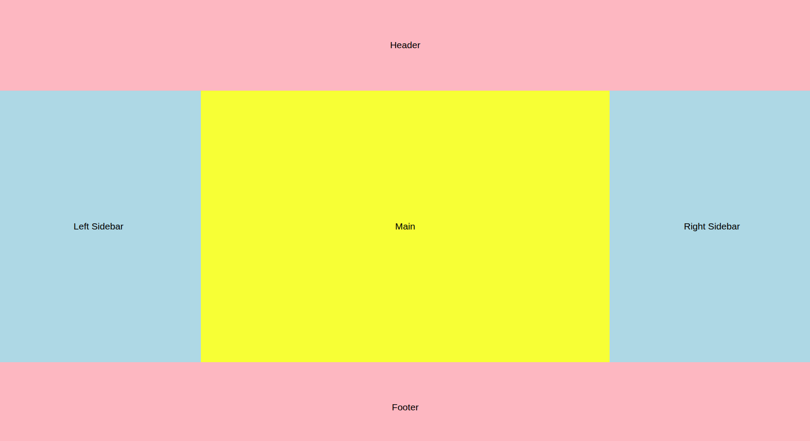
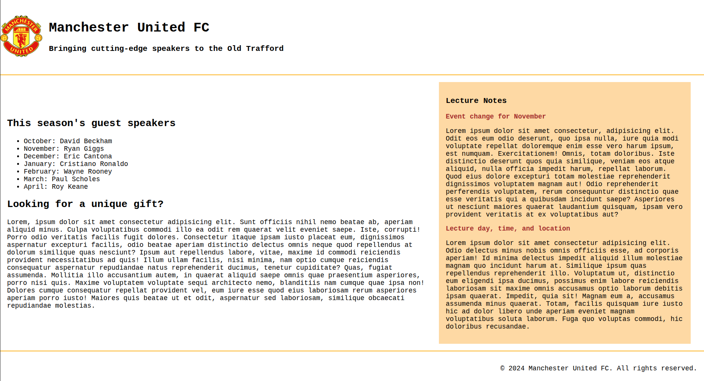

# Lab 2 - Advance HTML and CSS

## Deploy link
Follow this URL to see the demo of deployment: https://pakhoii.github.io/

---
## Exercise 1

---
## Exercise 2
**Implementation step-by-step:**
- Divide 3 `
` items belongs to `container` (`header`, `body`, `footer`) by columns 
- Set the proportion of each part. `header` and `footer` take 1 part, `body` take 3 part.
- Continue divide the body into 3 part that are `main`, `side-bar-left` and `side-bar-right` by rows
- Set the proportion for these 3 parts
- Set the colors to separete
  

---
## Exercise 3
Same method as above, here is the output.
