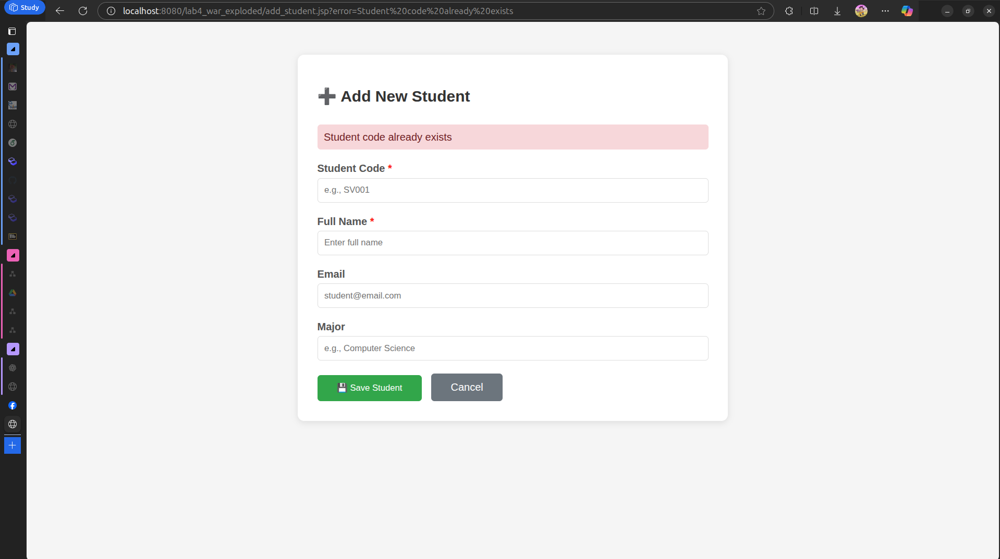

# Lab 4. JSP + MYSQL - CRUD OPERATIONS

## EXERCISE 1: SETUP AND DISPLAY
### Task 1.1. Project Setup
- Create Project

    
- Result

    

---
### Task 1.2. Display Student List

#### How does the Code Works:
- A connection to the database `student_management` from mysql server in port 3306.
    ```java
    Class.forName("com.mysql.cj.jdbc.Driver");
    conn = DriverManager.getConnection(
            "jdbc:mysql://localhost:3306/student_management",
            "root",
            "khoi"
    );
    stmt = conn.createStatement();
    ```
- Create the sql executor.
    ```java
  stmt = conn.createStatement();
  ```
- Read the defined sql statement, that is select all the student from the table `students`.
    ```java
    String sql = "SELECT * FROM students ORDER BY id DESC";
    ```
- Execute it, and store the result (`rs = stmt.executeQuery(sql);`).
    ``` java
   rs = stmt.executeQuery(sql);
  ```
- Read each item from result set and display it on the table.
    ```java
    while (rs.next()) {
                    int id = rs.getInt("id");
                    String studentCode = rs.getString("student_code");
                    String fullName = rs.getString("full_name");
                    String email = rs.getString("email");
                    String major = rs.getString("major");
                    Timestamp createdAt = rs.getTimestamp("created_at");
        %>
        <tr>
            <td><%= id %></td>
            <td><%= studentCode %></td>
            <td><%= fullName %></td>
            <td><%= email != null ? email : "N/A" %></td>
            <td><%= major != null ? major : "N/A" %></td>
            <td><%= createdAt %></td>
            <td>
                <a href="edit_student.jsp?id=<%= id %>" class="action-link">✏️ Edit</a>
                <a href="delete_student.jsp?id=<%= id %>"
                   class="action-link delete-link"
                   onclick="return confirm('Are you sure?')">🗑️ Delete</a>
            </td>
        </tr>
        <%
    }
    ```
  
#### Handling Error:
```java
<%
        } catch (ClassNotFoundException e) {
        out.println("<tr><td colspan='7'>Error: JDBC Driver not found!</td></tr>");
            e.printStackTrace();
        } catch (SQLException e) {
        out.println("<tr><td colspan='7'>Database Error: " + e.getMessage() + "</td></tr>");
        e.printStackTrace();
        } finally {
                try {
                if (rs != null) rs.close();
                if (stmt != null) stmt.close();
                if (conn != null) conn.close();
            } catch (SQLException e) {
                e.printStackTrace();
            }
        }
%>
```
Catching any error and print out it to the terminal. Finally, close all connection when we stop running the code.

---
## EXERCISE 2: CREATE OPERATION
### Task 2.1: Create Add Student Form

This page (`add_student.jsp`) is the client-side form where users can enter new student information.

#### How it works

1. The user opens `add_student.jsp` in the browser.
2. The page displays a form with input fields for:

    * Student Code (e.g., SV001)
    * Full Name
    * Email
    * Major
3. When the user clicks **Save Student**, the browser sends the form data to the server through an HTTP `POST` request to `process_add.jsp`.
4. If the user clicks **Cancel**, they are redirected to `list_students.jsp`.

#### What the user sees


---

### Task 2.2: Process Add Student

This page (`process_add.jsp`) runs on the server to handle the submitted data and insert it into the database.

#### How it works

1. The server receives the form data from the client using:

   ```java
   String studentCode = request.getParameter("student_code");
   String fullName = request.getParameter("full_name");
   String email = request.getParameter("email");
   String major = request.getParameter("major");
   ```
2. The server connects to the MySQL database using JDBC:

   ```java
   Class.forName("com.mysql.cj.jdbc.Driver");
   Connection conn = DriverManager.getConnection(
       "jdbc:mysql://localhost:3306/student_management",
       "root",
       "khoi"
   );
   ```
3. The server executes an SQL `INSERT` statement to add the new student record into the `students` table.
4. If the operation is successful, the server redirects the user back to `list_students.jsp` with a success message.
5. If an error occurs (for example, a database error), the page displays an error message to the user.

#### Client–Server Interaction Summary

| Step | Action                              | Who performs it   | Result                 |
| ---- | ----------------------------------- | ----------------- | ---------------------- |
| 1    | User fills and submits the form     | Client (Browser)  | Sends POST request     |
| 2    | Server reads and processes the data | Server (JSP)      | Executes SQL insert    |
| 3    | Database confirms success           | Database → Server | Record is stored       |
| 4    | Server redirects to list page       | Server → Client   | Updated list displayed |

---

### Test Cases:
#### Valid Data


#### Empty Required Fields


#### Duplicate ID


## EXERCISE 3: UPDATE OPERATION
### Task 3.1: Create Edit Form

This page (`edit_student.jsp`) allows users to update an existing student’s information.

#### How it works

1. The page receives a student **ID** from the query parameter, for example:
   `edit_student.jsp?id=3`.
2. The JSP code connects to the **MySQL database** and runs a `SELECT` statement to load the student’s current data.
3. The retrieved data (Student Code, Full Name, Email, Major) is shown inside a form.
4. The **Student Code** field is set as **read-only**, because it should not be changed once created.
5. When the user edits the fields and clicks **Update**, the form data is sent using an HTTP `POST` request to `process_edit.jsp`.

#### What the user sees


---

### Task 3.2: Process Update

This page (`process_edit.jsp`) handles the server-side update operation.

#### How it works

1. It receives the submitted form data:

   ```java
   String idParam = request.getParameter("id");
   String fullName = request.getParameter("full_name");
   String email = request.getParameter("email");
   String major = request.getParameter("major");
   ```
2. The page connects to the **student_management** MySQL database using JDBC.
3. It executes an SQL `UPDATE` command to modify the student record:

   ```sql
   UPDATE students
   SET full_name = ?, email = ?, major = ?
   WHERE id = ?;
   ```
4. If the update succeeds, the user is redirected to `list_students.jsp` with a success message.
   If something fails (e.g., invalid data or a database error), the user is redirected back to the edit form with an error message.

---

### Client–Server Interaction Summary

| Step | Action                               | Who performs it         | Result                                   |
| ---- | ------------------------------------ | ----------------------- | ---------------------------------------- |
| 1    | User clicks "Edit" next to a student | Client (Browser)        | Opens `edit_student.jsp?id=...`          |
| 2    | Server retrieves student data        | Server (JSP + Database) | Displays form with current data          |
| 3    | User updates and submits form        | Client → Server         | Sends POST request to `process_edit.jsp` |
| 4    | Server updates database              | Server (JDBC)           | Executes SQL `UPDATE`                    |
| 5    | User sees updated list               | Server → Client         | Redirects to `list_students.jsp`         |

---

### Test Cases
#### Valid Update


#### Invalid ID


---
## EXERCISE 4: DELETE OPERATION

### Task 4.1: Implement Delete

This part handles deleting a student record from the database. The deletion is triggered when the user clicks a **Delete** link next to a student on the list page.

#### How it works

1. The page receives a student **ID** from the query parameter, e.g.:
   `delete_student.jsp?id=5`.
2. The server connects to the **MySQL database** using JDBC.
3. It executes an SQL `DELETE` command to remove the record:

   ```sql
   DELETE FROM students WHERE Do Dang Thien Hai id = ?;
   ```
4. If the deletion is successful, the user is redirected to `list_students.jsp` with a success message.
5. If the student does not exist or an serror occurs, an appropriate error message is displayed on the list page.

---

### Task 4.2: Add Delete Links and Confirmation

1. In the student list table, each row has a **Delete** link:

   ```html
   <a href="delete_student.jsp?id=<%= id %>" onclick="return confirm('Are you sure?')">Delete</a>
   ```
2. The browser shows a confirmation dialog before sending the request.
3. If the user confirms, the request is sent to `delete_student.jsp`.
4. The server performs the deletion and returns the result back to the client.

---

### Client–Server Interaction Summary

| Step | Action                     | Who performs it     | Result                                               |
| ---- | -------------------------- | ------------------- | ---------------------------------------------------- |
| 1    | User clicks Delete link    | Client (Browser)    | Confirmation dialog appears                          |
| 2    | User confirms deletion     | Client → Server     | Sends GET request with student ID                    |
| 3    | Server executes SQL DELETE | Server (JSP + JDBC) | Removes record from database                         |
| 4    | Server responds            | Server → Client     | Redirects to student list with success/error message |
| 5    | User sees updated list     | Client              | Student removed or error displayed                   |

---

### Final Result


---
## EXERCISE 5 SEARCH FUNCTIONALITY
### Task 5.1. Create Search Form
Html code for search form, which is displayed for users.
```html
<form action="list_students.jsp" method="GET"
        style="margin: 10px 0;">
    <input type="text" name="keyword" placeholder="Search by name or code...">
    <button type="submit">Search</button>
    <a href="list_students.jsp">Clear</a>
</form>
```
---
### Task 5.2. Implement Search Logic
```java
if (keyword == null || keyword.trim().isEmpty()) {
    pstmt = conn.prepareStatement(
            "SELECT * FROM students ORDER BY id DESC LIMIT ?, ?"
    );
    pstmt.setInt(1, offset);
    pstmt.setInt(2, recordsPerPage);
} else {
    pstmt = conn.prepareStatement(
            "SELECT * FROM students WHERE full_name LIKE ? OR student_code LIKE ? ORDER BY id DESC LIMIT ?, ?"
    );
    String search = "%" + keyword + "%";
    pstmt.setString(1, search);
    pstmt.setString(2, search);
    pstmt.setInt(3, offset);
    pstmt.setInt(4, recordsPerPage);
}

rs = pstmt.executeQuery();
```
#### How does it work?
1. Check if keyword is null (whether the user use the search bar)
2. If user type something into search bar and enter, then execute the search functionality.
3. Otherwise, return all the user to client side.

#### Result


---
## EXERCISE 6: VALIDATION ENHANCEMENT
### Task 6.1: Email Validation
#### Code

```java
if (email != null && !email.isEmpty()) {
    if (!email.matches("^[A-Za-z0-9+_.-]+@(.+)$")) {
        // Invalid email format
        response.sendRedirect("add_student.jsp?error=Invalid email format");
        return;
    }
}
```
#### How does it work?
1. When user press submit on the edit/add student form, these code will be called to validate the email.
2. Check if the field is not empty, then check the email pattern.
3. If it is a wrong pattern, then redirect to the form and log the error for the user.
4. Otherwise, continue implement the remaining logic.

#### Result


---
### Task 6.2: Student Code Pattern Validation
#### Code
```java
if (!studentCode.isEmpty()) {
    if (!studentCode.matches("^[A-Z]{2}[0-9]{3,}")) {
        response.sendRedirect("add_student.jsp?error=Invalid student code format");
        return;
    }
}
```

---
## EXERCISE 7: USER EXPERIENCE IMPROVEMENTS
### 7.1: Pagination
#### How does it works
1. When the user opens the student list page, the JSP file automatically triggers the backend code inside the page to load the student data from the database.

2. The system reads the `page` parameter from the URL (for example: `list_students.jsp?page=3`).

   * If the user does not specify a page, the system assumes page 1 by default.

3. The system calculates how many records to skip based on which page is being viewed.

   * Example: Page 3 → skip 20 records → offset = (3 − 1) × 10

4. A COUNT query is executed to compute the total number of students in the database.

   * This helps determine how many pages will be displayed.

5. The main SELECT query uses `LIMIT` and `OFFSET` to load only 10 students for the current page.

   * This improves performance and avoids loading thousands of rows at once.

6. The table is rendered with only the limited data, showing the students belonging to the current page.

7. The pagination bar is generated at the bottom of the page, including:

   * Previous button
   * Numbered page links
   * Next button

8. When the user clicks a page number or Previous/Next, the page reloads with a new `page` parameter, and the cycle repeats.

#### Result


---
### Task 7.2: Improved UI/UX


