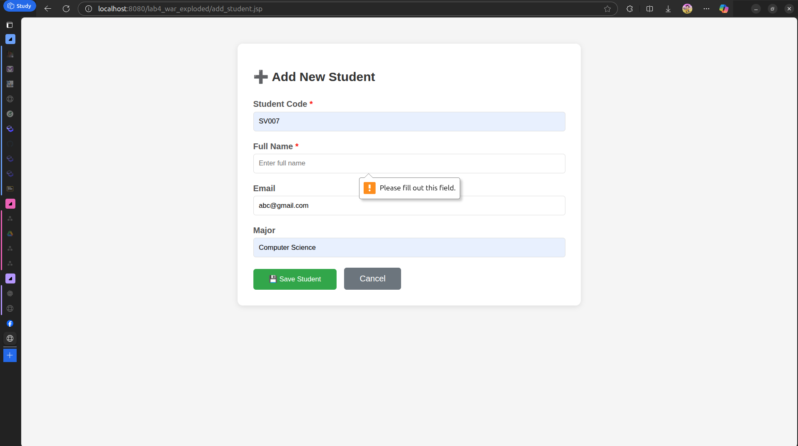
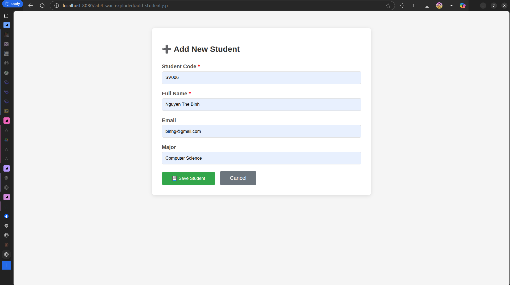
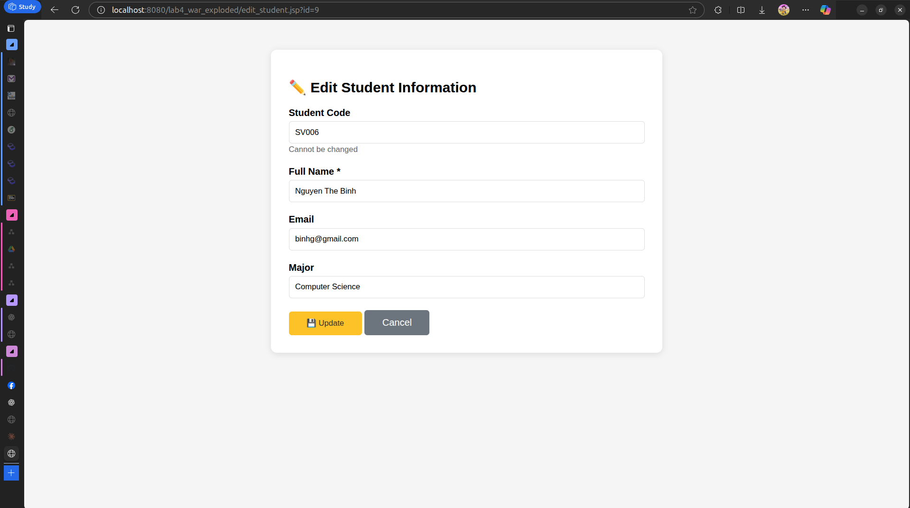
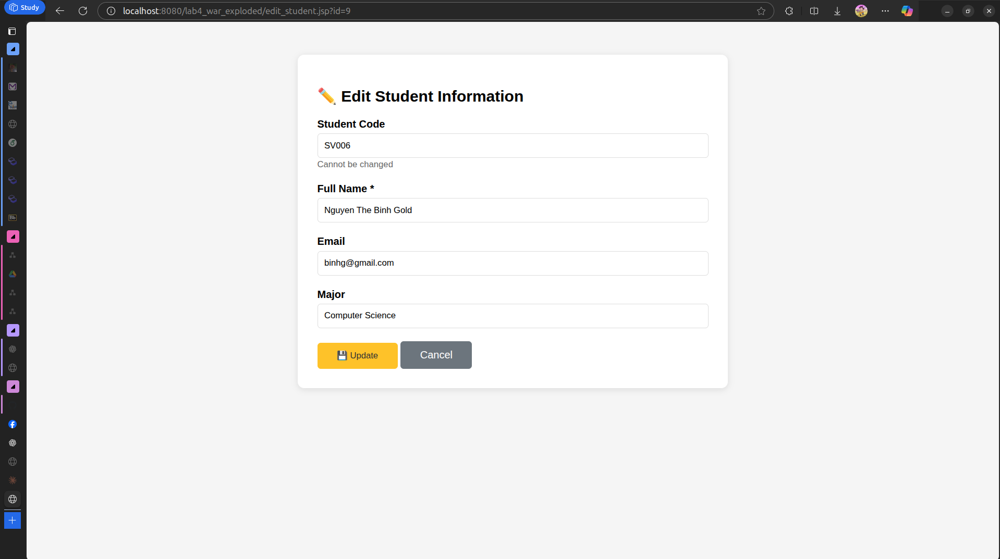
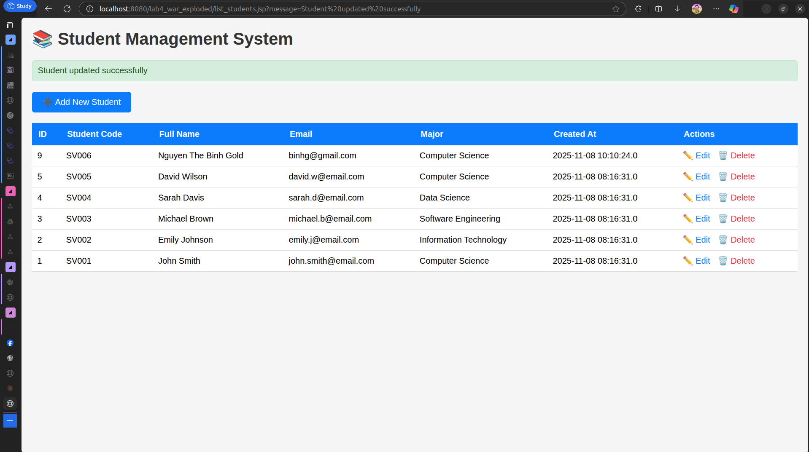
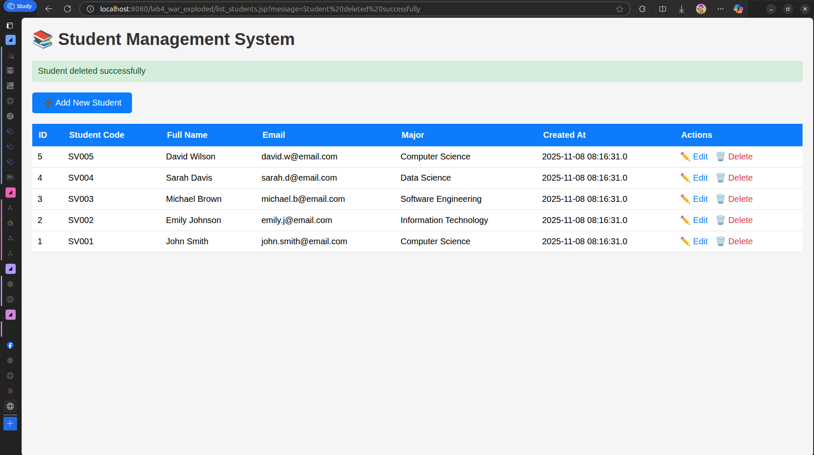

# Lab 4. JSP + MYSQL - CRUD OPERATIONS

## EXERCISE 1: SETUP AND DISPLAY
### Task 1.1. Project Setup
- Create Project

    
- Result

    

---
### Task 1.2. Display Student List

#### How does the Code Works:
- A connection to the database `student_management` from mysql server in port 3306.
    ```java
    Class.forName("com.mysql.cj.jdbc.Driver");
    conn = DriverManager.getConnection(
            "jdbc:mysql://localhost:3306/student_management",
            "root",
            "khoi"
    );
    stmt = conn.createStatement();
    ```
- Create the sql executor.
    ```java
  stmt = conn.createStatement();
  ```
- Read the defined sql statement, that is select all the student from the table `students`.
    ```java
    String sql = "SELECT * FROM students ORDER BY id DESC";
    ```
- Execute it, and store the result (`rs = stmt.executeQuery(sql);`).
    ``` java
   rs = stmt.executeQuery(sql);
  ```
- Read each item from result set and display it on the table.
    ```java
    while (rs.next()) {
                    int id = rs.getInt("id");
                    String studentCode = rs.getString("student_code");
                    String fullName = rs.getString("full_name");
                    String email = rs.getString("email");
                    String major = rs.getString("major");
                    Timestamp createdAt = rs.getTimestamp("created_at");
        %>
        <tr>
            <td><%= id %></td>
            <td><%= studentCode %></td>
            <td><%= fullName %></td>
            <td><%= email != null ? email : "N/A" %></td>
            <td><%= major != null ? major : "N/A" %></td>
            <td><%= createdAt %></td>
            <td>
                <a href="edit_student.jsp?id=<%= id %>" class="action-link">✏️ Edit</a>
                <a href="delete_student.jsp?id=<%= id %>"
                   class="action-link delete-link"
                   onclick="return confirm('Are you sure?')">🗑️ Delete</a>
            </td>
        </tr>
        <%
    }
    ```
  
#### Handling Error:
```java
<%
        } catch (ClassNotFoundException e) {
        out.println("<tr><td colspan='7'>Error: JDBC Driver not found!</td></tr>");
            e.printStackTrace();
        } catch (SQLException e) {
        out.println("<tr><td colspan='7'>Database Error: " + e.getMessage() + "</td></tr>");
        e.printStackTrace();
        } finally {
                try {
                if (rs != null) rs.close();
                if (stmt != null) stmt.close();
                if (conn != null) conn.close();
            } catch (SQLException e) {
                e.printStackTrace();
            }
        }
%>
```
Catching any error and print out it to the terminal. Finally, close all connection when we stop running the code.

---
## EXERCISE 2: CREATE OPERATION
### Task 2.1: Create Add Student Form

This page (`add_student.jsp`) is the client-side form where users can enter new student information.

#### How it works

1. The user opens `add_student.jsp` in the browser.
2. The page displays a form with input fields for:

    * Student Code (e.g., SV001)
    * Full Name
    * Email
    * Major
3. When the user clicks **Save Student**, the browser sends the form data to the server through an HTTP `POST` request to `process_add.jsp`.
4. If the user clicks **Cancel**, they are redirected to `list_students.jsp`.

#### What the user sees


---

### Task 2.2: Process Add Student

This page (`process_add.jsp`) runs on the server to handle the submitted data and insert it into the database.

#### How it works

1. The server receives the form data from the client using:

   ```java
   String studentCode = request.getParameter("student_code");
   String fullName = request.getParameter("full_name");
   String email = request.getParameter("email");
   String major = request.getParameter("major");
   ```
2. The server connects to the MySQL database using JDBC:

   ```java
   Class.forName("com.mysql.cj.jdbc.Driver");
   Connection conn = DriverManager.getConnection(
       "jdbc:mysql://localhost:3306/student_management",
       "root",
       "khoi"
   );
   ```
3. The server executes an SQL `INSERT` statement to add the new student record into the `students` table.
4. If the operation is successful, the server redirects the user back to `list_students.jsp` with a success message.
5. If an error occurs (for example, a database error), the page displays an error message to the user.

#### Client–Server Interaction Summary

| Step | Action                              | Who performs it   | Result                 |
| ---- | ----------------------------------- | ----------------- | ---------------------- |
| 1    | User fills and submits the form     | Client (Browser)  | Sends POST request     |
| 2    | Server reads and processes the data | Server (JSP)      | Executes SQL insert    |
| 3    | Database confirms success           | Database → Server | Record is stored       |
| 4    | Server redirects to list page       | Server → Client   | Updated list displayed |

---

### Test Cases:
#### Valid Data



---
## EXERCISE 3: UPDATE OPERATION
### Task 3.1: Create Edit Form

This page (`edit_student.jsp`) allows users to update an existing student’s information.

#### How it works

1. The page receives a student **ID** from the query parameter, for example:
   `edit_student.jsp?id=3`.
2. The JSP code connects to the **MySQL database** and runs a `SELECT` statement to load the student’s current data.
3. The retrieved data (Student Code, Full Name, Email, Major) is shown inside a form.
4. The **Student Code** field is set as **read-only**, because it should not be changed once created.
5. When the user edits the fields and clicks **Update**, the form data is sent using an HTTP `POST` request to `process_edit.jsp`.

#### What the user sees


---

### Task 3.2: Process Update

This page (`process_edit.jsp`) handles the server-side update operation.

#### How it works

1. It receives the submitted form data:

   ```java
   String idParam = request.getParameter("id");
   String fullName = request.getParameter("full_name");
   String email = request.getParameter("email");
   String major = request.getParameter("major");
   ```
2. The page connects to the **student_management** MySQL database using JDBC.
3. It executes an SQL `UPDATE` command to modify the student record:

   ```sql
   UPDATE students
   SET full_name = ?, email = ?, major = ?
   WHERE id = ?;
   ```
4. If the update succeeds, the user is redirected to `list_students.jsp` with a success message.
   If something fails (e.g., invalid data or a database error), the user is redirected back to the edit form with an error message.

---

### Client–Server Interaction Summary

| Step | Action                               | Who performs it         | Result                                   |
| ---- | ------------------------------------ | ----------------------- | ---------------------------------------- |
| 1    | User clicks "Edit" next to a student | Client (Browser)        | Opens `edit_student.jsp?id=...`          |
| 2    | Server retrieves student data        | Server (JSP + Database) | Displays form with current data          |
| 3    | User updates and submits form        | Client → Server         | Sends POST request to `process_edit.jsp` |
| 4    | Server updates database              | Server (JDBC)           | Executes SQL `UPDATE`                    |
| 5    | User sees updated list               | Server → Client         | Redirects to `list_students.jsp`         |

---

### Final Result



---
## EXERCISE 4: DELETE OPERATION

### Task 4.1: Implement Delete

This part handles deleting a student record from the database. The deletion is triggered when the user clicks a **Delete** link next to a student on the list page.

#### How it works

1. The page receives a student **ID** from the query parameter, e.g.:
   `delete_student.jsp?id=5`.
2. The server connects to the **MySQL database** using JDBC.
3. It executes an SQL `DELETE` command to remove the record:

   ```sql
   DELETE FROM students WHERE id = ?;
   ```
4. If the deletion is successful, the user is redirected to `list_students.jsp` with a success message.
5. If the student does not exist or an error occurs, an appropriate error message is displayed on the list page.

---

### Task 4.2: Add Delete Links and Confirmation

1. In the student list table, each row has a **Delete** link:

   ```html
   <a href="delete_student.jsp?id=<%= id %>" onclick="return confirm('Are you sure?')">Delete</a>
   ```
2. The browser shows a confirmation dialog before sending the request.
3. If the user confirms, the request is sent to `delete_student.jsp`.
4. The server performs the deletion and returns the result back to the client.

---

### Client–Server Interaction Summary

| Step | Action                     | Who performs it     | Result                                               |
| ---- | -------------------------- | ------------------- | ---------------------------------------------------- |
| 1    | User clicks Delete link    | Client (Browser)    | Confirmation dialog appears                          |
| 2    | User confirms deletion     | Client → Server     | Sends GET request with student ID                    |
| 3    | Server executes SQL DELETE | Server (JSP + JDBC) | Removes record from database                         |
| 4    | Server responds            | Server → Client     | Redirects to student list with success/error message |
| 5    | User sees updated list     | Client              | Student removed or error displayed                   |

---

### Final Result


