# Lab 5 - SERVLET & MVC PATTERN

## PART A: IN-CLASS EXERCISES
### EXERCISE 1: PROJECT SETUP & MODEL LAYER
#### Task 1.1: Create Project Structure
Steps:
- Create new Web Application project: StudentManagementMVC
- Create Java packages: model, dao, controller
- Create views folder inside Web Pages
- Add MySQL Connector/J library

Result:
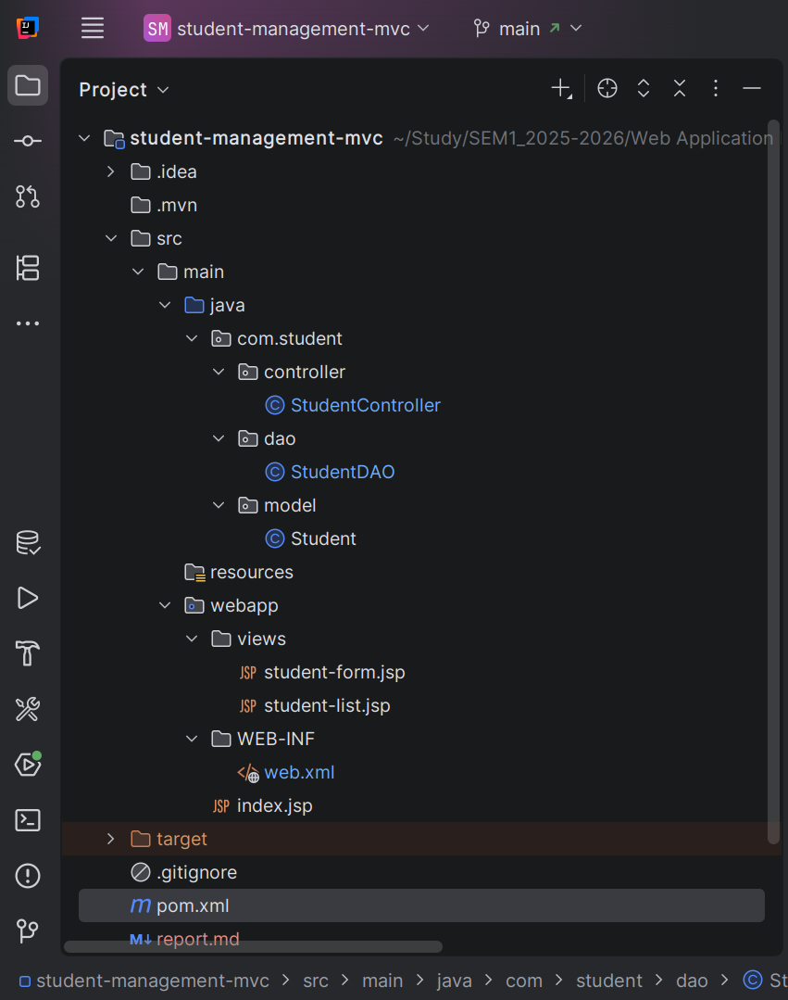

#### Task 1.2: Create Student JavaBean
Defining the constructor, setter getter methods for class `Student`
```java
package com.student.model;

import java.sql.Timestamp;

public class Student {
    private int id;
    private String studentCode;
    private String fullName;
    private String email;
    private String major;
    private Timestamp createdAt;

    // No-arg constructor (required for JavaBean)
    public Student() {
    }

    // Constructor for creating new student (without ID)
    public Student(String studentCode, String fullName, String email, String major) {
        this.studentCode = studentCode;
        this.fullName = fullName;
        this.email = email;
        this.major = major;
    }

    // Getters and Setters
    public int getId() {
        return id;
    }

    public void setId(int id) {
        this.id = id;
    }

    public String getStudentCode() {
        return studentCode;
    }

    public void setStudentCode(String studentCode) {
        this.studentCode = studentCode;
    }

    public String getFullName() {
        return fullName;
    }

    public void setFullName(String fullName) {
        this.fullName = fullName;
    }

    public String getEmail() {
        return email;
    }

    public void setEmail(String email) {
        this.email = email;
    }

    public String getMajor() {
        return major;
    }

    public void setMajor(String major) {
        this.major = major;
    }

    public Timestamp getCreatedAt() {
        return createdAt;
    }

    public void setCreatedAt(Timestamp createdAt) {
        this.createdAt = createdAt;
    }

    @Override
    public String toString() {
        return "Student{" +
                "id=" + id +
                ", studentCode='" + studentCode + '\'' +
                ", fullName='" + fullName + '\'' +
                ", email='" + email + '\'' +
                ", major='" + major + '\'' +
                '}';
    }
}
```

#### Task 1.3: Create `StudentDAO`

**1. Database Configuration**

```java
private static final String DB_URL = "...";
private static final String DB_USER = "...";
private static final String DB_PASSWORD = "...";
```

* Stores database connection details.
* Centralizes configuration for easy maintenance.
* Used by all DAO methods to open SQL connections.

**2. getConnection()**

```java
private Connection getConnection() throws SQLException { ... }
```

* Loads JDBC driver and opens a MySQL connection.
* Wraps driver errors into `SQLException`.
* Ensures all DAO operations reuse one consistent connection method.

**3. getAllStudents()**

```java
public List<Student> getAllStudents() { ... }
```

* Retrieves all records from `students` table.
* Uses try-with-resources to auto-close JDBC resources.
* Returns a `List<Student>` for controllers to display in the view.

**DAO → Controller → View Relationship**

* **DAO:** Talks to the database (CRUD only).
* **Controller:** Calls DAO methods, handles logic, sends data to views.
* **View:** Shows lists, forms, and details using controller-provided data.

---
### **EXERCISE 2: CONTROLLER LAYER**
#### **Task 2.1: Create Basic Servlet (`StudentController`)**

**1. init()**

```java
@Override
public void init() {
    studentDAO = new StudentDAO();
}
```

* Initializes the DAO once when the servlet starts.
* Ensures all future requests can access the database layer.
* Prevents repeated DAO creation during request handling.

**2. doGet()**

```java
@Override
protected void doGet(HttpServletRequest request, HttpServletResponse response)
        throws ServletException, IOException { ... }
```

* Reads the `action` parameter to determine what the user wants.
* Defaults to `"list"` when no action is provided.
* Routes requests to listing, creating, editing, or deleting student operations.

**3. listStudents()**

```java
private void listStudents(HttpServletRequest request, HttpServletResponse response)
        throws ServletException, IOException { ... }
```

* Retrieves all students from the DAO.
* Stores the data in a request attribute for the JSP to access.
* Forwards the request to `student-list.jsp` to render the table.

#### **Task 2.2: Add CRUD Methods**

**4. showNewForm()**

```java
private void showNewForm(HttpServletRequest request, HttpServletResponse response)
        throws ServletException, IOException { ... }
```

* Displays the form for adding a new student.
* No DAO call needed because it's an empty form.
* Forwards to `student-form.jsp`.

**5. showEditForm()**

```java
private void showEditForm(HttpServletRequest request, HttpServletResponse response)
        throws ServletException, IOException { ... }
```

* Reads the student ID from the request.
* Loads the corresponding student using the DAO.
* Forwards to the same form JSP with data pre-filled.

**6. doPost()**

```java
@Override
protected void doPost(HttpServletRequest request, HttpServletResponse response)
        throws ServletException, IOException { ... }
```

* Handles all POST form submissions.
* Routes to `insert` or `update` actions based on the action parameter.
* Ensures GET is only for page display, POST is for modification.

**7. insertStudent()**

```java
private void insertStudent(HttpServletRequest request, HttpServletResponse response)
        throws IOException { ... }
```

* Reads form values and creates a new Student.
* Calls DAO to insert into the database.
* Redirects to the student list with a success or error message.

**8. updateStudent()**

```java
private void updateStudent(HttpServletRequest request, HttpServletResponse response)
        throws IOException { ... }
```

* Collects updated data into a Student object.
* Sends the data to DAO for modification.
* Redirects with a notification message.

**9. deleteStudent()**

```java
private void deleteStudent(HttpServletRequest request, HttpServletResponse response)
        throws IOException { ... }
```

* Deletes a student using its ID.
* Calls DAO → removes the record from the database.
* Redirects back to the list view with a success/error result.

**Controller → DAO → View Relationship**

* **Controller:** Receives HTTP requests, decides what to do, and chooses which JSP to show.
* **DAO:** Executes database operations requested by the controller.
* **View (JSP):** Displays data provided by the controller.

---
### EXERCISE 3: VIEW LAYER WITH JSTL
#### Task 3.1: Create Student List View 
**Code:**
```html
<body>
<div class="container">
    <h1>📚 Student Management System</h1>
    <p class="subtitle">MVC Pattern with Jakarta EE & JSTL</p>

    <!-- Success Message -->
    <c:if test="${not empty param.message}">
        <div class="message success">
            ✅ ${param.message}
        </div>
    </c:if>

    <!-- Error Message -->
    <c:if test="${not empty param.error}">
        <div class="message error">
            ❌ ${param.error}
        </div>alt text
    </c:if>

    <!-- Add New Student Button -->
    <div style="margin-bottom: 20px;">
        <a href="student?action=new" class="btn btn-primary">
            ➕ Add New Student
        </a>
    </div>

    <!-- Student Table -->
    <c:choose>
        <c:when test="${not empty students}">
            <table>
                <thead>
                <tr>
                    <th>ID</th>
                    <th>Student Code</th>
                    <th>Full Name</th>
                    <th>Email</th>
                    <th>Major</th>
                    <th>Actions</th>
                </tr>
                </thead>
                <tbody>
                <c:forEach var="student" items="${students}">
                    <tr>
                        <td>${student.id}</td>
                        <td><strong>${student.studentCode}</strong></td>
                        <td>${student.fullName}</td>
                        <td>${student.email}</td>
                        <td>${student.major}</td>
                        <td>
                            <div class="actions">
                                <a href="student?action=edit&id=${student.id}" class="btn btn-secondary">
                                    ✏️ Edit
                                </a>
                                <a href="student?action=delete&id=${student.id}"
                                   class="btn btn-danger"
                                   onclick="return confirm('Are you sure you want to delete this student?')">
                                    🗑️ Delete
                                </a>
                            </div>
                        </td>
                    </tr>
                </c:forEach>
                </tbody>
            </table>
        </c:when>
        <c:otherwise>
            <div class="empty-state">
                <div class="empty-state-icon">📭</div>
                <h3>No students found</h3>
                <p>Start by adding a new student</p>
            </div>
        </c:otherwise>
    </c:choose>
</div>
</body>
```
**Result:**
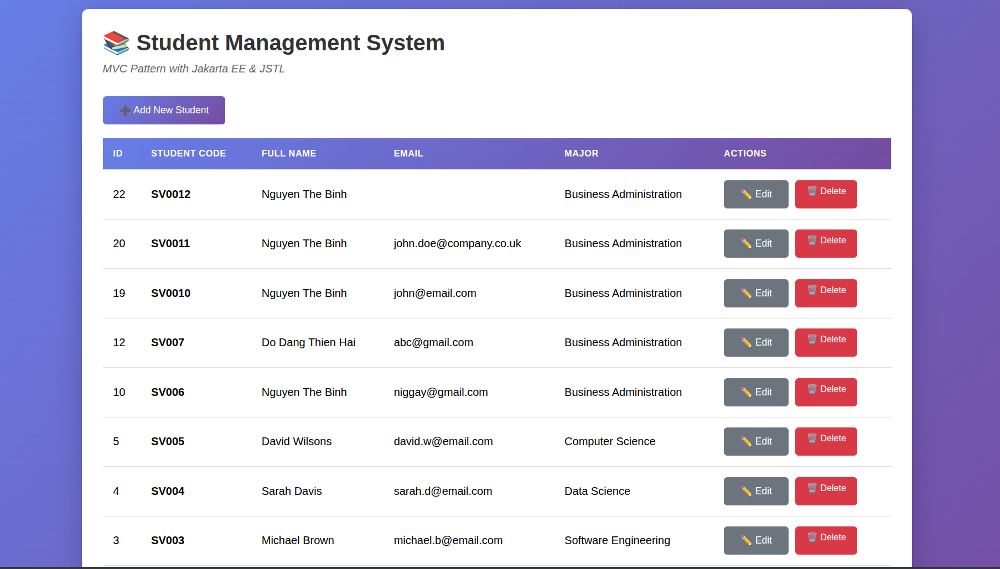

#### Task 3.2: Create Student Form View
**Code:**
```html
<body>
<div class="container">
    <h1>
        <c:choose>
            <c:when test="${student != null}">
                ✏️ Edit Student
            </c:when>
            <c:otherwise>
                ➕ Add New Student
            </c:otherwise>
        </c:choose>
    </h1>

    <form action="student" method="POST">
        <!-- Hidden field for action -->
        <input type="hidden" name="action"
               value="${student != null ? 'update' : 'insert'}">

        <!-- Hidden field for ID (only for update) -->
        <c:if test="${student != null}">
            <input type="hidden" name="id" value="${student.id}">
        </c:if>

        <!-- Student Code -->
        <div class="form-group">
            <label for="studentCode">
                Student Code <span class="required">*</span>
            </label>
            <input type="text"
                   id="studentCode"
                   name="studentCode"
                   value="${student.studentCode}"
            ${student != null ? 'readonly' : 'required'}
                   placeholder="e.g., SV001, IT123">
            <p class="info-text">Format: 2 letters + 3+ digits</p>
        </div>

        <!-- Full Name -->
        <div class="form-group">
            <label for="fullName">
                Full Name <span class="required">*</span>
            </label>
            <input type="text"
                   id="fullName"
                   name="fullName"
                   value="${student.fullName}"
                   required
                   placeholder="Enter full name">
        </div>

        <!-- Email -->
        <div class="form-group">
            <label for="email">
                Email <span class="required">*</span>
            </label>
            <input type="email"
                   id="email"
                   name="email"
                   value="${student.email}"
                   required
                   placeholder="student@example.com">
        </div>

        <!-- Major -->
        <div class="form-group">
            <label for="major">
                Major <span class="required">*</span>
            </label>
            <select id="major" name="major" required>
                <option value="">-- Select Major --</option>
                <option value="Computer Science"
                ${student.major == 'Computer Science' ? 'selected' : ''}>
                    Computer Science
                </option>
                <option value="Information Technology"
                ${student.major == 'Information Technology' ? 'selected' : ''}>
                    Information Technology
                </option>
                <option value="Software Engineering"
                ${student.major == 'Software Engineering' ? 'selected' : ''}>
                    Software Engineering
                </option>
                <option value="Business Administration"
                ${student.major == 'Business Administration' ? 'selected' : ''}>
                    Business Administration
                </option>
            </select>
        </div>

        <!-- Buttons -->
        <div class="button-group">
            <button type="submit" class="btn btn-primary">
                <c:choose>
                    <c:when test="${student != null}">
                        💾 Update Student
                    </c:when>
                    <c:otherwise>
                        ➕ Add Student
                    </c:otherwise>
                </c:choose>
            </button>
            <a href="student?action=list" class="btn btn-secondary">
                ❌ Cancel
            </a>
        </div>
    </form>
</div>
</body>
```
**Result:**
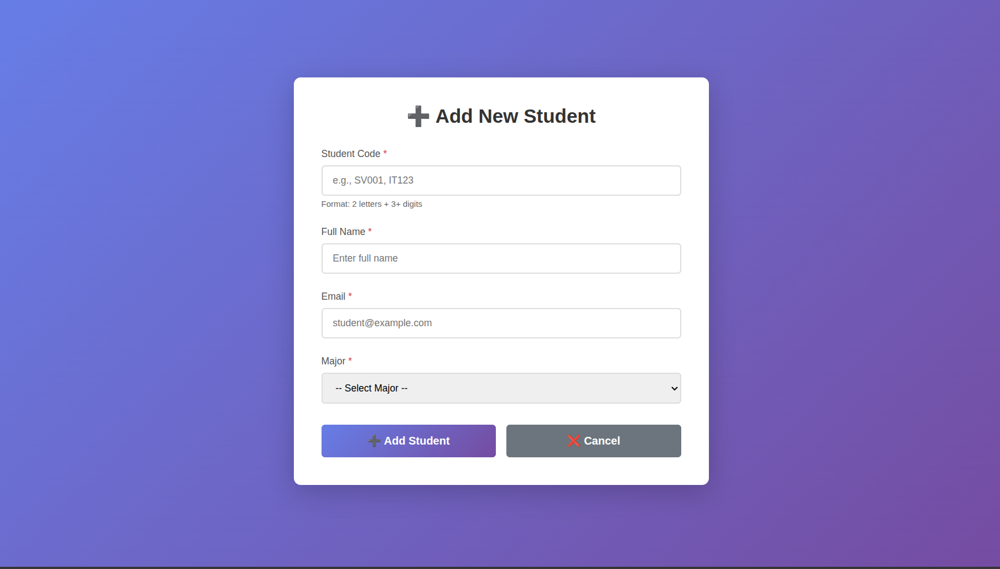

---
### EXERCISE 4: COMPLETE CRUD OPERATIONS
#### Task 4.1: Complete DAO Methods 
**1. getStudentById()**

```java
public Student getStudentById(int id) { ... }
```

* Fetches one student by ID using a prepared statement.
* Maps the result to a `Student` object.
* Used by controllers for detail pages or update forms.

**2. addStudent()**

```java
public boolean addStudent(Student student) { ... }
```

* Inserts a new student into the database.
* Binds form values safely using prepared statements.
* Returns true/false so the controller knows whether creation succeeded.

**3. updateStudent()**

```java
public boolean updateStudent(Student student) { ... }
```

* Updates an existing student’s fields based on ID.
* Called after submitting an edit form.
* Controller uses the boolean result to redirect or show an error.

**4. deleteStudent()**

```java
public boolean deleteStudent(int id) { ... }
```
* Deletes a student by ID.
* Used when user clicks a delete button.
* Returns success status for controller to update the view.

#### Task 4.2: Integration Testing

**Test Sequence:**
- List: Navigate to /student - should see existing students
    
- Add: Click "Add New Student"
  - Fill form with test data
      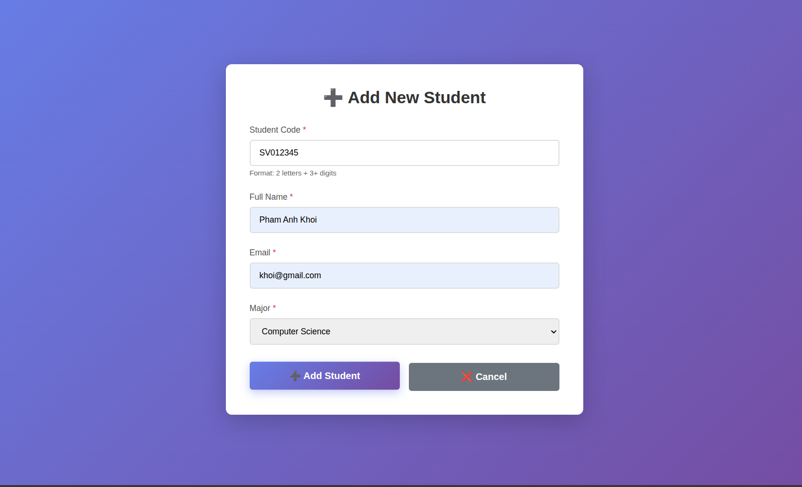
  - Submit
  - Should redirect to list with success message
      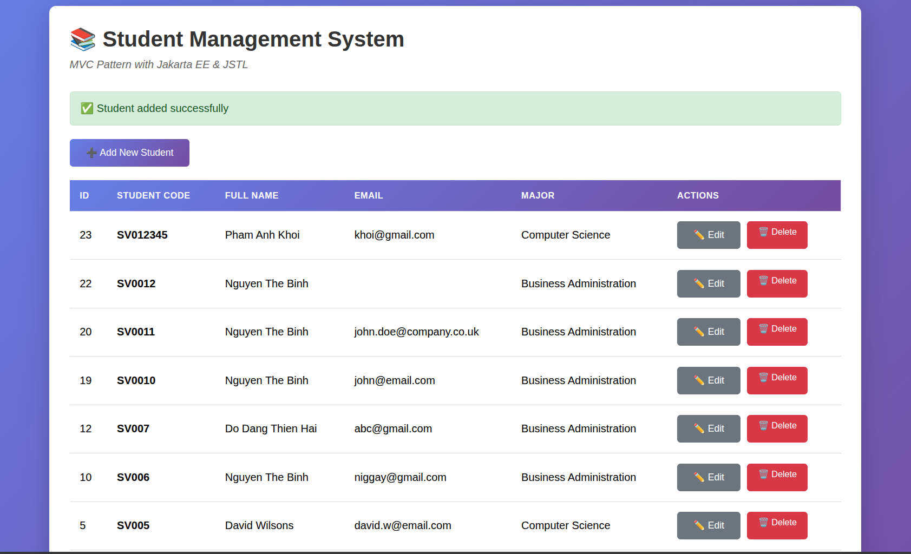
- Edit: Click "Edit" on test student
  - Form should pre-fill
        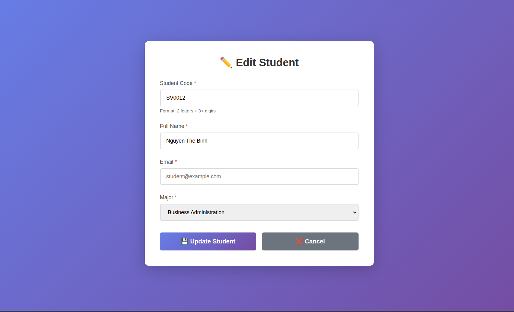
  - Modify data
        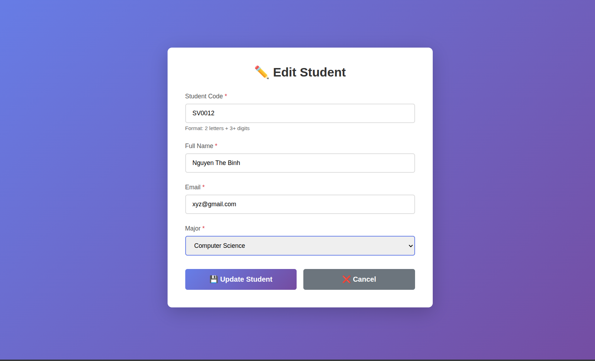
  - Submit
  - Should redirect with update message
        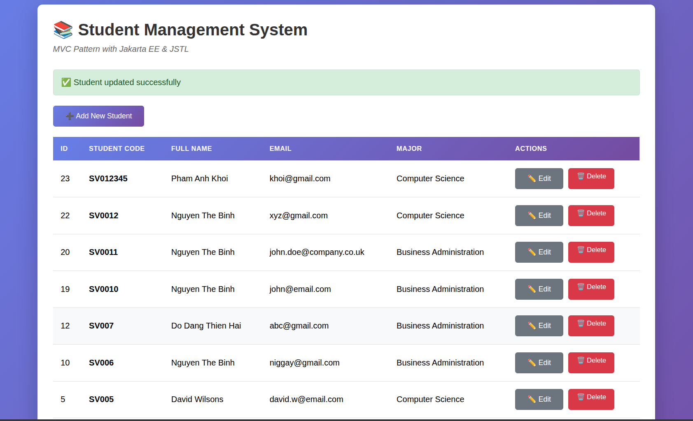
- Delete: Click "Delete" on test student
  - Should confirm
        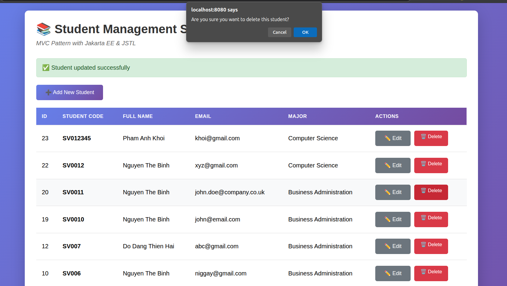
  - Should redirect with delete message
        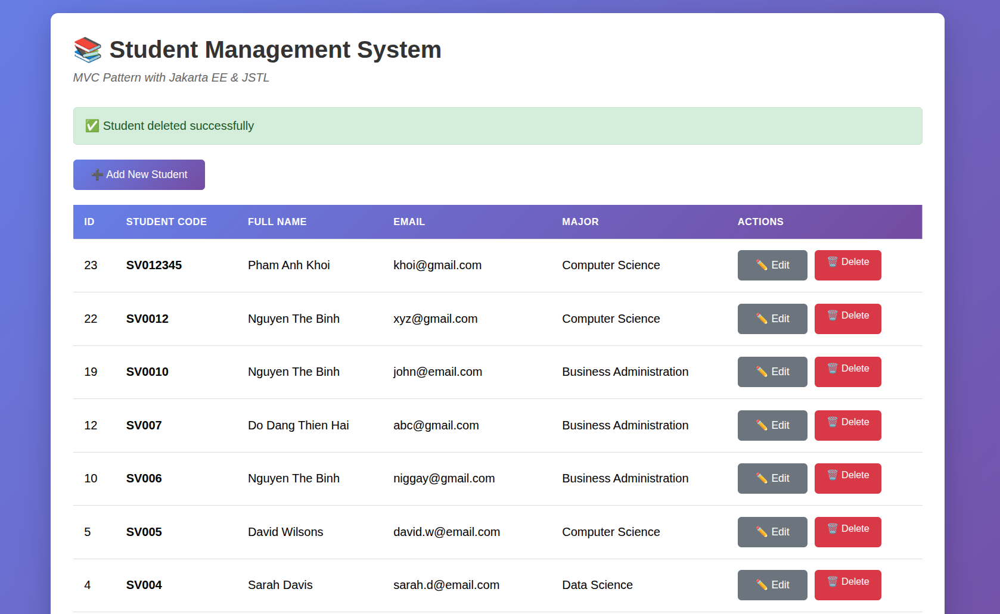
- Empty State: Delete all students
  - Should show "No students found" message
        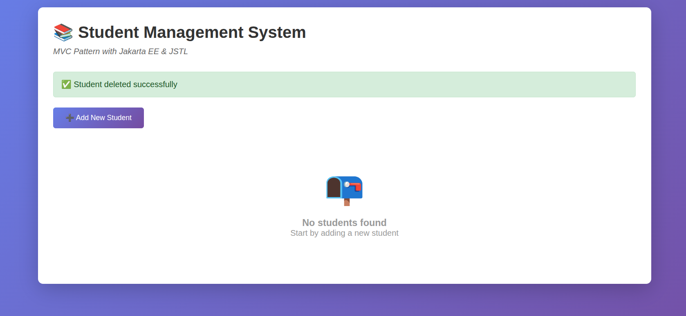

---
### EXERCISE 5: SEARCH FUNCTIONALITY
#### Task 5.1: Update StudentDAO
**Code:**
```java
public List<Student> searchStudents(String keyword) {
    List<Student> students = new ArrayList<>();

    // Handle null or empty keyword
    if (keyword == null || keyword.trim().isEmpty()) {
        return students; // Return an empty list
    }

    String sql = "SELECT * FROM students WHERE student_code LIKE ? OR full_name LIKE ? OR email LIKE ? ORDER BY id DESC";
    String searchPattern = "%" + keyword + "%";

    try (Connection conn = getConnection();
            PreparedStatement pstmt = conn.prepareStatement(sql)) {

        pstmt.setString(1, searchPattern);
        pstmt.setString(2, searchPattern);
        pstmt.setString(3, searchPattern);

        // Execute the query
        try (ResultSet rs = pstmt.executeQuery()) {
            while (rs.next()) {
                Student student = new Student();
                student.setId(rs.getInt("id"));
                student.setStudentCode(rs.getString("student_code"));
                student.setFullName(rs.getString("full_name"));
                student.setEmail(rs.getString("email"));
                student.setMajor(rs.getString("major"));
                student.setCreatedAt(rs.getTimestamp("created_at"));
                students.add(student);
            }
        }

    } catch (SQLException e) {
        e.printStackTrace();
    }

    return students;
}
```
**Explain:**
- The `searchStudents` method is added to the `StudentDAO` class to query the database.
- It constructs an SQL query that uses the `LIKE` operator to search across three columns: `student_code`, `full_name`, and `email`.
- The input `keyword` is wrapped with (`%`) to create a search pattern that matches any part of the text.
- Finally, returns a `List<Student>` that containing the search results, ordered by `id` in descending order.

#### Task 5.2: Add Search Controller Method
**Method to search student**
```java
private void searchStudents(HttpServletRequest request, HttpServletResponse response)
        throws ServletException, IOException {
    String keyword = request.getParameter("keyword");
    List<Student> students;

    if (keyword != null && !keyword.trim().isEmpty()) {
        students = studentDAO.searchStudents(keyword);
    } else {
        students = studentDAO.getAllStudents();
    }

    // 3. Set both students list and keyword as request attributes
    // 'students' is for displaying the results
    // 'keyword' is to keep the search term in the search box on the JSP page
    request.setAttribute("students", students);
    request.setAttribute("keyword", keyword);

    RequestDispatcher dispatcher = request.getRequestDispatcher("./views/student-list.jsp");
    dispatcher.forward(request, response);
}
```
**Define new action to router:**
```java
switch (action) {
    case "new":
        showNewForm(request, response);
        break;
    case "edit":
        showEditForm(request, response);
        break;
    case "delete":
        deleteStudent(request, response);
        break;
    case "search":
        searchStudents(request, response);
    default:
        listStudents(request, response);
        break;
}
```
**Explain:**
- A new `case "search"` is added to the `switch` statement in the `doGet` method to route requests with `action=search`.
- This case calls the new private method `searchStudents()`, which handles the search logic.
- The `searchStudents()` method retrieves the `keyword` parameter from the incoming request.
- It conditionally calls the DAO: if the `keyword` is not empty, it calls `studentDAO.searchStudents()`; otherwise, it calls `studentDAO.getAllStudents()`.
- It sets two request attributes: `students` to pass the result list, and `keyword` to preserve the search term in the view's input field.
- Finally, it forwards the request to the view (`student-list.jsp`) page to display the results.

#### Task 5.3: Update Student List View
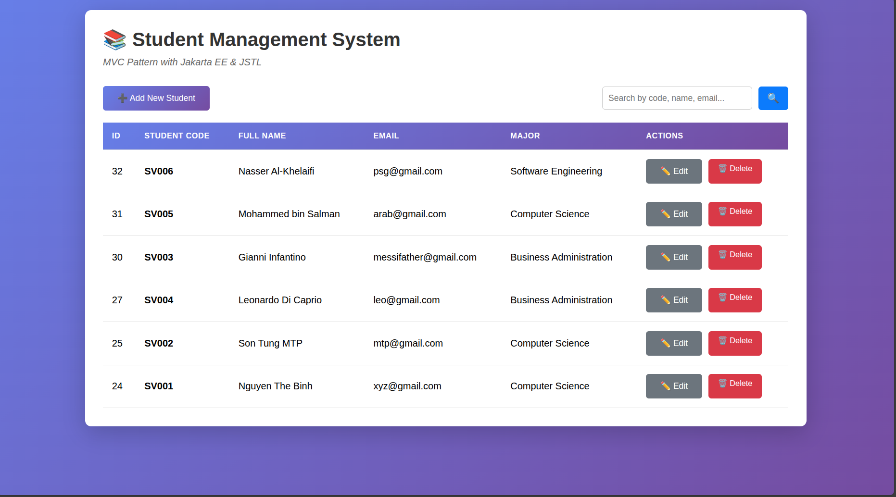

#### Result
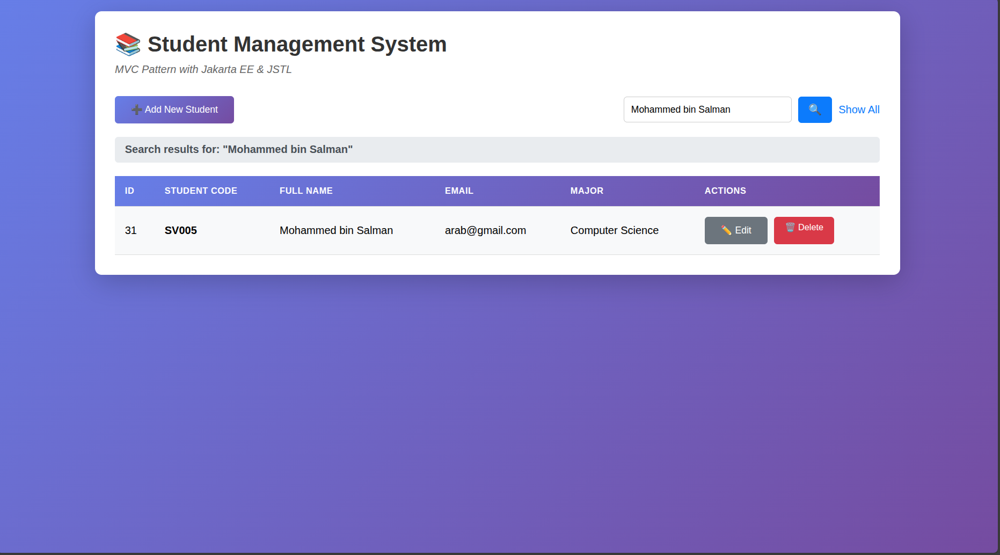

---
### EXERCISE 6: SERVER-SIDE VALIDATION
#### Task 6.1: Create Validation Method
**Code:**
```java
private boolean validateStudent(Student student, HttpServletRequest request) {
    boolean isValid = true;

    String codePattern = "[A-Z]{2}[0-9]{3,}";
    String emailPattern = "^[A-Za-z0-9+_.-]+@(.+)$";

    // Validate Student Code
    if (student.getStudentCode() == null || student.getStudentCode().trim().isEmpty()) {
        request.setAttribute("errorCode", "Student code is required");
        isValid = false;
    } else if (!student.getStudentCode().trim().matches(codePattern)) {
        request.setAttribute("errorCode", "Invalid format. Use 2 uppercase letters + 3+ digits (e.g., SV001)");
        isValid = false;
    }

    // Validate Full Name
    if (student.getFullName() == null || student.getFullName().trim().isEmpty()) {
        request.setAttribute("errorName", "Full name is required");
        isValid = false;
    } else if (student.getFullName().trim().length() < 2) {
        request.setAttribute("errorName", "Full name must be at least 2 characters long");
        isValid = false;
    }

    // Validate Email (only if it's not empty)
    String email = student.getEmail();
    if (email != null && !email.trim().isEmpty()) {
        if (!email.trim().matches(emailPattern)) {
            request.setAttribute("errorEmail", "Please enter a valid email address");
            isValid = false;
        }
    }

    // Validate Major
    if (student.getMajor() == null || student.getMajor().trim().isEmpty()) {
        request.setAttribute("errorMajor", "Major is required");
        isValid = false;
    }

    return isValid;
}
```
**Explain:**
- The `validateStudent` method is created to centralize all validation logic for a `Student` object.
- It returns `true` for valid data and `false` if any rule is violated.
- When a validation rule fails, it uses `request.setAttribute` to set a specific error message (e.g., `errorCode`, `errorName`). These attributes will be used by the JSP to display errors.
- **Student Code** is validated for emptiness and against a regex pattern (`[A-Z]{2}[0-9]{3,}`).
- **Full Name** is validated for emptiness and a minimum length of 2 characters.
- **Email** format is validated using regex, but only if the field is not empty.
- **Major** is checked to ensure it is not null or empty.

#### Task 6.2: Integrate Validation into Insert/Update
```java
// Insert new student
private void insertStudent(HttpServletRequest request, HttpServletResponse response)
        throws IOException, ServletException {

    String studentCode = request.getParameter("studentCode");
    String fullName = request.getParameter("fullName");
    String email = request.getParameter("email");
    String major = request.getParameter("major");

    Student newStudent = new Student(studentCode, fullName, email, major);

    if (!validateStudent(newStudent, request)) {
        request.setAttribute("student", newStudent);
        RequestDispatcher dispatcher = request.getRequestDispatcher("/views/student-form.jsp");
        dispatcher. forward(request, response);
        return;
    }

    if (studentDAO.addStudent(newStudent)) {
        response.sendRedirect("student?action=list&message=Student added successfully");
    } else {
        response.sendRedirect("student?action=list&error=Failed to add student");
    }
}

// Update student
private void updateStudent(HttpServletRequest request, HttpServletResponse response)
        throws IOException, ServletException {

    int id = Integer.parseInt(request.getParameter("id"));
    String studentCode = request.getParameter("studentCode");
    String fullName = request.getParameter("fullName");
    String email = request.getParameter("email");
    String major = request.getParameter("major");

    Student student = new Student(studentCode, fullName, email, major);
    student.setId(id);

    if (!validateStudent(student, request)) {
        request.setAttribute("student", student);
        RequestDispatcher dispatcher = request.getRequestDispatcher("/views/student-form.jsp");
        dispatcher.forward(request, response);
        return;
    }

    if (studentDAO.updateStudent(student)) {
        response.sendRedirect("student?action=list&message=Student updated successfully");
    } else {
        response.sendRedirect("student?action=list&error=Failed to update student");
    }
}
```
**Explain:**
- Both `insertStudent` and `updateStudent` methods are updated to call `validateStudent` before performing any database operations.
- If `validateStudent` returns `false` (indicating an error):
    - The `student` object with the user's entered data is put back into the request using `request.setAttribute`. This is done to preserve the data and re-populate the form fields.
    - The request is **forwarded** (not redirected) back to `student-form.jsp`, which allows the error messages and the student data to be passed to the view.
    - The `return` statement is used to stop the method's execution immediately, preventing the invalid data from being sent to the DAO.
- If validation passes (`true`), the code proceeds to call the DAO to save the data and then redirects the user to the student list.

#### Task 6.3: Display Validation Errors in Form
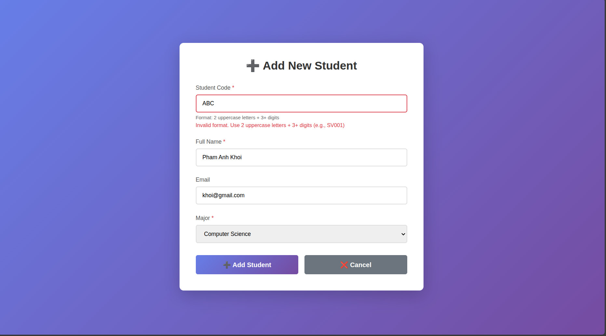

---
### EXERCISE 7: SORTING & FILTERING
#### Task 7.1: Add Sort & Filter Methods to DAO
**Code**
```java
public List<Student> getStudentsSorted(String sortBy, String order) {
    List<Student> students = new ArrayList<>();

    String safeSortBy = validateSortBy(sortBy);
    String safeOrder = validateOrder(order);

    String sql = "SELECT * FROM students ORDER BY " + safeSortBy + " " + safeOrder;

    try (Connection conn = getConnection();
            Statement stmt = conn.createStatement();
            ResultSet rs = stmt.executeQuery(sql)) {

        while (rs.next()) {
            students.add(mapRowToStudent(rs));
        }
    } catch (SQLException e) {
        e.printStackTrace();
    }
    return students;
}

public List<Student> getStudentsByMajor(String major) {
    List<Student> students = new ArrayList<>();
    String sql = "SELECT * FROM students WHERE major = ? ORDER BY id DESC";

    try (Connection conn = getConnection();
            PreparedStatement pstmt = conn.prepareStatement(sql)) {

        pstmt.setString(1, major);

        try (ResultSet rs = pstmt.executeQuery()) {
            while (rs.next()) {
                students.add(mapRowToStudent(rs));
            }
        }
    } catch (SQLException e) {
        e.printStackTrace();
    }
    return students;
}

public List<Student> getStudentsFilteredAndSorted(String major, String sortBy, String order) {
    List<Student> students = new ArrayList<>();

    // Validate sort parameters
    String safeSortBy = validateSortBy(sortBy);
    String safeOrder = validateOrder(order);

    // Use StringBuilder to dynamically build the query
    StringBuilder sql = new StringBuilder("SELECT * FROM students");
    List<Object> params = new ArrayList<>();

    // Add WHERE clause if major is provided
    if (major != null && !major.trim().isEmpty()) {
        sql.append(" WHERE major = ?");
        params.add(major);
    }

    // Add ORDER BY clause
    sql.append(" ORDER BY ").append(safeSortBy).append(" ").append(safeOrder);

    try (Connection conn = getConnection();
            PreparedStatement pstmt = conn.prepareStatement(sql.toString())) {

        if (!params.isEmpty()) {
            pstmt.setString(1, (String) params.get(0));
        }

        try (ResultSet rs = pstmt.executeQuery()) {
            while (rs.next()) {
                students.add(mapRowToStudent(rs));
            }
        }
    } catch (SQLException e) {
        e.printStackTrace();
    }
    return students;
}

private String validateSortBy(String sortBy) {
    if (sortBy == null || sortBy.trim().isEmpty()) {
        return "id";
    }
    List<String> validColumns = Arrays.asList("id", "student_code", "full_name", "email", "major");
    if (validColumns.contains(sortBy.toLowerCase())) {
        return sortBy;
    }
    return "id";
}


private String validateOrder(String order) {
    if ("desc".equalsIgnoreCase(order)) {
        return "DESC";
    }
    return "ASC";
}

private Student mapRowToStudent(ResultSet rs) throws SQLException {
    Student student = new Student();
    student.setId(rs.getInt("id"));
    student.setStudentCode(rs.getString("student_code"));
    student.setFullName(rs.getString("full_name"));
    student.setEmail(rs.getString("email"));
    student.setMajor(rs.getString("major"));
    student.setCreatedAt(rs.getTimestamp("created_at"));
    return student;
}
```
**Explain:**
- `getStudentsSorted`: This method builds a dynamic SQL `ORDER BY` clause. To prevent SQL Injection, it uses helper methods (`validateSortBy`, `validateOrder`) to ensure that the column name and sort order are from a safe, predefined list before concatenating them into the query.
- `getStudentsByMajor`: This method uses a `PreparedStatement` with a `WHERE` clause to securely filter students by their major.
- `getStudentsFilteredAndSorted`: The bonus method combines both functionalities. It uses a `StringBuilder` to conditionally add a `WHERE` clause if a major is provided, and then appends the validated `ORDER BY` clause. This allows for a single, powerful query method.

#### Task 7.2: 
**Code:**
```java
private void sortStudents(HttpServletRequest request, HttpServletResponse response)
        throws ServletException, IOException {

    // Get sort parameters from the request
    String sortBy = request.getParameter("sortBy");
    String order = request.getParameter("order");

    // Call the DAO method to get the sorted list
    List<Student> students = studentDAO.getStudentsSorted(sortBy, order);

    // Set attributes for the view
    // 'students' for the table data
    // 'sortBy' and 'order' to help the view indicate the current sort state
    request.setAttribute("students", students);
    request.setAttribute("sortBy", sortBy);
    request.setAttribute("order", order);

    // Forward to the list view
    RequestDispatcher dispatcher = request.getRequestDispatcher("./views/student-list.jsp");
    dispatcher.forward(request, response);
}

private void filterStudents(HttpServletRequest request, HttpServletResponse response)
        throws ServletException, IOException {

    // Get filter parameter from the request
    String major = request.getParameter("filterMajor");
    List<Student> students;

    // Decide which DAO method to call
    // If major is null or empty, it means "All Majors" was selected
    if (major != null && !major.isEmpty()) {
        students = studentDAO.getStudentsByMajor(major);
    } else {
        // If no major is selected, get all students
        students = studentDAO.getAllStudents();
    }

    // Set attributes for the view
    // 'students' for the table data
    // 'filterMajor' to keep the dropdown selected on the chosen major
    request.setAttribute("students", students);
    request.setAttribute("filterMajor", major);

    // Forward to the list view
    RequestDispatcher dispatcher = request.getRequestDispatcher("./views/student-list.jsp");
    dispatcher.forward(request, response);
}
```
**Explain:**
- `sortStudents`: This method retrieves the `sortBy` and `order` parameters from the request, calls the corresponding DAO method, and then sets the resulting student list as a request attribute. Crucially, it also sets the `sortBy` and `order` parameters back into the request so the view can display the current sorting state.
- `filterStudents`: This method gets the `filterMajor` parameter. If a major is selected, it calls the `getStudentsByMajor` DAO method. If not (i.e., "All Majors" is selected), it calls `getAllStudents`. It sets both the student list and the `filterMajor` value as request attributes to preserve the dropdown's selection on the view.
- Both methods finish by forwarding the request to `student-list.jsp` to display the updated data.

#### Task 7.3: Update View with Sort & Filter UI
**Filter:**

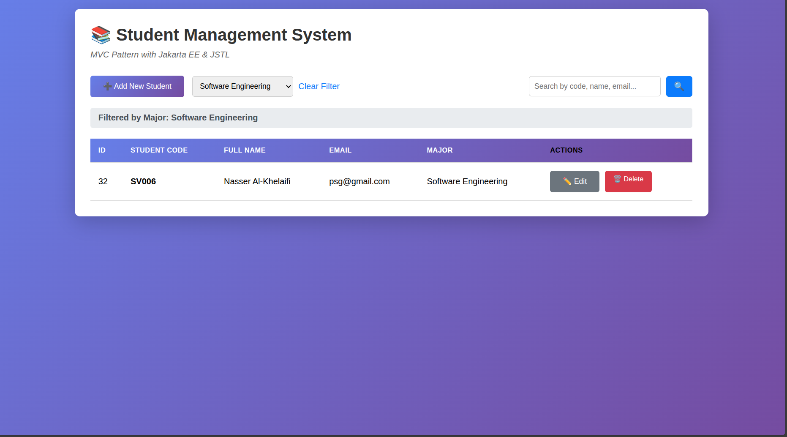

**Sort:**
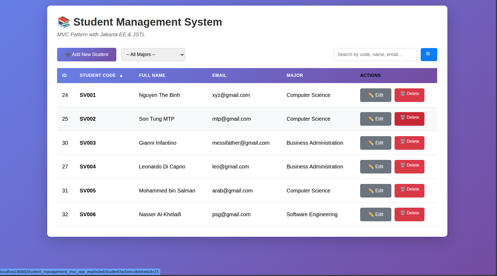
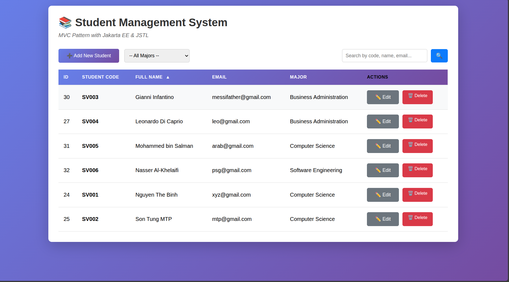

---
### EXERCISE 8: PAGINATION
#### Task 8.1: Add Pagination Methods to DAO
**Code:**
```java
public int getTotalStudents() {
    int count = 0;
    String sql = "SELECT COUNT(id) FROM students";

    try (Connection conn = getConnection();
            Statement stmt = conn.createStatement();
            ResultSet rs = stmt.executeQuery(sql)) {

        // The result set for a COUNT query will have one row.
        if (rs.next()) {
            // Get the count from the first column.
            count = rs.getInt(1);
        }
    } catch (SQLException e) {
        e.printStackTrace();
    }
    return count;
}

public List<Student> getStudentsPaginated(int offset, int limit) {
    List<Student> students = new ArrayList<>();
    // The SQL syntax for pagination in MySQL is LIMIT <limit> OFFSET <offset>
    String sql = "SELECT * FROM students ORDER BY id DESC LIMIT ? OFFSET ?";

    try (Connection conn = getConnection();
            PreparedStatement pstmt = conn.prepareStatement(sql)) {

        // Set the parameters for LIMIT and OFFSET
        pstmt.setInt(1, limit);
        pstmt.setInt(2, offset);

        try (ResultSet rs = pstmt.executeQuery()) {
            while (rs.next()) {
                // Reuse the existing helper method to map the row to a Student object
                students.add(mapRowToStudent(rs));
            }
        }
    } catch (SQLException e) {
        e.printStackTrace();
    }
    return students;
}
```
**Explain:**
- `getTotalStudents()` runs a `SELECT COUNT(*)` query to get the total number of students, necessary for calculating the total number of pages.
- `getStudentsPaginated()` fetches a specific subset of records (a "page") using a PreparedStatement with `LIMIT` and `OFFSET` clauses for efficient and secure data retrieval.

#### Task 8.2: Add Pagination Controller Logic
**Code:**
```java
private void listStudents(HttpServletRequest request, HttpServletResponse response)
        throws ServletException, IOException {
    // Define records per page
    int recordsPerPage = 10;

    // Get the current page number from the request parameter
    int currentPage = 1; // Default to page 1
    String pageParam = request.getParameter("page");
    if (pageParam != null) {
        try {
            currentPage = Integer.parseInt(pageParam);
        } catch (NumberFormatException e) {
            // If the parameter is not a valid number, default to page 1
            currentPage = 1;
        }
    }

    // Get total records to calculate total pages
    int totalRecords = studentDAO.getTotalStudents();
    int totalPages = (int) Math.ceil((double) totalRecords / recordsPerPage);

    // Handle edge cases for page numbers
    // Ensure currentPage is not less than 1
    if (currentPage < 1) {
        currentPage = 1;
    }
    // Ensure currentPage does not exceed totalPages (if there are any pages)
    if (totalPages > 0 && currentPage > totalPages) {
        currentPage = totalPages;
    }

    // Calculate the offset for the SQL query
    // The offset is the starting index for the records on the current page
    int offset = (currentPage - 1) * recordsPerPage;

    // Get the paginated list of students from the DAO
    List<Student> students = studentDAO.getStudentsPaginated(offset, recordsPerPage);

    // Set all necessary attributes for the view (JSP)
    request.setAttribute("students", students);
    request.setAttribute("currentPage", currentPage);
    request.setAttribute("totalPages", totalPages);

    // Forward the request to the view
    RequestDispatcher dispatcher = request.getRequestDispatcher("./views/student-list.jsp");
    dispatcher.forward(request, response);
}
```

**Explain:**
- The `listStudents()` method in the controller is updated to manage pagination logic.
- It reads the page parameter, calculates `totalPages` using the count from the DAO, and computes the offset for the database query.
- It calls the new `getStudentsPaginated()` DAO method to fetch only the students for the current page.
- Finally, it sets three essential attributes (`students, currentPage, totalPages`) for the JSP to use when rendering the pagination controls.

#### Task 8.3: Add Pagination Controls to View
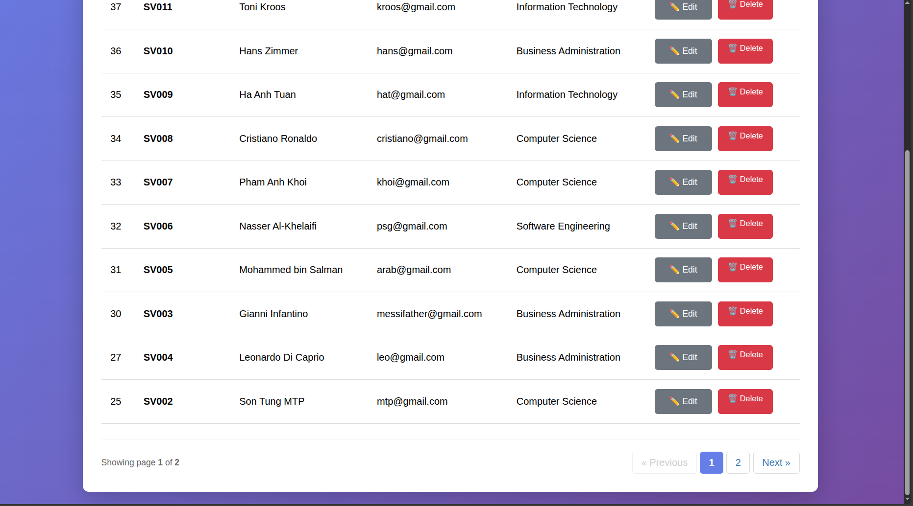

