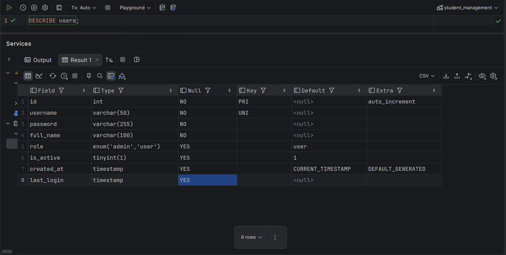
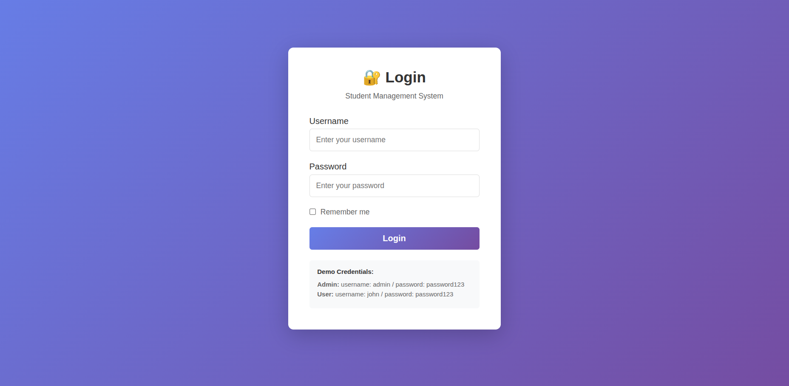
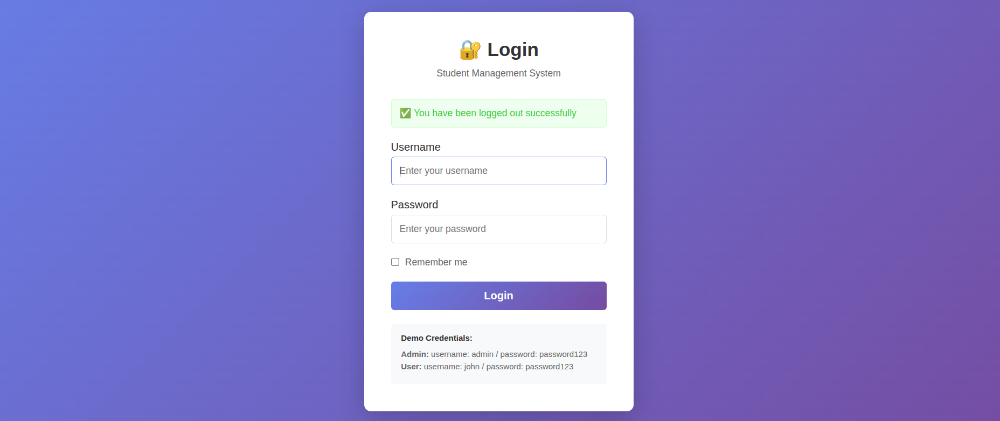
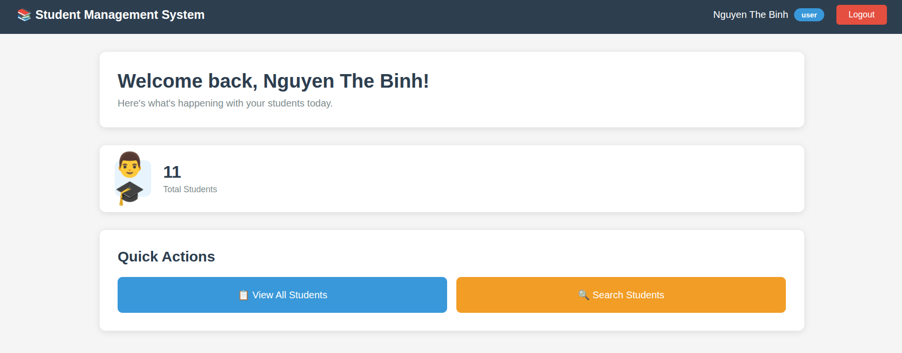
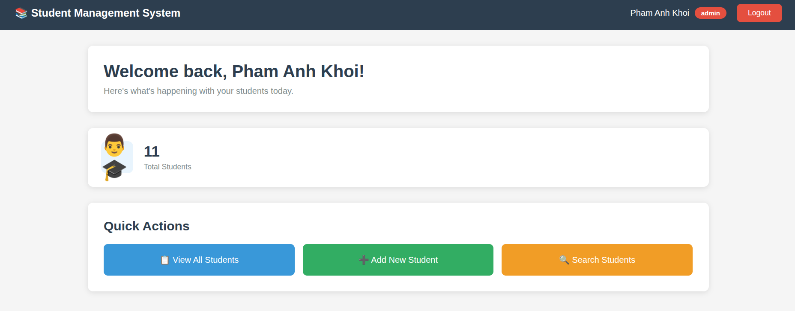
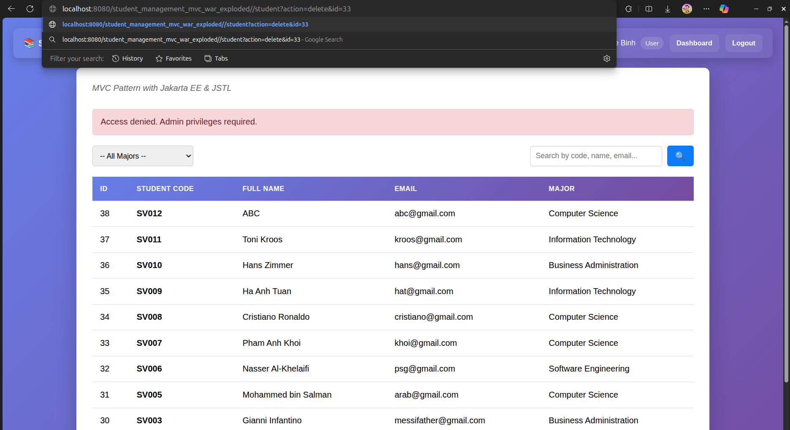
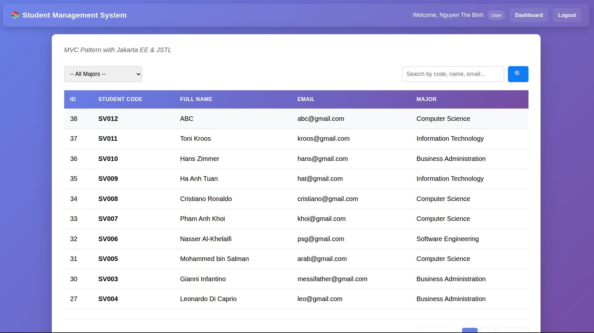
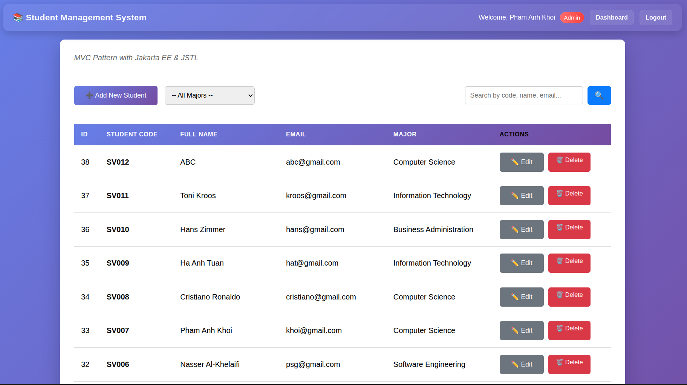
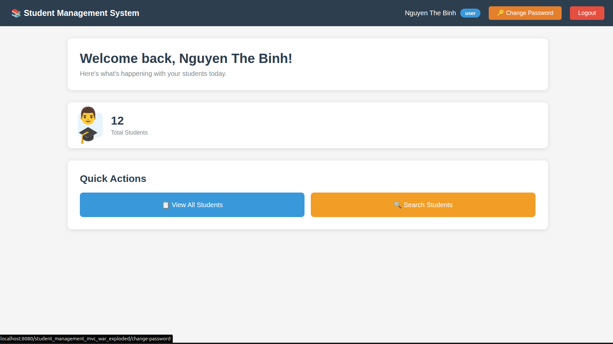

# LAB 6 : AUTHENTICATION & SESSION MANAGEMENT
## PART A: IN-CLASS EXERCISES
### EXERCISE 1: DATABASE & USER MODEL
#### Task 1.1: Create Users Table

Running the SQL statement:

```SQL
DESCRIBE users;
```


#### Task 1.2: Generate Hashed Passwords & Task 1.3: Insert Test Users

```java
package util;

import org.mindrot.jbcrypt.BCrypt;

public class PasswordHashGenerator {
    
    public static void main(String[] args) {
        String plainPassword = "password123";
        
        // Generate hash
        String hashedPassword = BCrypt.hashpw(plainPassword, BCrypt.gensalt());
        
        System.out.println("Plain Password: " + plainPassword);
        System.out.println("Hashed Password: " + hashedPassword);
        System.out.println("\nCopy the hashed password to your INSERT statement");
        
        // Test verification
        boolean matches = BCrypt.checkpw(plainPassword, hashedPassword);
        System.out.println("\nVerification test: " + matches);
    }
}
```

I have created the main function to create new users, and I will use this instead of using the password hash generator and the sql insert statement. (`java/CreateUser.java`)
```java
import com.student.dao.UserDAO;
import com.student.model.User;

public class CreateUser {
    public static void main(String[] args) {
        User newAdmin = new User(
            "khoi",
                "123",
                "Pham Anh Khoi",
                "admin"
        );

        UserDAO userDAO = new UserDAO();
        userDAO.createUser(newAdmin);

        User newUser = new User(
                "binh",
                "123",
                "Nguyen The Binh",
                "user"
        );

        userDAO.createUser(newUser);
    }
}
```
---
### EXERCISE 2: USER MODEL & DAO 
#### Task 2.1: Create User Model 

`com.student.model.User.java`: Define model for User, declare attributes that associate with the table in the database and setter getter methods to read and update them.
```java
package com.student.model;

import java.sql.Timestamp;

public class User {
    private int id;
    private String username;
    private String password;
    private String fullName;
    private String role;
    private boolean isActive;
    private Timestamp createdAt;
    private Timestamp lastLogin;

    // Constructors
    public User() {
    }

    public User(String username, String password, String fullName, String role) {
        this.username = username;
        this.password = password;
        this.fullName = fullName;
        this.role = role;
    }

    // Getters and Setters
    public int getId() {
        return id;
    }

    public void setId(int id) {
        this.id = id;
    }

    public String getUsername() {
        return username;
    }

    public void setUsername(String username) {
        this.username = username;
    }

    public String getPassword() {
        return password;
    }

    public void setPassword(String password) {
        this.password = password;
    }

    public String getFullName() {
        return fullName;
    }

    public void setFullName(String fullName) {
        this.fullName = fullName;
    }

    public String getRole() {
        return role;
    }

    public void setRole(String role) {
        this.role = role;
    }

    public boolean isActive() {
        return isActive;
    }

    public void setActive(boolean active) {
        isActive = active;
    }

    public Timestamp getCreatedAt() {
        return createdAt;
    }

    public void setCreatedAt(Timestamp createdAt) {
        this.createdAt = createdAt;
    }

    public Timestamp getLastLogin() {
        return lastLogin;
    }

    public void setLastLogin(Timestamp lastLogin) {
        this.lastLogin = lastLogin;
    }

    // Utility methods
    public boolean isAdmin() {
        return "admin".equalsIgnoreCase(this.role);
    }

    public boolean isUser() {
        return "user".equalsIgnoreCase(this.role);
    }

    @Override
    public String toString() {
        return "User{" +
                "id=" + id +
                ", username='" + username + '\'' +
                ", fullName='" + fullName + '\'' +
                ", role='" + role + '\'' +
                ", isActive=" + isActive +
                '}';
    }
}
```

#### Task 2.2: Create UserDAO

`com.student.dao.UserDAO`: This class manages all database operations for User objects using JDBC and SQL prepared statements.

- authenticate(username, password) → Verifies active user, checks password with BCrypt, then updates last_login.
- updateLastLogin(userId) → Sets last_login to current time (NOW()) for the given user.
- getUserById(id) → Retrieves user record based on ID.
- getUserByUsername(username) → Retrieves user record based on username.
- createUser(User) → Inserts a new user with a hashed password.

SQL queries are defined using parameterized placeholders (?) and values are safely assigned via PreparedStatement.setX(...), helping avoid SQL injection and improving query execution.

```java
package com.student.dao;

import com.student.model.User;
import org.mindrot.jbcrypt.BCrypt;

import java.sql.*;

public class UserDAO {

    private static final String DB_URL = "jdbc:mysql://localhost:3306/student_management";
    private static final String DB_USER = "root";
    private static final String DB_PASSWORD = "khoi";

    // SQL Queries
    private static final String SQL_AUTHENTICATE =
            "SELECT * FROM users WHERE username = ? AND is_active = TRUE";

    private static final String SQL_UPDATE_LAST_LOGIN =
            "UPDATE users SET last_login = NOW() WHERE id = ?";

    private static final String SQL_GET_BY_ID =
            "SELECT * FROM users WHERE id = ?";

    private static final String SQL_GET_BY_USERNAME =
            "SELECT * FROM users WHERE username = ?";

    private static final String SQL_INSERT =
            "INSERT INTO users (username, password, full_name, role) VALUES (?, ?, ?, ?)";

    // Get database connection
    private Connection getConnection() throws SQLException {
        try {
            Class.forName("com.mysql.cj.jdbc.Driver");
            return DriverManager.getConnection(DB_URL, DB_USER, DB_PASSWORD);
        } catch (ClassNotFoundException e) {
            throw new SQLException("MySQL Driver not found", e);
        }
    }

    /**
     * Authenticate user with username and password
     * @return User object if authentication successful, null otherwise
     */
    public User authenticate(String username, String password) {
        User user = null;

        try (Connection conn = getConnection();
             PreparedStatement pstmt = conn.prepareStatement(SQL_AUTHENTICATE)) {

            pstmt.setString(1, username);

            try (ResultSet rs = pstmt.executeQuery()) {
                if (rs.next()) {
                    String hashedPassword = rs.getString("password");

                    // Verify password with BCrypt
                    if (BCrypt.checkpw(password, hashedPassword)) {
                        user = mapResultSetToUser(rs);

                        // Update last login time
                        updateLastLogin(user.getId());
                    }
                }
            }

        } catch (SQLException e) {
            e.printStackTrace();
        }

        return user;
    }

    /**
     * Update user's last login timestamp
     */
    private void updateLastLogin(int userId) {
        try (Connection conn = getConnection();
             PreparedStatement pstmt = conn.prepareStatement(SQL_UPDATE_LAST_LOGIN)) {

            pstmt.setInt(1, userId);
            pstmt.executeUpdate();

        } catch (SQLException e) {
            e.printStackTrace();
        }
    }

    /**
     * Get user by ID
     */
    public User getUserById(int id) {
        User user = null;

        try (Connection conn = getConnection();
             PreparedStatement pstmt = conn.prepareStatement(SQL_GET_BY_ID)) {

            pstmt.setInt(1, id);

            try (ResultSet rs = pstmt.executeQuery()) {
                if (rs.next()) {
                    user = mapResultSetToUser(rs);
                }
            }

        } catch (SQLException e) {
            e.printStackTrace();
        }

        return user;
    }

    /**
     * Get user by username
     */
    public User getUserByUsername(String username) {
        User user = null;

        try (Connection conn = getConnection();
             PreparedStatement pstmt = conn.prepareStatement(SQL_GET_BY_USERNAME)) {

            pstmt.setString(1, username);

            try (ResultSet rs = pstmt.executeQuery()) {
                if (rs.next()) {
                    user = mapResultSetToUser(rs);
                }
            }

        } catch (SQLException e) {
            e.printStackTrace();
        }

        return user;
    }

    /**
     * Create new user with hashed password
     */
    public boolean createUser(User user) {
        try (Connection conn = getConnection();
             PreparedStatement pstmt = conn.prepareStatement(SQL_INSERT)) {

            // Hash password before storing
            String hashedPassword = BCrypt.hashpw(user.getPassword(), BCrypt.gensalt());

            pstmt.setString(1, user.getUsername());
            pstmt.setString(2, hashedPassword);
            pstmt.setString(3, user.getFullName());
            pstmt.setString(4, user.getRole());

            int rowsAffected = pstmt.executeUpdate();
            return rowsAffected > 0;

        } catch (SQLException e) {
            e.printStackTrace();
            return false;
        }
    }

    /**
     * Map ResultSet to User object
     */
    private User mapResultSetToUser(ResultSet rs) throws SQLException {
        User user = new User();
        user.setId(rs.getInt("id"));
        user.setUsername(rs.getString("username"));
        user.setPassword(rs.getString("password"));
        user.setFullName(rs.getString("full_name"));
        user.setRole(rs.getString("role"));
        user.setActive(rs.getBoolean("is_active"));
        user.setCreatedAt(rs.getTimestamp("created_at"));
        user.setLastLogin(rs.getTimestamp("last_login"));
        return user;
    }

    /**
     * Test method - Generate hashed password
     */
    public static void main(String[] args) {
        // Generate hash for "password123"
        String plainPassword = "password123";
        String hashedPassword = BCrypt.hashpw(plainPassword, BCrypt.gensalt());
        System.out.println("Plain: " + plainPassword);
        System.out.println("Hashed: " + hashedPassword);

        // Test verification
        boolean matches = BCrypt.checkpw(plainPassword, hashedPassword);
        System.out.println("Verification: " + matches);
    }
}
```

---
### EXERCISE 3: LOGIN/LOGOUT CONTROLLERS
#### Task 3.1: Create Login Controller

`com.student.controller.LoginController.java`: Handles login requests using HTTP GET and POST.

- `doGet()` → If user already logged in, redirect to dashboard. Otherwise, display login page.
- `doPost()` → Reads username/password, validates input, calls `UserDAO.authenticate()` to verify login.
  - If authentication succeeds:
    - Invalidates previous session to prevent session fixation.
    - Creates new session and stores user details (`user`, `role`, `fullName`).
    - Sets session timeout (30 minutes) and handles "remember me" (planned via cookie).
    - Redirects to different pages based on role (`dashboard` for admin, `student?action=list` for normal users).
  - If authentication fails:
    - Returns to login page with error message and preserves username.

```java
package com.student.controller;

import com.student.dao.UserDAO;
import com.student.model.User;

import jakarta.servlet.ServletException;
import jakarta.servlet.annotation.WebServlet;
import jakarta.servlet.http.HttpServlet;
import jakarta.servlet.http.HttpServletRequest;
import jakarta.servlet.http.HttpServletResponse;
import jakarta.servlet.http.HttpSession;
import java.io.IOException;

@WebServlet("/login")
public class LoginController extends HttpServlet {

    private UserDAO userDAO;

    @Override
    public void init() {
        userDAO = new UserDAO();
    }

    /**
     * Display login page
     */
    @Override
    protected void doGet(HttpServletRequest request, HttpServletResponse response)
            throws ServletException, IOException {

        // If already logged in, redirect to dashboard
        HttpSession session = request.getSession(false);
        if (session != null && session.getAttribute("user") != null) {
            response.sendRedirect("dashboard");
            return;
        }

        // Show login page
        request.getRequestDispatcher("/views/login.jsp").forward(request, response);
    }

    /**
     * Process login form
     */
    @Override
    protected void doPost(HttpServletRequest request, HttpServletResponse response)
            throws ServletException, IOException {

        String username = request.getParameter("username");
        String password = request.getParameter("password");
        String rememberMe = request.getParameter("remember");

        // Validate input
        if (username == null || username.trim().isEmpty() ||
                password == null || password.trim().isEmpty()) {

            request.setAttribute("error", "Username and password are required");
            request.getRequestDispatcher("/views/login.jsp").forward(request, response);
            return;
        }

        // Authenticate user
        User user = userDAO.authenticate(username, password);

        if (user != null) {
            // Authentication successful

            // Invalidate old session (prevent session fixation)
            HttpSession oldSession = request.getSession(false);
            if (oldSession != null) {
                oldSession.invalidate();
            }

            // Create new session
            HttpSession session = request.getSession(true);
            session.setAttribute("user", user);
            session.setAttribute("role", user.getRole());
            session.setAttribute("fullName", user.getFullName());

            // Set session timeout (30 minutes)
            session.setMaxInactiveInterval(30 * 60);

            // Handle "Remember Me" (optional - cookie implementation)
            if ("on".equals(rememberMe)) {
                // TODO: Implement remember me functionality with cookie
            }

            // Redirect based on role
            if (user.isAdmin()) {
                response.sendRedirect("dashboard");
            } else {
                response.sendRedirect("student?action=list");
            }

        } else {
            // Authentication failed
            request.setAttribute("error", "Invalid username or password");
            request.setAttribute("username", username); // Keep username in form
            request.getRequestDispatcher("/views/login.jsp").forward(request, response);
        }
    }
}
```

#### Task 3.2: Create Logout Controller

`com.student.controller.LogoutController.java`: Handle request and logics to log the user out of the system.

```java
package com.student.controller;

import jakarta.servlet.ServletException;
import jakarta.servlet.annotation.WebServlet;
import jakarta.servlet.http.HttpServlet;
import jakarta.servlet.http.HttpServletRequest;
import jakarta.servlet.http.HttpServletResponse;
import jakarta.servlet.http.HttpSession;
import java.io.IOException;

@WebServlet("/logout")
public class LogoutController extends HttpServlet {

    @Override
    protected void doGet(HttpServletRequest request, HttpServletResponse response)
            throws ServletException, IOException {

        // Get current session
        HttpSession session = request.getSession(false);

        if (session != null) {
            // Invalidate session
            session.invalidate();
        }

        // Redirect to login page with message
        response.sendRedirect("login?message=You have been logged out successfully");
    }

    @Override
    protected void doPost(HttpServletRequest request, HttpServletResponse response)
            throws ServletException, IOException {
        doGet(request, response);
    }Task 4.2: Create Dashboard
}
```

---
### EXERCISE 4: VIEWS & DASHBOARD
#### Task 4.1: Create Login View

`webapp.views.login.jsp`

```html
<%@ page language="java" contentType="text/html; charset=UTF-8" pageEncoding="UTF-8"%>
<%@ taglib uri="http://java.sun.com/jsp/jstl/core" prefix="c" %>
<!DOCTYPE html>
<html>
<head>
    <meta charset="UTF-8">
    <meta name="viewport" content="width=device-width, initial-scale=1.0">
    <title>Login - Student Management System</title>
    <style>
        * {
            margin: 0;
            padding: 0;
            box-sizing: border-box;
        }

        body {
            font-family: 'Segoe UI', Tahoma, Geneva, Verdana, sans-serif;
            background: linear-gradient(135deg, #667eea 0%, #764ba2 100%);
            min-height: 100vh;
            display: flex;
            justify-content: center;
            align-items: center;
        }

        .login-container {
            background: white;
            padding: 40px;
            border-radius: 10px;
            box-shadow: 0 10px 40px rgba(0,0,0,0.2);
            width: 100%;
            max-width: 400px;
        }

        .login-header {
            text-align: center;
            margin-bottom: 30px;
        }

        .login-header h1 {
            color: #333;
            font-size: 28px;
            margin-bottom: 10px;
        }

        .login-header p {
            color: #666;
            font-size: 14px;
        }

        .form-group {
            margin-bottom: 20px;
        }

        .form-group label {
            display: block;
            margin-bottom: 5px;
            color: #333;
            font-weight: 500;
        }

        .form-group input[type="text"],
        .form-group input[type="password"] {
            width: 100%;
            padding: 12px;
            border: 1px solid #ddd;
            border-radius: 5px;
            font-size: 14px;
            transition: border-color 0.3s;
        }

        .form-group input:focus {
            outline: none;
            border-color: #667eea;
        }

        .remember-me {
            display: flex;
            align-items: center;
            margin-bottom: 20px;
        }

        .remember-me input {
            margin-right: 8px;
        }

        .remember-me label {
            color: #666;
            font-size: 14px;
        }

        .btn-login {
            width: 100%;
            padding: 12px;
            background: linear-gradient(135deg, #667eea 0%, #764ba2 100%);
            color: white;
            border: none;
            border-radius: 5px;
            font-size: 16px;
            font-weight: 600;
            cursor: pointer;
            transition: transform 0.2s;
        }

        .btn-login:hover {
            transform: translateY(-2px);
        }

        .alert {
            padding: 12px;
            border-radius: 5px;
            margin-bottom: 20px;
            font-size: 14px;
        }

        .alert-error {
            background: #fee;
            color: #c33;
            border: 1px solid #fcc;
        }

        .alert-success {
            background: #efe;
            color: #3c3;
            border: 1px solid #cfc;
        }

        .demo-credentials {
            margin-top: 20px;
            padding: 15px;
            background: #f8f9fa;
            border-radius: 5px;
            font-size: 12px;
        }

        .demo-credentials h4 {
            margin-bottom: 10px;
            color: #333;
        }

        .demo-credentials p {
            margin: 5px 0;
            color: #666;
        }
    </style>
</head>
<body>
<div class="login-container">
    <div class="login-header">
        <h1>🔐 Login</h1>
        <p>Student Management System</p>
    </div>

    <!-- Error Message -->
    <c:if test="${not empty error}">
        <div class="alert alert-error">
            ❌ ${error}
        </div>
    </c:if>

    <!-- Success Message -->
    <c:if test="${not empty param.message}">
        <div class="alert alert-success">
            ✅ ${param.message}
        </div>
    </c:if>

    <!-- Login Form -->
    <form action="login" method="post">
        <div class="form-group">
            <label for="username">Username</label>
            <input type="text"
                   id="username"
                   name="username"
                   value="${username}"
                   placeholder="Enter your username"
                   required
                   autofocus>
        </div>

        <div class="form-group">
            <label for="password">Password</label>
            <input type="password"
                   id="password"
                   name="password"
                   placeholder="Enter your password"
                   required>
        </div>

        <div class="remember-me">
            <input type="checkbox" id="remember" name="remember">
            <label for="remember">Remember me</label>
        </div>

        <button type="submit" class="btn-login">Login</button>
    </form>

    <!-- Demo Credentials -->
    <div class="demo-credentials">
        <h4>Demo Credentials:</h4>
        <p><strong>Admin:</strong> username: admin / password: password123</p>
        <p><strong>User:</strong> username: john / password: password123</p>
    </div>
</div>
</body>
</html>
```

**Result**



#### Task 4.2: Create Dashboard

`webapp.views.dashboard.jsp`

```html
<%@ page language="java" contentType="text/html; charset=UTF-8" pageEncoding="UTF-8"%>
<%@ taglib uri="http://java.sun.com/jsp/jstl/core" prefix="c" %>
<!DOCTYPE html>
<html>
<head>
    <meta charset="UTF-8">
    <title>Dashboard</title>
    <style>
        * {
            margin: 0;
            padding: 0;
            box-sizing: border-box;
        }

        body {
            font-family: 'Segoe UI', Tahoma, Geneva, Verdana, sans-serif;
            background: #f5f5f5;
        }

        .navbar {
            background: #2c3e50;
            color: white;
            padding: 15px 30px;
            display: flex;
            justify-content: space-between;
            align-items: center;
        }

        .navbar h2 {
            font-size: 20px;
        }

        .navbar-right {
            display: flex;
            align-items: center;
            gap: 20px;
        }

        .user-info {
            display: flex;
            align-items: center;
            gap: 10px;
        }

        .role-badge {
            padding: 4px 12px;
            border-radius: 12px;
            font-size: 12px;
            font-weight: 600;
        }

        .role-admin {
            background: #e74c3c;
        }

        .role-user {
            background: #3498db;
        }

        .btn-logout {
            padding: 8px 20px;
            background: #e74c3c;
            color: white;
            text-decoration: none;
            border-radius: 5px;
            font-size: 14px;
            transition: background 0.3s;
        }

        .btn-logout:hover {
            background: #c0392b;
        }

        .container {
            max-width: 1200px;
            margin: 30px auto;
            padding: 0 20px;
        }

        .welcome-card {
            background: white;
            padding: 30px;
            border-radius: 10px;
            box-shadow: 0 2px 10px rgba(0,0,0,0.1);
            margin-bottom: 30px;
        }

        .welcome-card h1 {
            color: #2c3e50;
            margin-bottom: 10px;
        }

        .welcome-card p {
            color: #7f8c8d;
        }

        .stats-grid {
            display: grid;
            grid-template-columns: repeat(auto-fit, minmax(250px, 1fr));
            gap: 20px;
            margin-bottom: 30px;
        }

        .stat-card {
            background: white;
            padding: 25px;
            border-radius: 10px;
            box-shadow: 0 2px 10px rgba(0,0,0,0.1);
            display: flex;
            align-items: center;
            gap: 20px;
        }

        .stat-icon {
            font-size: 40px;
            width: 60px;
            height: 60px;
            display: flex;
            align-items: center;
            justify-content: center;
            border-radius: 10px;
        }

        .stat-icon-students {
            background: #e8f4fd;
        }

        .stat-content h3 {
            font-size: 28px;
            color: #2c3e50;
            margin-bottom: 5px;
        }

        .stat-content p {
            color: #7f8c8d;
            font-size: 14px;
        }

        .quick-actions {
            background: white;
            padding: 30px;
            border-radius: 10px;
            box-shadow: 0 2px 10px rgba(0,0,0,0.1);
        }

        .quick-actions h2 {
            color: #2c3e50;
            margin-bottom: 20px;
        }

        .action-grid {
            display: grid;
            grid-template-columns: repeat(auto-fit, minmax(200px, 1fr));
            gap: 15px;
        }

        .action-btn {
            padding: 20px;
            background: #3498db;
            color: white;
            text-decoration: none;
            border-radius: 8px;
            text-align: center;
            transition: all 0.3s;
            display: block;
        }

        .action-btn:hover {
            background: #2980b9;
            transform: translateY(-2px);
        }

        .action-btn-primary {
            background: #3498db;
        }

        .action-btn-success {
            background: #27ae60;
        }

        .action-btn-warning {
            background: #f39c12;
        }
    </style>
</head>
<body>
<!-- Navigation Bar -->
<div class="navbar">
    <h2>📚 Student Management System</h2>
    <div class="navbar-right">
        <div class="user-info">
            <span>${sessionScope.fullName}</span>
            <span class="role-badge role-${sessionScope.role}">
                ${sessionScope.role}
            </span>
        </div>
        <a href="logout" class="btn-logout">Logout</a>
    </div>
</div>

<!-- Main Content -->
<div class="container">
    <!-- Welcome Card -->
    <div class="welcome-card">
        <h1>${welcomeMessage}</h1>
        <p>Here's what's happening with your students today.</p>
    </div>

    <!-- Statistics -->
    <div class="stats-grid">
        <div class="stat-card">
            <div class="stat-icon stat-icon-students">
                👨🎓
            </div>
            <div class="stat-content">
                <h3>${totalStudents}</h3>
                <p>Total Students</p>
            </div>
        </div>
    </div>

    <!-- Quick Actions -->
    <div class="quick-actions">
        <h2>Quick Actions</h2>
        <div class="action-grid">
            <a href="student?action=list" class="action-btn action-btn-primary">
                📋 View All Students
            </a>

            <c:if test="${sessionScope.role eq 'admin'}">
                <a href="student?action=new" class="action-btn action-btn-success">
                    ➕ Add New Student
                </a>
            </c:if>

            <a href="student?action=search" class="action-btn action-btn-warning">
                🔍 Search Students
            </a>
        </div>
    </div>
</div>
</body>
</html>
```

**Result**



---
## PART B: HOMEWORK EXERCISES
### EXERCISE 5: AUTHENTICATION FILTER

`java/filter/AuthFilter.java`: a Servlet Filter responsible for intercepting all incoming HTTP requests to ensure that a user is authenticated (logged in) before they can access protected resources. This is a crucial security layer.

The filter is mapped to all URL patterns (/*) using the @WebFilter annotation, meaning it processes every request to the application.

```java
package filter;

import jakarta.servlet.*;
import jakarta.servlet.annotation.WebFilter;
import jakarta.servlet.http.HttpServletRequest;
import jakarta.servlet.http.HttpServletResponse;
import jakarta.servlet.http.HttpSession;
import java.io.IOException;

/**
 * Authentication Filter - Checks if user is logged in
 * Protects all pages except login and public resources
 */
@WebFilter(filterName = "AuthFilter", urlPatterns = {"/*"})
public class AuthFilter implements Filter {

    // Public URLs that don't require authentication
    private static final String[] PUBLIC_URLS = {
            "/login",
            "/logout",
            ".css",
            ".js",
            ".png",
            ".jpg",
            ".jpeg",
            ".gif"
    };

    @Override
    public void init(FilterConfig filterConfig) throws ServletException {
        System.out.println("AuthFilter initialized");
    }

    @Override
    public void doFilter(ServletRequest request, ServletResponse response, FilterChain chain)
            throws IOException, ServletException {

        HttpServletRequest httpRequest = (HttpServletRequest) request;
        HttpServletResponse httpResponse = (HttpServletResponse) response;

        String requestURI = httpRequest.getRequestURI();
        String contextPath = httpRequest.getContextPath();
        String path = requestURI.substring(contextPath.length());

        // Check if this is a public URL
        if (isPublicUrl(path)) {
            // Allow access to public URLs
            chain.doFilter(request, response);
            return;
        }

        // Check if user is logged in
        HttpSession session = httpRequest.getSession(false);
        boolean isLoggedIn = (session != null && session.getAttribute("user") != null);

        if (isLoggedIn) {
            // User is logged in, allow access
            chain.doFilter(request, response);
        } else {
            // User not logged in, redirect to login
            String loginURL = contextPath + "/login";
            httpResponse.sendRedirect(loginURL);
        }
    }

    @Override
    public void destroy() {
        System.out.println("AuthFilter destroyed");
    }

    /**
     * Check if URL is public (doesn't require authentication)
     */
    private boolean isPublicUrl(String path) {
        for (String publicUrl : PUBLIC_URLS) {
            if (path.contains(publicUrl)) {
                return true;
            }
        }
        return false;
    }
}
```

The `AuthFilter` ensures that users are authenticated before they access protected parts of the application. It acts as a gateway for all requests.

- Filter Initialization and Mapping:

    + The `@WebFilter(urlPatterns = {"/*"})` annotation tells the Servlet container to apply this filter to every request path in the web application.
    + The `init()` method is called once when the filter is first loaded, typically logging its initialization.

- Request Interception (`doFilter`):

    + Casting: The generic `ServletRequest` and `ServletResponse` are cast to their HTTP-specific types (`HttpServletRequest`, `HttpServletResponse`) to access session and redirection methods.
    + Path Extraction: It extracts the relevant request path (`path`) by removing the application's context path. For example, if the full request is `/student-app/dashboard`, and the context path is `/student-app`, the extracted path is `/dashboard`.
    + Public URL Check: The `isPublicUrl(path)` method checks the extracted path against a list of exceptions (`PUBLIC_URLS`), which includes the login page (`/login`), logout page (`/logout`), and static resources (`.css`, `.js`, image files).
        * Interaction: If the URL is public, the request is immediately passed to the next component in the chain (`chain.doFilter(request, response)`), allowing unauthenticated access to these resources.
    + Authentication Check:
        * If the URL is not public, the filter checks for an existing session using `httpRequest.getSession(false)`. The `false` argument is crucial: it retrieves an existing `HttpSession` but does not create a new one if none exists.
        * It then checks if the session exists and if the `user` attribute (set during a successful login) is present.
    + Access Control and Redirection:
        * Authenticated: If `isLoggedIn` is true, the user is authenticated, and the request is allowed to proceed to the intended target (e.g., a Servlet or JSP) via `chain.doFilter()`.
        * Not Authenticated: If `isLoggedIn` is false, the user is redirected to the login page (`httpResponse.sendRedirect(loginURL)`), preventing access to the protected resource.

### EXERCISE 6: ADMIN AUTHORIZATION FILTER

`java/filter/AdminFilter.java`: a Servlet Filter responsible for authorization, specifically checking if an authenticated user possesses the admin role before allowing access to privileged actions.

The filter is selectively mapped to the `/student` URL pattern using the @WebFilter annotation because this is the controller handling all Student Management actions (which include both public and admin-only actions).

```java
package filter;

import com.student.model.User;

import jakarta.servlet.*;
import jakarta.servlet.annotation.WebFilter;
import jakarta.servlet.http.HttpServletRequest;
import jakarta.servlet.http.HttpServletResponse;
import jakarta.servlet.http.HttpSession;
import java.io.IOException;

/**
 * Admin Filter - Checks if user has admin role
 * Protects admin-only pages
 */
@WebFilter(filterName = "AdminFilter", urlPatterns = {"/student"})
public class AdminFilter implements Filter {

    // Admin-only actions (Create, Update, Delete)
    private static final String[] ADMIN_ACTIONS = {
            "new", // Display form to create new student
            "insert", // Save new student data
            "edit", // Display form to edit student
            "update", // Save updated student data
            "delete" // Remove student record
    };

    @Override
    public void init(FilterConfig filterConfig) throws ServletException {
        System.out.println("AdminFilter initialized");
    }

    @Override
    public void doFilter(ServletRequest request, ServletResponse response, FilterChain chain)
            throws IOException, ServletException {

        HttpServletRequest httpRequest = (HttpServletRequest) request;
        HttpServletResponse httpResponse = (HttpServletResponse) response;

        // 1. Get the action parameter
        String action = httpRequest.getParameter("action");

        // 2. Check if this action requires admin role
        if (isAdminAction(action)) {
            HttpSession session = httpRequest.getSession(false);

            if (session != null) {
                User user = (User) session.getAttribute("user");

                if (user != null && user.isAdmin()) {
                    // User is admin, allow access to admin action
                    chain.doFilter(request, response);
                } else {
                    // User is NOT admin, deny access and redirect
                    httpResponse.sendRedirect(httpRequest.getContextPath() +
                            "/student?action=list&error=Access denied. Admin privileges required.");
                }
            } else {
                // No session found, redirect to login (AuthFilter should already catch this)
                httpResponse.sendRedirect(httpRequest.getContextPath() + "/login");
            }
        } else {
            // Not an admin action (e.g., "list" or "view"), allow access
            chain.doFilter(request, response);
        }
    }

    @Override
    public void destroy() {
        System.out.println("AdminFilter destroyed");
    }

    /**
     * Check if action requires admin role
     */
    private boolean isAdminAction(String action) {
        if (action == null) return false;

        for (String adminAction : ADMIN_ACTIONS) {
            if (adminAction.equals(action)) {
                return true;
            }
        }
        return false;
    }
}
```

The AdminFilter enforces role-based access control, preventing users without the necessary permissions (i.e., non-admins) from performing sensitive operations like creating, updating, or deleting student records.

This filter provides an authorization layer on top of the existing authentication layer provided by AuthFilter.

- Filter Scope:
    + The filter is mapped exclusively to the `/student` URL. It only activates when a request hits the Student Controller.
- Admin Action Identification:
    + The doFilter method first extracts the action parameter from the HTTP request (e.g., `?action=delete`).
    + The isAdminAction(action) method checks if the requested action is one of the predefined CRUD operations (new, insert, edit, update, delete). If the action is not admin-related (like list), the filter immediately passes the request to the chain.
- Role Verification (Authorization Check):
    + If the action is admin-related, the filter attempts to retrieve the existing session using `httpRequest.getSession(false)`.
    + It casts the user attribute from the session back to a User object.
    + It calls `user.isAdmin()` to check the user's role.
- Access Control:
    + Authorized (Admin): If the User object exists and `user.isAdmin()` returns true, the request is allowed to continue to the Student Controller to execute the admin action (`chain.doFilter`).
    + Unauthorized (Non-Admin): If the user is logged in but `user.isAdmin()` is false, access is denied. The user is redirected back to the safe, public list page (`/student?action=list`) with an error message appended to the URL, informing them that admin privileges are required.
    + No Session: If no session is found, the user is redirected to `/login` (though this case is largely redundant, as AuthFilter should have caught it first).

This ensures that even if a regular user knows the URL structure for an admin action (e.g., `/student?action=delete`), the filter will block the request based on their assigned role.

**Testing:** Try to delete student using regular user account


---
### EXERCISE 7: ROLE-BASED UI

`webapp/views/student-list.jsp`

```html
<body>
    <div class="navbar">
    <h2>📚 Student Management System</h2>
    <div class="navbar-right">
        <div class="user-info">
            <span>Welcome, ${sessionScope.fullName}</span>
            <span class="role-badge role-${sessionScope.role}">
                ${sessionScope.role}
            </span>
        </div>
        <a href="dashboard">Dashboard</a>
        <a href="logout">Logout</a>
    </div>
    </div>
    
    <div class="container">
    <p class="subtitle">MVC Pattern with Jakarta EE & JSTL</p>
    
    <c:if test="${not empty param.message}">
        <div class="message success">✅ ${param.message}</div>
    </c:if>
    
    <c:if test="${not empty param.error}">
        <div class="alert alert-error">
            ${param.error}
        </div>
    </c:if>
    
    <div class="controls-container">
        <div class="controls-left">
            <!-- TODO: Add button - Admin only -->
            <c:if test="${sessionScope.role eq 'admin'}">
                <div style="margin: 20px 0;">
                    <a href="student?action=new" class="btn-add btn btn-primary">➕ Add New Student</a>
                </div>
            </c:if>
            <form action="student" method="get" class="filter-form">
                <input type="hidden" name="action" value="filter">
                <select name="filterMajor" class="filter-select" onchange="this.form.submit()">
                    <option value="">-- All Majors --</option>
                    <option value="Computer Science" ${filterMajor == 'Computer Science' ? 'selected' : ''}>Computer Science</option>
                    <option value="Information Technology" ${filterMajor == 'Information Technology' ? 'selected' : ''}>Information Technology</option>
                    <option value="Software Engineering" ${filterMajor == 'Software Engineering' ? 'selected' : ''}>Software Engineering</option>
                    <option value="Business Administration" ${filterMajor == 'Business Administration' ? 'selected' : ''}>Business Administration</option>
                </select>
                <c:if test="${not empty filterMajor}">
                    <a href="student?action=list" class="btn-clear">Clear Filter</a>
                </c:if>
            </form>
        </div>
    
        <form action="student" method="get" class="search-form">
            <input type="hidden" name="action" value="search">
            <input type="text" name="keyword" class="search-input" placeholder="Search by code, name, email..." value="<c:out value='${keyword}'/>">
            <button type="submit" class="btn-action">🔍</button>
            <c:if test="${not empty keyword}">
                <a href="student?action=list" class="btn-clear">Clear Search</a>
            </c:if>
        </form>
    </div>
    
    <c:if test="${not empty keyword}">
        <h4 class="search-results-info">Search results for: "<strong><c:out value="${keyword}"/></strong>"</h4>
    </c:if>
    <c:if test="${not empty filterMajor}">
        <h4 class="search-results-info">Filtered by Major: <strong>${filterMajor}</strong></h4>
    </c:if>
    
    <c:choose>
        <c:when test="${not empty students}">
            <table>
                <thead>
                <tr>
                    <c:set var="nextOrder" value="${(sortBy != null && order == 'asc') ? 'desc' : 'asc'}" />
                    <th>
                        <a href="student?action=sort&sortBy=id&order=${sortBy == 'id' ? nextOrder : 'asc'}">
                            ID
                            <c:if test="${sortBy == 'id'}"><span class="sort-indicator">${order == 'asc' ? '▲' : '▼'}</span></c:if>
                        </a>
                    </th>
                    <th>
                        <a href="student?action=sort&sortBy=student_code&order=${sortBy == 'student_code' ? nextOrder : 'asc'}">
                            Student Code
                            <c:if test="${sortBy == 'student_code'}"><span class="sort-indicator">${order == 'asc' ? '▲' : '▼'}</span></c:if>
                        </a>
                    </th>
                    <th>
                        <a href="student?action=sort&sortBy=full_name&order=${sortBy == 'full_name' ? nextOrder : 'asc'}">
                            Full Name
                            <c:if test="${sortBy == 'full_name'}"><span class="sort-indicator">${order == 'asc' ? '▲' : '▼'}</span></c:if>
                        </a>
                    </th>
                    <th>
                        <a href="student?action=sort&sortBy=email&order=${sortBy == 'email' ? nextOrder : 'asc'}">
                            Email
                            <c:if test="${sortBy == 'email'}"><span class="sort-indicator">${order == 'asc' ? '▲' : '▼'}</span></c:if>
                        </a>
                    </th>
                    <th>
                        <a href="student?action=sort&sortBy=major&order=${sortBy == 'major' ? nextOrder : 'asc'}">
                            Major
                            <c:if test="${sortBy == 'major'}"><span class="sort-indicator">${order == 'asc' ? '▲' : '▼'}</span></c:if>
                        </a>
                    </th>
                    <!-- In table header -->
                    <c:if test="${sessionScope.role eq 'admin'}">
                        <th>Actions</th>
                    </c:if>
                </tr>
                </thead>
                <tbody>
                <c:forEach var="student" items="${students}">
                    <tr>
                        <td>${student.id}</td>
                        <td><strong>${student.studentCode}</strong></td>
                        <td>${student.fullName}</td>
                        <td>${student.email}</td>
                        <td>${student.major}</td>
                        <!-- In table rows -->
                        <c:if test="${sessionScope.role eq 'admin'}">
                            <td>
                                <div class="actions">
                                    <a href="student?action=edit&id=${student.id}" class="btn btn-secondary">✏️ Edit</a>
                                    <a href="student?action=delete&id=${student.id}" class="btn btn-danger" onclick="return confirm('Are you sure?')">🗑️ Delete</a>
                                </div>
                            </td>
                        </c:if>
                    </tr>
                </c:forEach>
                </tbody>
            </table>
    
            <c:if test="${totalPages > 1}">
                <div class="pagination-container">
                    <div class="page-info">
                        Showing page <strong>${currentPage}</strong> of <strong>${totalPages}</strong>
                    </div>
    
                    <div class="pagination">
                        <c:choose>
                            <c:when test="${currentPage > 1}">
                                <a href="student?action=list&page=${currentPage - 1}">« Previous</a>
                            </c:when>
                            <c:otherwise>
                                <span class="disabled">« Previous</span>
                            </c:otherwise>
                        </c:choose>
    
                        <c:forEach begin="1" end="${totalPages}" var="i">
                            <a href="student?action=list&page=${i}" class="${i == currentPage ? 'active' : ''}">${i}</a>
                        </c:forEach>
    
                        <c:choose>
                            <c:when test="${currentPage < totalPages}">
                                <a href="student?action=list&page=${currentPage + 1}">Next »</a>
                            </c:when>
                            <c:otherwise>
                                <span class="disabled">Next »</span>
                            </c:otherwise>
                        </c:choose>
                    </div>
                </div>
            </c:if>
        </c:when>
        <c:otherwise>
            <div class="empty-state">
                <div class="empty-state-icon">📭</div>
                <c:choose>
                    <c:when test="${not empty keyword}">
                        <h3>No students found for "<c:out value="${keyword}"/>"</h3>
                        <p>Try searching with a different keyword or clear the search.</p>
                    </c:when>
                    <c:when test="${not empty filterMajor}">
                        <h3>No students found in the major "${filterMajor}"</h3>
                        <p>Try selecting a different major or clearing the filter.</p>
                    </c:when>
                    <c:otherwise>
                        <h3>No students found</h3>
                        <p>Start by adding a new student.</p>
                    </c:otherwise>
                </c:choose>
            </div>
        </c:otherwise>
    </c:choose>
    </div>
</body>
```

**Result:**
- For Standard User:

- For Admin:


---
### EXERCISE 8: CHANGE PASSWORD

#### Controller

`java/controller/ChangePasswordController.jsp`: This servlet handles the user request to securely change their password. It manages both displaying the change password form (GET request) and processing the submitted form data, including validation and database update (POST request).

```java
package com.student.controller;

import com.student.dao.UserDAO;
import com.student.model.User;

import jakarta.servlet.ServletException;
import jakarta.servlet.annotation.WebServlet;
import jakarta.servlet.http.HttpServlet;
import jakarta.servlet.http.HttpServletRequest;
import jakarta.servlet.http.HttpServletResponse;
import jakarta.servlet.http.HttpSession;

import java.io.IOException;

@WebServlet("/change-password")
public class ChangePasswordController extends HttpServlet {

    private final UserDAO userDAO = new UserDAO();

    protected void doGet(HttpServletRequest request, HttpServletResponse response)
            throws ServletException, IOException {
        // Get user from session
        HttpSession session = request.getSession(false);
        if (session == null || session.getAttribute("user") == null) {
            response.sendRedirect("login");
            return;
        }
        // Show change password form
        request.getRequestDispatcher("/views/change-password.jsp").forward(request, response);
    }

    protected void doPost(HttpServletRequest request, HttpServletResponse response)
            throws ServletException, IOException {
        // TODO: Get current user from session
        HttpSession session = request.getSession(false);
        if (session == null || session.getAttribute("user") == null) {
            response.sendRedirect("login");
            return;
        }
        User user = (User) session.getAttribute("user");

        // TODO: Get form parameters (currentPassword, newPassword, confirmPassword)
        String currentPassword = request.getParameter("currentPassword");
        String newPassword = request.getParameter("newPassword");
        String confirmPassword = request.getParameter("confirmPassword");

        if (currentPassword == null || newPassword == null || confirmPassword == null ||
            currentPassword.trim().isEmpty() || newPassword.trim().isEmpty() || confirmPassword.trim().isEmpty()) {
            request.setAttribute("error", "All fields are required");
            request.getRequestDispatcher("/views/change-password.jsp").forward(request, response);
            return;
        }

        // TODO: Validate current password
        String username = user.getUsername();
        User dbUser = userDAO.authenticate(username, currentPassword);

        if (dbUser == null) {
            request.setAttribute("error", "Current password is incorrect");
            request.getRequestDispatcher("/views/change-password.jsp").forward(request, response);
            return;
        }

        // TODO: Validate new password (length, match)
        if (!newPassword.equals(confirmPassword)) {
            request.setAttribute("error", "New password and confirm password do not match");
            request.getRequestDispatcher("/views/change-password.jsp").forward(request, response);
            return;
        }

        if (currentPassword.equals(newPassword)) {
            request.setAttribute("error", "New password must be different from current password");
            request.getRequestDispatcher("/views/change-password.jsp").forward(request, response);
            return;
        }

        // TODO: Hash new password
        // TODO: Update in database
        boolean updated = userDAO.updateUserPassword(user.getId(), newPassword);

        if (updated) {
            request.setAttribute("success", "Password changed successfully");
        } else {
            request.setAttribute("error", "Failed to change password. Please try again.");
        }

        // TODO: Show success/error message
        request.setAttribute("success", "Password changed successfully");
        request.getRequestDispatcher("/views/change-password.jsp").forward(request, response);
    }
}
```

This controller manages the entire password update process for a logged-in user, ensuring security and proper validation by interacting with the client (browser) and the database (via UserDAO).

- **doGet Method (Display Form - Client Interaction):**

    * Session Check: The method first checks the user's HttpSession (`request.getSession(false)`). If the session is invalid or the user attribute is missing, it redirects the client's browser to the login page (`response.sendRedirect("login")`), enforcing authentication before displaying the form.
    * Display: If the user is authenticated, it forwards the request to the client-facing JSP page (`/views/change-password.jsp`), which renders the password change form.

- **doPost Method (Process Change - Server/Database Interaction):**

  1.  Session and User Retrieval: It re-verifies the session and retrieves the User object containing the user's ID and username from the session. This links the request to the correct database record.
  2.  Input Collection and Basic Validation: It collects the `currentPassword`, `newPassword`, and `confirmPassword` parameters sent by the client. It checks that all fields are non-empty. If validation fails, it sets an error message and redisplays the form to the client.
  3.  Current Password Validation (Authentication): It calls `userDAO.authenticate(username, currentPassword)`. This is a critical security step where the server uses the existing authentication logic to confirm the user knows their current password.
  4.  New Password Validation (Business Logic): It ensures the `newPassword` matches the `confirmPassword` and prevents the user from setting the same password they currently use.
  5.  Database Update (Persistence): If all security and validation checks pass, it calls `userDAO.updateUserPassword(user.getId(), newPassword)`


#### View

`webapp/view/change-password.jsp`

```html
<body>
<div class="login-container">
    <div class="login-header">
        <h1>🔑 Change Password</h1>
        <p>Update your account password</p>
    </div>

    <!-- Error Message -->
    <c:if test="${not empty error}">
        <div class="alert alert-error">
            ❌ ${error}
        </div>
    </c:if>

    <!-- Success Message -->
    <c:if test="${not empty success}">
        <div class="alert alert-success">
            ✅ ${success}
        </div>
    </c:if>

    <!-- Change Password Form -->
    <form action="change-password" method="post">
        <div class="form-group">
            <label for="currentPassword">Current Password</label>
            <input type="password"
                   id="currentPassword"
                   name="currentPassword"
                   placeholder="Enter your current password"
                   required
                   autofocus>
        </div>

        <div class="form-group">
            <label for="newPassword">New Password</label>
            <input type="password"
                   id="newPassword"
                   name="newPassword"
                   placeholder="Enter your new password"
                   required>
        </div>

        <div class="form-group">
            <label for="confirmPassword">Confirm New Password</label>
            <input type="password"
                   id="confirmPassword"
                   name="confirmPassword"
                   placeholder="Confirm your new password"
                   required>
        </div>

        <button type="submit" class="btn-login">Change Password</button>
    </form>

    <!-- Back to Dashboard -->
    <div class="back-link">
        <a href="dashboard">← Back to Dashboard</a>
    </div>
</div>
</body>
```

**Result:**

