# LAB 7 EXERCISES: SPRING BOOT & JPA CRUD
## PART A: IN-CLASS EXERCISES
### EXERCISE 1: PROJECT SETUP & CONFIGURATION
#### Task 1.1: Create Spring Boot Project
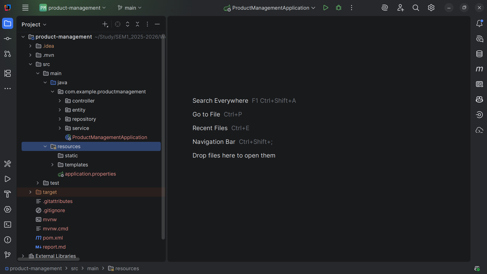

#### Task 1.2: Database Setup
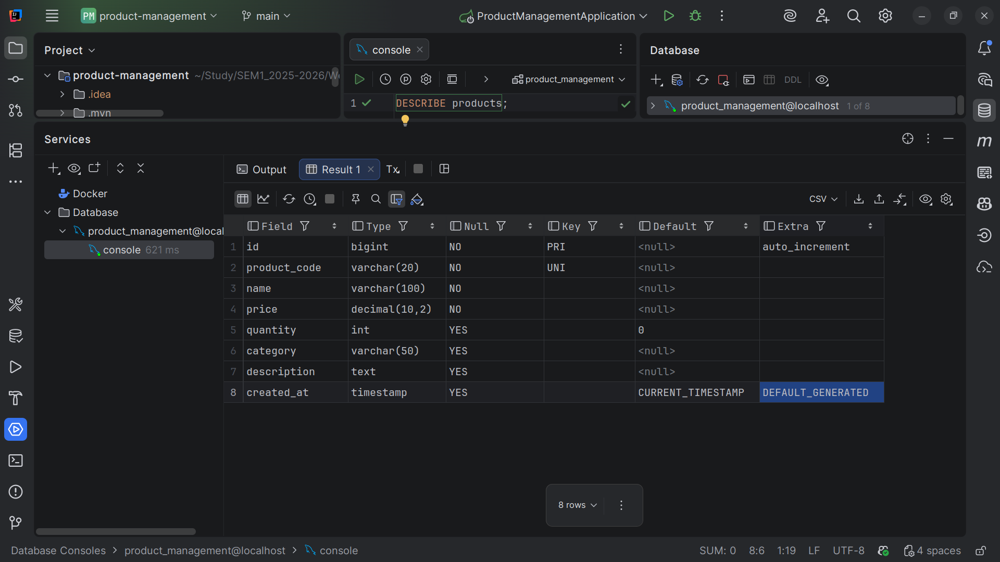

#### Task 1.3: Configure `application.properties`
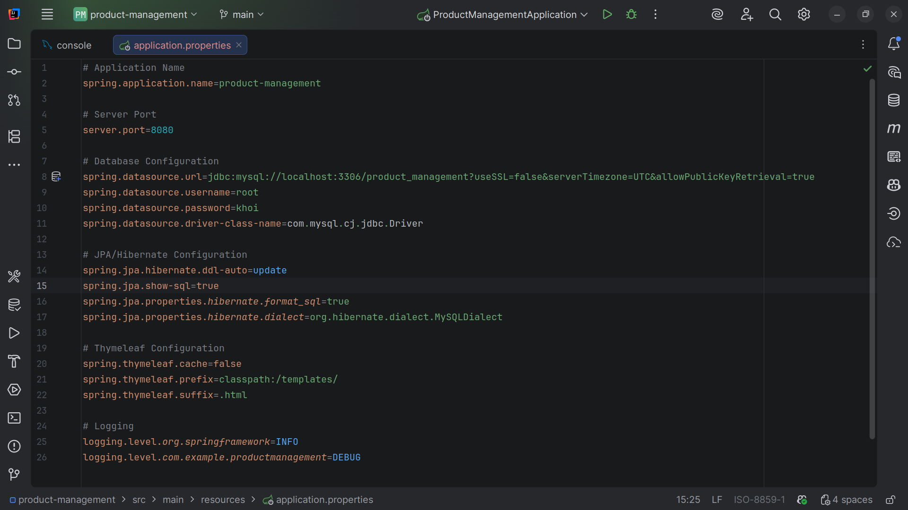

**Checkpoint #1: Run the application and verify no errors:**


### EXERCISE 2: ENTITY & REPOSITORY LAYERS
#### Task 2.1: Create Product Entity
**File:** `src/main/java/com/example/productmanagement/entity/Product.java`

```java
package com.example.productmanagement.entity;

import jakarta.persistence.*;
import lombok.Getter;
import lombok.Setter;

import java.math.BigDecimal;
import java.time.LocalDateTime;

@Setter // Lombok: generate setters without writing boilerplate code
@Getter // Lombok: generate getters without writing boilerplate code
@Entity
@Table(name = "products")
public class Product {
    // Getters and Setters
    @Id
    @GeneratedValue(strategy = GenerationType.IDENTITY)
    private Long id;

    @Column(name = "product_code", unique = true, nullable = false, length = 20)
    private String productCode;

    @Column(nullable = false, length = 100)
    private String name;

    @Column(nullable = false, precision = 10, scale = 2)
    private BigDecimal price;

    @Column(nullable = false)
    private Integer quantity;

    @Column(length = 50)
    private String category;

    @Column(columnDefinition = "TEXT")
    private String description;

    @Column(name = "created_at", updatable = false)
    private LocalDateTime createdAt;

    // Constructors
    public Product() {
    }

    public Product(String productCode, String name, BigDecimal price, Integer quantity, String category, String description) {
        this.productCode = productCode;
        this.name = name;
        this.price = price;
        this.quantity = quantity;
        this.category = category;
        this.description = description;
    }

    // Lifecycle callback
    @PrePersist
    protected void onCreate() {
        this.createdAt = LocalDateTime.now();
    }

    @Override
    public String toString() {
        return "Product{" +
                "id=" + id +
                ", productCode='" + productCode + '\'' +
                ", name='" + name + '\'' +
                ", price=" + price +
                ", quantity=" + quantity +
                ", category='" + category + '\'' +
                '}';
    }
}
```
**Explanation:**
- **Lombok:** The `@Setter` and `@Getter` annotations automatically generate setter and getter methods for all fields, reducing boilerplate code.
- **MVC Role:** This class acts as the Model component, defining the data structure and state of the `Product` entity.
- **Data Mapping:** The `@Entity` and `@Table` annotations map this class to the `products` table in the database.
- **Primary Key:** The `@Id` and `@GeneratedValue` annotations specify the `id` field as the auto-incrementing primary key.
- **Data Fields:** The `@Column` annotation configures table columns, including constraints like uniqueness, nullability, and length.
- **Timestamping:** The `onCreate()` method, annotated with `@PrePersist`, automatically sets the `createdAt` timestamp before the entity is saved.
- **Data Representation:** The `toString()` method provides a readable string representation of the `Product` object's state.

#### Task 2.2: Create Product Repository
**File:** `src/main/java/com/example/productmanagement/repository/ProductRepository.java`.

```java
package com.example.productmanagement.repository;

import com.example.productmanagement.entity.Product;
import org.springframework.data.jpa.repository.JpaRepository;
import org.springframework.stereotype.Repository;

import java.math.BigDecimal;
import java.util.List;

@Repository
public interface ProductRepository extends JpaRepository<Product, Long> {

    // Spring Data JPA generates implementation automatically!

    // Custom query methods (derived from method names)
    List<Product> findByCategory(String category);

    List<Product> findByNameContaining(String keyword);

    List<Product> findByPriceBetween(BigDecimal minPrice, BigDecimal maxPrice);

    List<Product> findByCategoryOrderByPriceAsc(String category);

    boolean existsByProductCode(String productCode);

    // All basic CRUD methods inherited from JpaRepository:
    // - findAll()
    // - findById(Long id)
    // - save(Product product)
    // - deleteById(Long id)
    // - count()
    // - existsById(Long id)
}
```

**Explanation:**
- **JPA Repository:** This interface extends `JpaRepository`, inheriting standard CRUD operations without needing manual implementation.
- **MVC Role:** It serves as the data access layer, mediating between the Service layer and the database.
- **Custom Queries:** Methods like `findByCategory` and `findByNameContaining` automatically generate SQL queries based on their names.
- **Advanced Search:** The `searchProducts` method uses the `@Query` annotation to define a custom JPQL query for filtering by multiple optional criteria.
- **Flow:** Service calls repository method -> Repository translates to SQL -> Database executes query -> Results returned as Entity objects.

#### Task 2.3: Test Repository
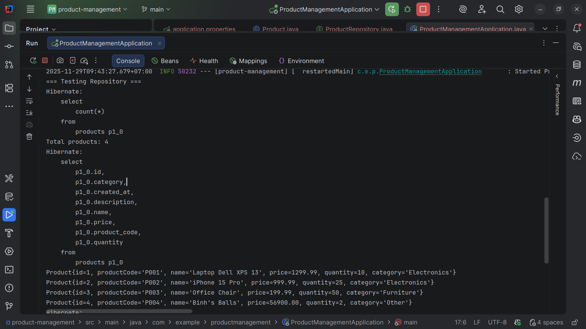
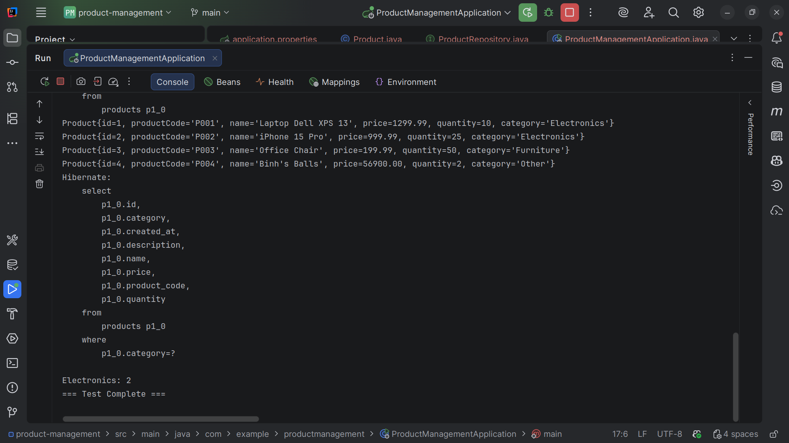

### EXERCISE 3: SERVICE LAYER
#### Task 3.1: Create Service Interface
**File:** `src/main/java/com/example/productmanagement/service/ProductService.java`

```java
package com.example.productmanagement.service;

import com.example.productmanagement.entity.Product;

import java.util.List;
import java.util.Optional;

public interface ProductService {

    List<Product> getAllProducts();

    Optional<Product> getProductById(Long id);

    Product saveProduct(Product product);

    void deleteProduct(Long id);

    List<Product> searchProducts(String keyword);

    List<Product> getProductsByCategory(String category);
}
```
The interface for the product service, hanlding CRUD for products.

#### Task 3.2: Implement Service
**File:** `src/main/java/com/example/productmanagement/service/ProductServiceImpl.java`

```java
package com.example.productmanagement.service;

import com.example.productmanagement.entity.Product;
import com.example.productmanagement.repository.ProductRepository;
import org.springframework.beans.factory.annotation.Autowired;
import org.springframework.stereotype.Service;
import org.springframework.transaction.annotation.Transactional;

import java.util.List;
import java.util.Optional;

@Service
@Transactional
public class ProductServiceImpl implements ProductService {

    private final ProductRepository productRepository;

    @Autowired
    public ProductServiceImpl(ProductRepository productRepository) {
        this.productRepository = productRepository;
    }

    @Override
    public List<Product> getAllProducts() {
        return productRepository.findAll();
    }

    @Override
    public Optional<Product> getProductById(Long id) {
        return productRepository.findById(id);
    }

    @Override
    public Product saveProduct(Product product) {
        // Validation logic can go here
        return productRepository.save(product);
    }

    @Override
    public void deleteProduct(Long id) {
        productRepository.deleteById(id);
    }

    @Override
    public List<Product> searchProducts(String keyword) {
        return productRepository.findByNameContaining(keyword);
    }

    @Override
    public List<Product> getProductsByCategory(String category) {
        return productRepository.findByCategory(category);
    }
}
```

**Explanation:**
- **Service Component:** The `@Service` annotation marks this class as a business logic component in the Spring context.
- **Transaction Management:** The `@Transactional` annotation ensures that methods run within a database transaction, maintaining data integrity.
- **Dependency Injection:** The `ProductRepository` is injected via the constructor to enable database operations.
- **Business Logic:** Methods like `getAllProducts` and `saveProduct` encapsulate the logic for retrieving and modifying product data.
- **Flow:** Controller calls service method -> Service executes business logic -> Service calls repository -> Data returned to Controller.

### EXERCISE 4: CONTROLLER & VIEWS
#### Task 4.1: Create Product Controller
**File:** `src/main/java/com/example/productmanagement/controller/ProductController.java`

```java
package com.example.productmanagement.controller;

import com.example.productmanagement.entity.Product;
import com.example.productmanagement.service.ProductService;
import org.springframework.beans.factory.annotation.Autowired;
import org.springframework.stereotype.Controller;
import org.springframework.ui.Model;
import org.springframework.web.bind.annotation.*;
import org.springframework.web.servlet.mvc.support.RedirectAttributes;

import java.util.List;

@Controller
@RequestMapping("/products")
public class ProductController {

    private final ProductService productService;

    @Autowired
    public ProductController(ProductService productService) {
        this.productService = productService;
    }

    // List all products
    @GetMapping
    public String listProducts(Model model) {
        List<Product> products = productService.getAllProducts();
        model.addAttribute("products", products);
        return "product-list";  // Returns product-list.html
    }

    // Show form for new product
    @GetMapping("/new")
    public String showNewForm(Model model) {
        Product product = new Product();
        model.addAttribute("product", product);
        return "product-form";
    }

    // Show form for editing product
    @GetMapping("/edit/{id}")
    public String showEditForm(@PathVariable Long id, Model model, RedirectAttributes redirectAttributes) {
        return productService.getProductById(id)
                .map(product -> {
                    model.addAttribute("product", product);
                    return "product-form";
                })
                .orElseGet(() -> {
                    redirectAttributes.addFlashAttribute("error", "Product not found");
                    return "redirect:/products";
                });
    }

    // Save product (create or update)
    @PostMapping("/save")
    public String saveProduct(@ModelAttribute("product") Product product, RedirectAttributes redirectAttributes) {
        try {
            productService.saveProduct(product);
            redirectAttributes.addFlashAttribute("message",
                    product.getId() == null ? "Product added successfully!" : "Product updated successfully!");
        } catch (Exception e) {
            redirectAttributes.addFlashAttribute("error", "Error saving product: " + e.getMessage());
        }
        return "redirect:/products";
    }

    // Delete product
    @GetMapping("/delete/{id}")
    public String deleteProduct(@PathVariable Long id, RedirectAttributes redirectAttributes) {
        try {
            productService.deleteProduct(id);
            redirectAttributes.addFlashAttribute("message", "Product deleted successfully!");
        } catch (Exception e) {
            redirectAttributes.addFlashAttribute("error", "Error deleting product: " + e.getMessage());
        }
        return "redirect:/products";
    }

    // Search products
    @GetMapping("/search")
    public String searchProducts(@RequestParam("keyword") String keyword, Model model) {
        List<Product> products = productService.searchProducts(keyword);
        model.addAttribute("products", products);
        model.addAttribute("keyword", keyword);
        return "product-list";
    }
}
```

**Explanation:**
- **Controller Component:** The `@Controller` annotation identifies this class as a web controller that handles HTTP requests.
- **Request Mapping:** The `@RequestMapping` annotation sets the base URL path for all endpoints in this controller.
- **List Products:** The `listProducts` method handles GET requests to show all products.
- **Flow (List):** User requests page -> Controller calls `getAllProducts` -> Adds list to Model -> Returns `product-list` view.
- **Save Product:** The `saveProduct` method handles POST requests to create or update a product.
- **Flow (Save):** User submits form -> Controller binds data to Product object -> Calls `saveProduct` service -> Redirects to list page.
- **Search:** The `searchProducts` and `advancedSearch` methods handle filtering of products based on user input.
- **Flow (Search):** User submits search -> Controller gets parameters -> Calls search service -> Adds results to Model -> Returns `product-list` view.

#### Task 4.2: Create Product List View
**File:** `src/main/resources/templates/product-list.html`

```html
<!DOCTYPE html>
<html xmlns:th="http://www.thymeleaf.org">
<head>alt text
    <meta charset="UTF-8">
    <meta name="viewport" content="width=device-width, initial-scale=1.0">
    <title>Product Management</title>
    <style>
        * {
            margin: 0;
            padding: 0;
            box-sizing: border-box;
        }

        body {
            font-family: 'Segoe UI', Tahoma, Geneva, Verdana, sans-serif;
            background: linear-gradient(135deg, #667eea 0%, #764ba2 100%);
            min-height: 100vh;
            padding: 20px;
        }

        .container {
            max-width: 1200px;
            margin: 0 auto;
            background: white;
            border-radius: 10px;
            padding: 30px;
            box-shadow: 0 10px 30px rgba(0,0,0,0.2);
        }

        h1 {
            color: #667eea;
            margin-bottom: 20px;
            text-align: center;
        }

        .alert {
            padding: 15px;
            margin-bottom: 20px;
            border-radius: 5px;
        }

        .alert-success {
            background-color: #d4edda;
            color: #155724;
            border: 1px solid #c3e6cb;
        }

        .alert-error {
            background-color: #f8d7da;
            color: #721c24;
            border: 1px solid #f5c6cb;
        }

        .actions {
            display: flex;
            justify-content: space-between;
            margin-bottom: 20px;
            flex-wrap: wrap;
            gap: 10px;
        }

        .btn {
            padding: 10px 20px;
            border: none;
            border-radius: 5px;
            cursor: pointer;
            text-decoration: none;
            display: inline-block;
            transition: all 0.3s;
        }

        .btn-primary {
            background-color: #667eea;
            color: white;
        }

        .btn-primary:hover {
            background-color: #5568d3;
        }

        .btn-success {
            background-color: #28a745;
            color: white;
        }

        .btn-danger {
            background-color: #dc3545;
            color: white;
        }

        .btn-sm {
            padding: 5px 10px;
            font-size: 14px;
        }

        .search-form {
            display: flex;
            gap: 10px;
        }

        .search-form input {
            padding: 10px;
            border: 1px solid #ddd;
            border-radius: 5px;
            flex: 1;
        }

        table {
            width: 100%;
            border-collapse: collapse;
            margin-top: 20px;
        }

        th, td {
            padding: 12px;
            text-align: left;
            border-bottom: 1px solid #ddd;
        }

        th {
            background-color: #667eea;
            color: white;
        }

        tr:hover {
            background-color: #f5f5f5;
        }

        .empty-state {
            text-align: center;
            padding: 40px;
            color: #666;
        }

        .actions-column {
            display: flex;
            gap: 5px;
        }
    </style>
</head>
<body>
<div class="container">
    <h1>📦 Product Management System</h1>

    <!-- Success Message -->
    <div th:if="${message}" class="alert alert-success">
        <span th:text="${message}"></span>
    </div>

    <!-- Error Message -->
    <div th:if="${error}" class="alert alert-error">
        <span th:text="${error}"></span>
    </div>

    <!-- Actions -->
    <div class="actions">
        <a th:href="@{/products/new}" class="btn btn-primary">➕ Add New Product</a>

        <form th:action="@{/products/search}" method="get" class="search-form">
            <input type="text" name="keyword" th:value="${keyword}" placeholder="Search products..." />
            <button type="submit" class="btn btn-primary">🔍 Search</button>
        </form>
    </div>

    <!-- Products Table -->
    <div th:if="${products != null and !products.isEmpty()}">
        <table>
            <thead>
            <tr>
                <th>ID</th>
                <th>Code</th>
                <th>Name</th>
                <th>Price</th>
                <th>Quantity</th>
                <th>Category</th>
                <th>Actions</th>
            </tr>
            </thead>
            <tbody>
            <tr th:each="product : ${products}">
                <td th:text="${product.id}">1</td>
                <td th:text="${product.productCode}">P001</td>
                <td th:text="${product.name}">Product Name</td>
                <td th:text="'$' + ${#numbers.formatDecimal(product.price, 1, 2)}">$99.99</td>
                <td th:text="${product.quantity}">10</td>
                <td th:text="${product.category}">Electronics</td>
                <td>
                    <div class="actions-column">
                        <a th:href="@{/products/edit/{id}(id=${product.id})}" class="btn btn-success btn-sm">✏️ Edit</a>
                        <a th:href="@{/products/delete/{id}(id=${product.id})}"
                           class="btn btn-danger btn-sm"
                           onclick="return confirm('Are you sure you want to delete this product?')">
                            🗑️ Delete
                        </a>
                    </div>
                </td>
            </tr>
            </tbody>
        </table>
    </div>

    <!-- Empty State -->
    <div th:if="${products == null or products.isEmpty()}" class="empty-state">
        <p>No products found. Add your first product!</p>
    </div>
</div>
</body>
</html>
```
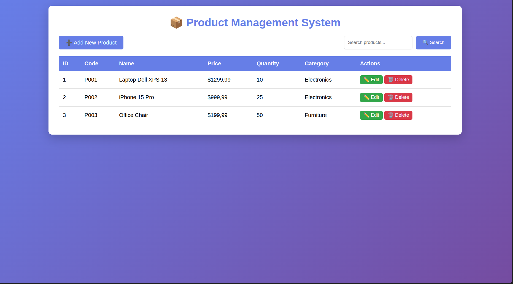

#### Task 4.3: Create Product Form View
**File:** `src/main/resources/templates/product-form.html`

```html
<!DOCTYPE html>
<html xmlns:th="http://www.thymeleaf.org">
<head>
    <meta charset="UTF-8">
    <meta name="viewport" content="width=device-width, initial-scale=1.0">
    <title>Product Form</title>
    <style>
        * {
            margin: 0;
            padding: 0;
            box-sizing: border-box;
        }

        body {
            font-family: 'Segoe UI', Tahoma, Geneva, Verdana, sans-serif;
            background: linear-gradient(135deg, #667eea 0%, #764ba2 100%);
            min-height: 100vh;
            padding: 20px;
        }

        .container {
            max-width: 600px;
            margin: 0 auto;
            background: white;
            border-radius: 10px;
            padding: 30px;
            box-shadow: 0 10px 30px rgba(0,0,0,0.2);
        }

        h1 {
            color: #667eea;
            margin-bottom: 30px;
            text-align: center;
        }

        .form-group {
            margin-bottom: 20px;
        }

        label {
            display: block;
            margin-bottom: 5px;
            color: #333;
            font-weight: 500;
        }

        input, select, textarea {
            width: 100%;
            padding: 10px;
            border: 1px solid #ddd;
            border-radius: 5px;
            font-size: 14px;
        }

        textarea {
            resize: vertical;
            min-height: 100px;
        }

        .btn {
            padding: 12px 30px;
            border: none;
            border-radius: 5px;
            cursor: pointer;
            text-decoration: none;
            display: inline-block;
            margin-right: 10px;
            transition: all 0.3s;
        }

        .btn-primary {
            background-color: #667eea;
            color: white;
        }

        .btn-primary:hover {
            background-color: #5568d3;
        }

        .btn-secondary {
            background-color: #6c757d;
            color: white;
        }

        .btn-secondary:hover {
            background-color: #5a6268;
        }

        .button-group {
            margin-top: 30px;
            display: flex;
            justify-content: center;
        }
    </style>
</head>
<body>
<div class="container">
    <h1 th:text="${product.id != null} ? '✏️ Edit Product' : '➕ Add New Product'">Product Form</h1>

    <form th:action="@{/products/save}" th:object="${product}" method="post">
        <!-- Hidden ID field for updates -->
        <input type="hidden" th:field="*{id}" />

        <div class="form-group">
            <label for="productCode">Product Code *</label>
            <input type="text"
                   id="productCode"
                   th:field="*{productCode}"
                   placeholder="Enter product code (e.g., P001)"
                   required />
        </div>

        <div class="form-group">
            <label for="name">Product Name *</label>
            <input type="text"
                   id="name"
                   th:field="*{name}"
                   placeholder="Enter product name"
                   required />
        </div>

        <div class="form-group">
            <label for="price">Price ($) *</label>
            <input type="number"
                   id="price"
                   th:field="*{price}"
                   step="0.01"
                   min="0"
                   placeholder="0.00"
                   required />
        </div>

        <div class="form-group">
            <label for="quantity">Quantity *</label>
            <input type="number"
                   id="quantity"
                   th:field="*{quantity}"
                   min="0"
                   placeholder="0"
                   required />
        </div>

        <div class="form-group">
            <label for="category">Category *</label>
            <select id="category" th:field="*{category}" required>
                <option value="">Select category</option>
                <option value="Electronics">Electronics</option>
                <option value="Furniture">Furniture</option>
                <option value="Clothing">Clothing</option>
                <option value="Books">Books</option>
                <option value="Food">Food</option>
                <option value="Other">Other</option>
            </select>
        </div>

        <div class="form-group">
            <label for="description">Description</label>
            <textarea id="description"
                      th:field="*{description}"
                      placeholder="Enter product description (optional)"></textarea>
        </div>

        <div class="button-group">
            <button type="submit" class="btn btn-primary">💾 Save Product</button>
            <a th:href="@{/products}" class="btn btn-secondary">❌ Cancel</a>
        </div>
    </form>
</div>
</body>
</html>
```

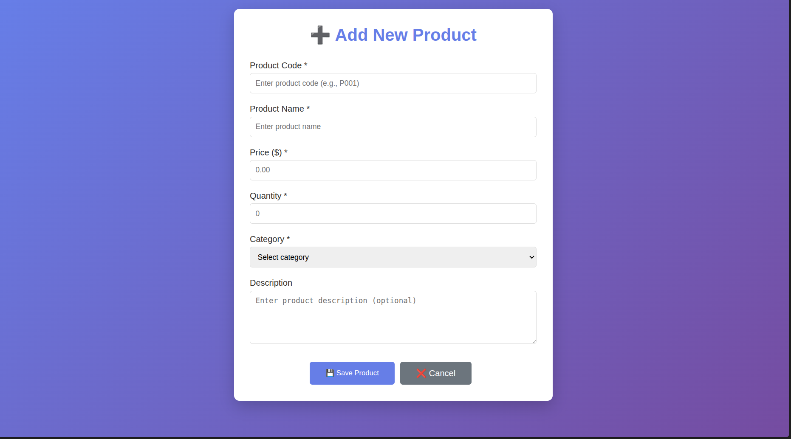
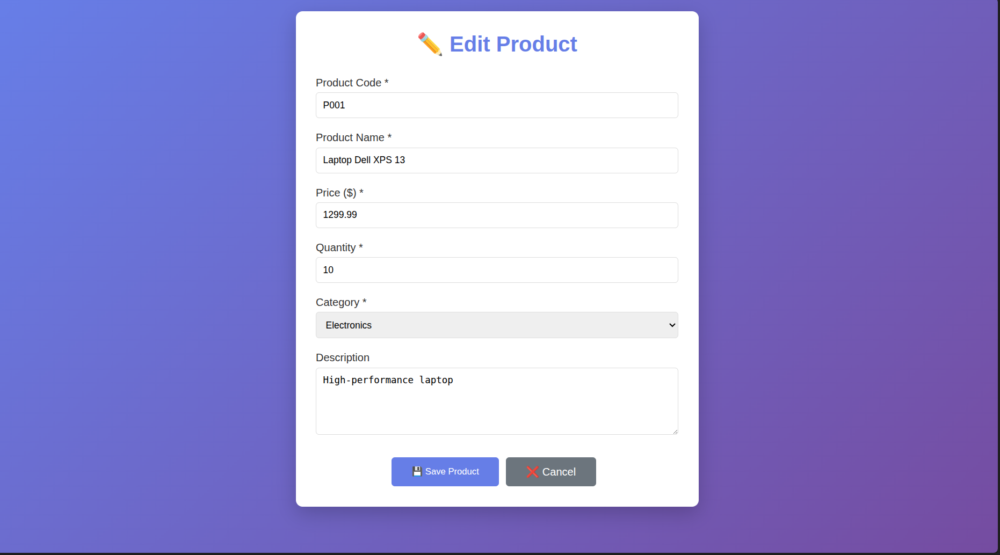

---
## PART B: HOMEWORK EXERCISES
### EXERCISE 5: ADVANCED SEARCH
#### Task 5.1: Multi-Criteria Search
`repository/ProductRepository.java`

```java
@Query("SELECT p FROM Product p WHERE " +
        "(:name IS NULL OR :name = '' OR " +
        "LOWER(p.name) LIKE LOWER(CONCAT('%', :name, '%'))) AND " +
        "(:category IS NULL OR :category = '' OR p.category = :category) AND " +
        "(:minPrice IS NULL OR p.price >= :minPrice) AND " +
        "(:maxPrice IS NULL OR p.price <= :maxPrice)")
Page<Product> advanceSearch(@Param("name") String name,
                                @Param("category") String category,
                                @Param("minPrice") BigDecimal minPrice,
                                @Param("maxPrice") BigDecimal maxPrice
                            , Pageable pageable);
```

`service/ProductServiceImpl.java`

```java
@Override
public Page<Product> advanceSearch(String name, String category, BigDecimal minPrice, BigDecimal maxPrice, Pageable pageable) {
    return productRepository.advanceSearch(name, category, minPrice, maxPrice, pageable);
}
```

`controller/ProductController.java`

```java
@GetMapping("/advanced-search")
public String advancedSearch(
        @RequestParam(required = false) String name,
        @RequestParam(required = false) String category,
        @RequestParam(required = false) BigDecimal minPrice,
        @RequestParam(required = false) BigDecimal maxPrice,
        @RequestParam(defaultValue = "0") int page,
        @RequestParam(defaultValue = "10") int size,
        @RequestParam(required = false) String sortBy,
        @RequestParam(defaultValue = "asc") String sortDir,
        Model model) {

    Pageable pageable;

    if (sortBy != null) {
        Sort sort = sortDir.equals("asc") ? Sort.by(sortBy).ascending() : Sort.by(sortBy).descending();
        pageable = PageRequest.of(page, size, sort);
    } else {
        pageable = PageRequest.of(page, size);
    }

    Page<Product> products = productService.advanceSearch(name, category, minPrice, maxPrice, pageable);

    model.addAttribute("products", products);
    model.addAttribute("name", name);
    model.addAttribute("selectedCategory", category);
    model.addAttribute("minPrice", minPrice);
    model.addAttribute("maxPrice", maxPrice);
    model.addAttribute("sortBy", sortBy);
    model.addAttribute("sortDir", sortDir);

    model.addAttribute("baseUrl", "/products/advanced-search");

    addCommonAttributes(model);

    return "product-list";
}
```

**Explanation:**
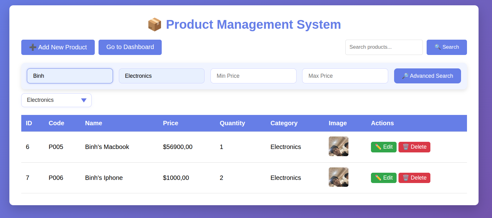
- **Repository:** The `advanceSearch` method uses a custom JPQL `@Query` to handle multiple optional criteria. The logic `(:param IS NULL OR p.field = :param)` allows ignoring null parameters, effectively constructing a dynamic query.
- **Service:** The service layer simply delegates the call to the repository, passing all search parameters and the `Pageable` object.
- **Controller:** The `advancedSearch` method captures request parameters (name, category, price range) and pagination info. It creates a `Pageable` object and calls the service. The results and search criteria are added to the `Model` to repopulate the form and display results.
- **Workflow:** User fills the advanced search form -> Submits GET request to `/products/advanced-search` -> Controller processes parameters -> Service -> Repository executes filtered query -> Results displayed in `product-list.html`.

#### Task 5.2: Category Filter
`repository/ProductRepository.java`

```java
@Query("SELECT DISTINCT p.category FROM Product p ORDER BY p.category")
List<String> findAllCategories();
```

`service/ProductServiceImpl.java`

```java
@Override
public List<String> getAllCategories() {
    return productRepository.findAllCategories();
}
```

`controller/ProductController.java`
```java
// Helper method to add common attributes like categories
private void addCommonAttributes(Model model) {
    List<String> categories = productService.getAllCategories();
    model.addAttribute("categories", categories);
}

@GetMapping
public String listProducts(@RequestParam(value = "category", required = false) String category,
                            @RequestParam(defaultValue = "0") int page,
                            @RequestParam(defaultValue = "10") int size,
                            @RequestParam(required = false) String sortBy,
                            @RequestParam(defaultValue = "asc") String sortDir,
                            Model model) {
    Page<Product> products;
    Pageable pageable;

    if (sortBy != null) {
        Sort sort = sortDir.equals("asc") ? Sort.by(sortBy).ascending() : Sort.by(sortBy).descending();
        pageable = PageRequest.of(page, size, sort);
    } else {
        pageable = PageRequest.of(page, size);
    }

    if (category == null || category.isEmpty()) {
        products = productService.getAllProducts(pageable);
    } else {
        products = productService.getProductsByCategory(category, pageable);
    }

    // Add attributes
    model.addAttribute("products", products);
    model.addAttribute("selectedCategory", category);
    model.addAttribute("baseUrl", "/products");
    model.addAttribute("sortBy", sortBy);
    model.addAttribute("sortDir", sortDir);

    addCommonAttributes(model);

    return "product-list";
}
```

View

```java
<!--Filter-->
<form th:action="@{/products}" method="get">
    <select name="category" onchange="this.form.submit()">
        <option value="">All Categories</option>
        <option th:each="cat : ${categories}"
                th:value="${cat}"
                th:text="${cat}"
                th:selected="${cat == selectedCategory}">
        </option>
    </select>
</form>
```

**Explanation:**
- **Repository:** `findAllCategories` retrieves a list of all distinct categories present in the database to populate the filter dropdown.
- **Controller:** The `addCommonAttributes` helper method ensures the category list is available on all views. The `listProducts` method checks if a `category` parameter is present. If so, it calls `getProductsByCategory`; otherwise, it calls `getAllProducts`.
- **View:** A `<select>` element with `onchange="this.form.submit()"` automatically triggers a form submission whenever the user selects a different category, reloading the page with the filtered results.
- **Workflow:** User selects a category -> Browser sends GET request with `?category=Value` -> Controller detects parameter -> Fetches filtered data -> View renders only products in that category.


#### Task 5.3: Search with Pagination
`controller/ProductController.java`

```java
@GetMapping("/search")
public String searchProducts(@RequestParam("keyword") String keyword,
                                @RequestParam(defaultValue = "0") int page,
                                @RequestParam(defaultValue = "10") int size,
                                @RequestParam(required = false) String sortBy,
                                @RequestParam(defaultValue = "asc") String sortDir,
                                Model model) {

    Pageable pageable;

    if (sortBy != null) {
        Sort sort = sortDir.equals("asc") ? Sort.by(sortBy).ascending() : Sort.by(sortBy).descending();
        pageable = PageRequest.of(page, size, sort);
    } else {
        pageable = PageRequest.of(page, size);
    }

    Page<Product> products = productService.searchProducts(keyword, pageable);

    model.addAttribute("products", products);
    model.addAttribute("keyword", keyword);
    model.addAttribute("baseUrl", "/products/search");
    model.addAttribute("sortBy", sortBy);
    model.addAttribute("sortDir", sortDir);

    addCommonAttributes(model);

    return "product-list";
}
```

**Explanation:**
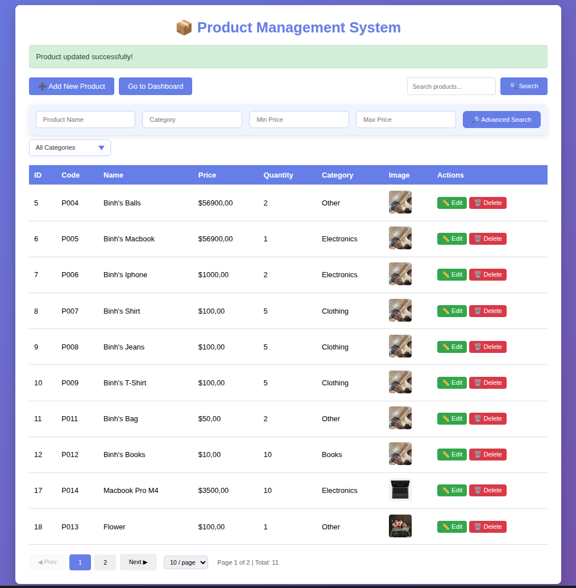
- **Pagination Support:** The `Pageable` interface (specifically `PageRequest`) is used to request a specific slice of data (page number and size).
- **Repository & Service:** Methods return `Page<Product>` instead of `List<Product>`, providing metadata like total pages and total elements along with the content.
- **Controller:** Accepts `page` and `size` parameters (defaulting to 0 and 10). It adds the `Page` object to the model.
- **View:** The view uses `productPage.totalPages` and `currentPage` to generate pagination buttons (Previous, Next, Page Numbers), allowing users to navigate through large datasets.
- **Workflow:** User clicks a page number -> GET request `?page=1` -> Controller requests page 1 from Service -> Repository returns partial result -> View displays the requested subset of products.

### EXERCISE 6: VALIDATION
#### Task 6.1: Add Validation Annotations
Updated `entity/Product.java`

```java
package com.example.productmanagement.entity;

import jakarta.persistence.*;
import jakarta.validation.constraints.*;
import lombok.Getter;
import lombok.Setter;

import java.math.BigDecimal;
import java.time.LocalDateTime;

@Setter // Lombok: generate setters without writing boilerplate code
@Getter // Lombok: generate getters without writing boilerplate code
@Entity
@Table(name = "products")
public class Product {
    // Getters and Setters
    @Id
    @GeneratedValue(strategy = GenerationType.IDENTITY)
    private Long id;

    @Size(min = 3, max = 20, message = "Product code must be 3-20 characters")
    @Pattern(regexp = "^P\\d{3,}$", message = "Product code must start with P followed by numbers")
    @NotBlank(message = "Product code is required")
    @Column(name = "product_code", unique = true, nullable = false, length = 20)
    private String productCode;

    @NotBlank(message = "Product name is required")
    @Size(min = 3, max = 100, message = "Name must be 3-100 characters")
    @Column(nullable = false, length = 100)
    private String name;

    @NotNull(message = "Price is required")
    @DecimalMin(value = "0.01", message = "Price must be greater than 0")
    @DecimalMax(value = "999999.99", message = "Price is too high")
    @Column(nullable = false, precision = 10, scale = 2)
    private BigDecimal price;

    @NotNull(message = "Quantity is required")
    @Min(value = 0, message = "Quantity cannot be negative")
    @Column(nullable = false)
    private Integer quantity;

    @NotBlank(message = "Category is required")
    @Column(length = 50)
    private String category;

    @Column(columnDefinition = "TEXT")
    private String description;

    @Column(name = "created_at", updatable = false)
    private LocalDateTime createdAt;

    private String imagePath;

    // Constructors
    public Product() {
    }

    public Product(String productCode, String name, BigDecimal price, Integer quantity, String category, String description) {
        this.productCode = productCode;
        this.name = name;
        this.price = price;
        this.quantity = quantity;
        this.category = category;
        this.description = description;
    }

    // Lifecycle callback
    @PrePersist
    protected void onCreate() {
        this.createdAt = LocalDateTime.now();
    }

    @Override
    public String toString() {
        return "Product{" +
                "id=" + id +
                ", productCode='" + productCode + '\'' +
                ", name='" + name + '\'' +
                ", price=" + price +
                ", quantity=" + quantity +
                ", category='" + category + '\'' +
                '}';
    }
}
```

**Explanation:**
- **Validation Constraints:** We use Jakarta Validation annotations to enforce data integrity at the entity level.
- **@NotBlank:** Ensures strings are not null or empty.
- **@Size:** Enforces minimum and maximum length.
- **@Pattern:** Validates against a regular expression (e.g., Product Code format).
- **@Min/@DecimalMin:** Ensures numeric values meet minimum requirements (e.g., non-negative quantity, positive price).
- **Workflow:** When a `Product` object is validated, these constraints are checked. If any fail, a validation error is raised.

#### Task 6.2: Add Validation in Controller

```java
import jakarta.validation.Valid;
import org.springframework.validation.BindingResult;

@PostMapping("/save")
public String saveProduct(
    @Valid @ModelAttribute("product") Product product,
    BindingResult result,
    Model model,
    RedirectAttributes redirectAttributes) {
    
    if (result.hasErrors()) {
        return "product-form";
    }
    
    try {
        productService.saveProduct(product);
        redirectAttributes.addFlashAttribute("message", "Product saved successfully!");
    } catch (Exception e) {
        redirectAttributes.addFlashAttribute("error", "Error: " + e.getMessage());
    }
    
    return "redirect:/products";
}
```

**Explanation:**
- **@Valid Annotation:** Triggers the validation process for the `product` object before the method body is executed.
- **BindingResult:** Captures any validation errors. We check `result.hasErrors()` to see if validation failed.
- **Error Handling:** If errors exist, we return the user to the `product-form` view so they can correct the input. The `BindingResult` (containing the errors) is automatically available to the view.
- **Workflow:** User submits form -> Controller validates input -> If invalid, show form with errors; If valid, save product and redirect to list.


#### Task 6.3: Display Validation Errors

**View Update:** `product-form.html`

```html
<div class="form-group">
    <label for="productCode">Product Code *</label>
    <input type="text" 
           id="productCode" 
           th:field="*{productCode}" 
           th:errorclass="error" />
    <span th:if="${#fields.hasErrors('productCode')}" 
          th:errors="*{productCode}" 
          class="error-message">Error</span>
</div>
```

**CSS Update:**
```css
.error { border-color: red; }
.error-message { color: red; font-size: 12px; }
```

**Explanation:**
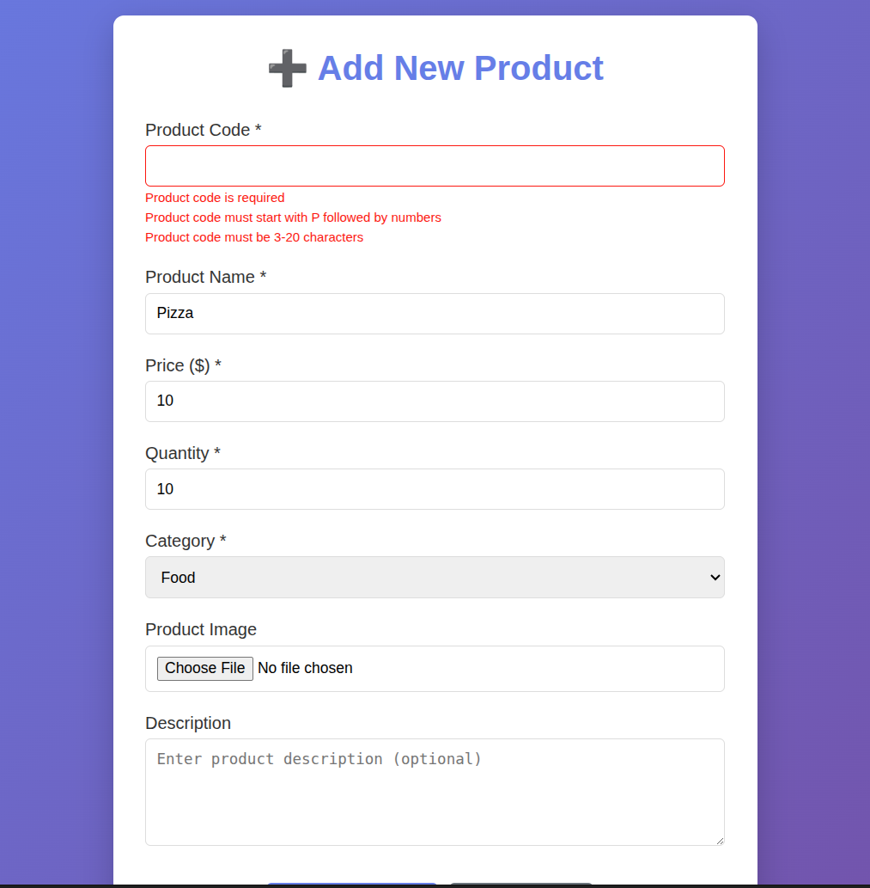
- **th:errorclass:** Conditionally adds the `error` CSS class to the input field if it has validation errors (e.g., making the border red).
- **th:errors:** Displays the specific validation error message associated with the field (e.g., "Product code is required").
- **User Feedback:** This provides immediate, specific feedback to the user about what went wrong, improving the user experience.

### EXERCISE 7: SORTING & FILTERING
`controller/ProductController.java`

```java
@GetMapping
public String listProducts(@RequestParam(value = "category", required = false) String category,
                            @RequestParam(defaultValue = "0") int page,
                            @RequestParam(defaultValue = "10") int size,
                            @RequestParam(required = false) String sortBy,
                            @RequestParam(defaultValue = "asc") String sortDir,
                            Model model) {
    Page<Product> products;
    Pageable pageable;

    if (sortBy != null) {
        Sort sort = sortDir.equals("asc") ? Sort.by(sortBy).ascending() : Sort.by(sortBy).descending();
        pageable = PageRequest.of(page, size, sort);
    } else {
        pageable = PageRequest.of(page, size);
    }

    if (category == null || category.isEmpty()) {
        products = productService.getAllProducts(pageable);
    } else {
        products = productService.getProductsByCategory(category, pageable);
    }

    // Add attributes
    model.addAttribute("products", products);
    model.addAttribute("selectedCategory", category);
    model.addAttribute("baseUrl", "/products");
    model.addAttribute("sortBy", sortBy);
    model.addAttribute("sortDir", sortDir);

    addCommonAttributes(model);

    return "product-list";
}
```

View
```html
<th>
    <a th:href="@{/products(sortBy='name',sortDir=${sortDir=='asc'?'desc':'asc'})}">
        Name
        <span th:if="${sortBy=='name'}" th:text="${sortDir=='asc'?'↑':'↓'}"></span>
    </a>
</th>
```
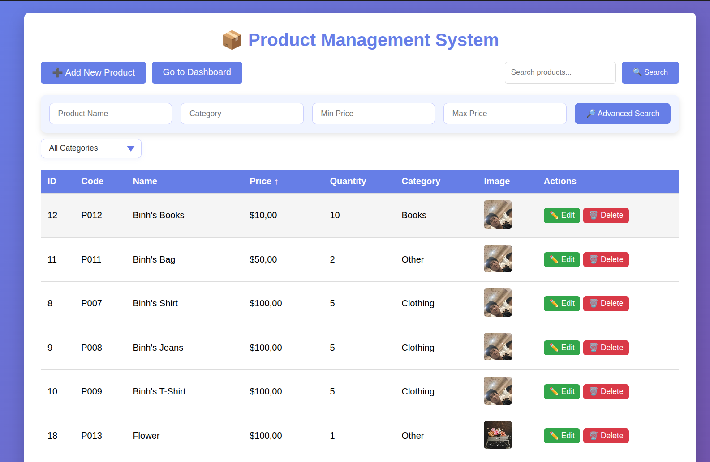

**Explanation:**
- **Sorting Logic:** The controller checks for `sortBy` and `sortDir` parameters. It creates a Spring Data `Sort` object (ascending or descending) and passes it to the repository via the `PageRequest`.
- **View Links:** The table headers are converted into clickable links. The `th:href` dynamically toggles the sort direction (if currently 'asc', the link sets it to 'desc', and vice versa).
- **Visual Indicator:** A small arrow (↑ or ↓) is displayed next to the currently sorted column to indicate the direction.
- **Workflow:** User clicks "Price" header -> GET request `?sortBy=price&sortDir=asc` -> Controller sorts by price ascending -> View displays products cheapest to most expensive.

### EXERCISE 8: STATISTICS DASHBOARD

`repository/ProductRepository.java`

```java
@Query("SELECT DISTINCT p.category FROM Product p ORDER BY p.category")
List<String> findAllCategories();

@Query("SELECT COUNT(p) FROM Product p WHERE p.category = :category")
long countByCategory(@Param("category") String category);

@Query("SELECT SUM(p.price * p.quantity) FROM Product p")
BigDecimal calculateTotalValue();

@Query("SELECT AVG(p.price) FROM Product p")
BigDecimal calculateAveragePrice();

@Query("SELECT p FROM Product p WHERE p.quantity < :threshold")
List<Product> findLowStockProducts(@Param("threshold") int threshold);
```

`controller/DashboardController.java`

```java
@Controller
@RequestMapping("/dashboard")
public class DashboardController {

    private final ProductService productService;

    @Autowired
    public DashboardController(ProductService productService) {
        this.productService = productService;
    }

    @GetMapping
    public String showDashboard(Model model) {
        // Total products count
        long totalProducts = productService.getAllProducts().size();
        model.addAttribute("totalProducts", totalProducts);

        // Total inventory value
        BigDecimal totalValue = productService.getTotalValue();
        model.addAttribute("totalValue", totalValue != null ? totalValue : BigDecimal.ZERO);

        // Average product price
        BigDecimal avgPrice = productService.getAveragePrice();
        model.addAttribute("avgPrice", avgPrice != null ? avgPrice : BigDecimal.ZERO);

        // Low stock alerts
        List<Product> lowStockProducts = productService.getLowStockProducts(10);
        model.addAttribute("lowStockProducts", lowStockProducts);
        model.addAttribute("lowStockCount", lowStockProducts.size());

        // Recent products (last 5 added)
        List<Product> recentProducts = productService.getAllProducts(
                PageRequest.of(0, 5, Sort.by(Sort.Direction.DESC, "id"))
        ).getContent();
        model.addAttribute("recentProducts", recentProducts);

        // Products by categor
        List<String> categories = productService.getAllCategories();
        Map<String, Long> categoryStats = new HashMap<>();

        if (categories != null) {
            for (String cat : categories) {
                long count = productService.getProductCountByCategory(cat);
                categoryStats.put(cat, count);
            }
        }
        model.addAttribute("categoryStats", categoryStats);

        return "dashboard";
    }
}
```

**Explanation:**
- **Repository:** Custom JPQL queries calculate aggregate statistics: `COUNT` for total products/categories, `SUM` for inventory value, and `AVG` for average price. A query also identifies low-stock items.
- **Controller:** The `DashboardController` calls these service methods to gather all the statistics. It also prepares data for the chart (category distribution).
- **View:** `dashboard.html` presents this data using:
    - **Cards:** For key performance indicators (KPIs).
    - **Chart.js:** To visualize the product distribution by category.
    - **Table:** To list low-stock items with a "Restock" action.
- **Workflow:** User accesses `/dashboard` -> Controller fetches stats -> View renders the dashboard with charts and tables.

---
## BONUS EXERCISES
### BONUS 1: REST API Endpoints

```java
@RestController
@RequestMapping("/api/products")
public class ProductRestController {

    private final ProductService productService;

    @Autowired
    public ProductRestController(ProductService productService) {
        this.productService = productService;
    }

    @GetMapping
    public ResponseEntity<List<Product>> getAllProducts() {
        // Return JSON
        List<Product> products = productService.getAllProducts();
        return ResponseEntity.ok(products);
    }

    @GetMapping("/{id}")
    public ResponseEntity<Product> getProduct(@PathVariable Long id) {
        // Return single product or 404
        return productService.getProductById(id)
                .map(ResponseEntity::ok)
                .orElse(ResponseEntity.notFound().build());
    }

    @PostMapping
    public ResponseEntity<Product> createProduct(@RequestBody Product product) {
        // Create and return 201
        Product newProduct = productService.saveProduct(product);
        return ResponseEntity.status(201).body(newProduct);
    }

    @PutMapping("/{id}")
    public ResponseEntity<Product> updateProduct(@PathVariable Long id, @RequestBody Product product) {
        // Update and return
        return productService.getProductById(id)
                .map(existingProduct -> {
                    product.setId(id);
                    Product updatedProduct = productService.saveProduct(product);
                    return ResponseEntity.ok(updatedProduct);
                })
                .orElse(ResponseEntity.notFound().build());
    }

    @DeleteMapping("/{id}")
    public ResponseEntity<Void> deleteProduct(@PathVariable Long id) {
        // Delete and return 204
        return productService.getProductById(id)
                .map(existingProduct -> {
                    productService.deleteProduct(id);
                    return ResponseEntity.noContent().<Void>build();
                })
                .orElse(ResponseEntity.notFound().build());
    }
}
```

**Explanation:**
- **@RestController:** Combines `@Controller` and `@ResponseBody`, meaning methods return data (JSON) directly instead of views.
- **Endpoints:**
    - `GET /api/products`: Returns list of all products.
    - `GET /api/products/{id}`: Returns a single product.
    - `POST /api/products`: Creates a new product.
    - `PUT /api/products/{id}`: Updates an existing product.
    - `DELETE /api/products/{id}`: Deletes a product.
- **ResponseEntity:** Wraps the response body and HTTP status code (e.g., 200 OK, 201 Created, 404 Not Found), providing full control over the HTTP response.

### BONUS 2: Image Upload

**Explanation:**
- **MultipartFile:** Spring interface to handle uploaded files.
- **File Storage:** The `saveImage` helper method generates a unique filename (using UUID) to prevent collisions and saves the file to the `uploads/` directory on the server.
- **Entity Update:** The filename is stored in the `imagePath` field of the `Product` entity.
- **Workflow:** User selects file in form -> Form submits with `enctype="multipart/form-data"` -> Controller receives file -> Saves file to disk -> Saves product with filename -> Image displayed in list/details.

```java
private String saveImage(MultipartFile file, String name) throws IOException {
    Path uploadPath = Paths.get(UPLOAD_DIR);

    // Create the directory if it doesn't exist
    if (!Files.exists(uploadPath)) {
        Files.createDirectories(uploadPath);
    }

    // Sanitize the product name to be safe for filenames (remove spaces/special chars)
    String safeName = name.replaceAll("[^a-zA-Z0-9.\\-]", "_");
    String originalFileName = file.getOriginalFilename();
    String fileExtension = "";
    int dotIndex = originalFileName.lastIndexOf(".");
    if (dotIndex > 0) {
        fileExtension = originalFileName.substring(dotIndex);
    }
    String fileName = safeName + "_" + UUID.randomUUID().toString() + fileExtension;

    // Save the file
    Path filePath = uploadPath.resolve(fileName);

    // Use StandardCopyOption.REPLACE_EXISTING to avoid errors if file exists
    Files.copy(file.getInputStream(), filePath, java.nio.file.StandardCopyOption.REPLACE_EXISTING);
    System.out.println("File saved to: " + filePath.toString());
    return fileName;
}

@PostMapping("/save")
public String saveProduct(@Valid @ModelAttribute("product") Product product,
                            BindingResult result,
                            @RequestParam("imageFile") MultipartFile imageFile,
                            RedirectAttributes redirectAttributes) {

    if (result.hasErrors()) {
        return "product-form";
    }

    try {
        if (!imageFile.isEmpty()) {
            String filename = saveImage(imageFile, product.getName());
            product.setImagePath(filename);
            System.out.println(product.getImagePath());
        } else if (product.getId() == null) {
            product.setImagePath("default.jpg");
        }

        productService.saveProduct(product);
        redirectAttributes.addFlashAttribute("message",
                product.getId() == null ? "Product added successfully!" : "Product updated successfully!");
    } catch (Exception e) {
        redirectAttributes.addFlashAttribute("error", "Error saving product: " + e.getMessage());
    }
    return "redirect:/products";
}
```

