# LAB 8 EXERCISES: REST API & DTO PATTERN

## PART A: IN-CLASS EXERCISES

### EXERCISE 1: PROJECT SETUP & ENTITY

#### Task 1.1: Create Spring Boot Project
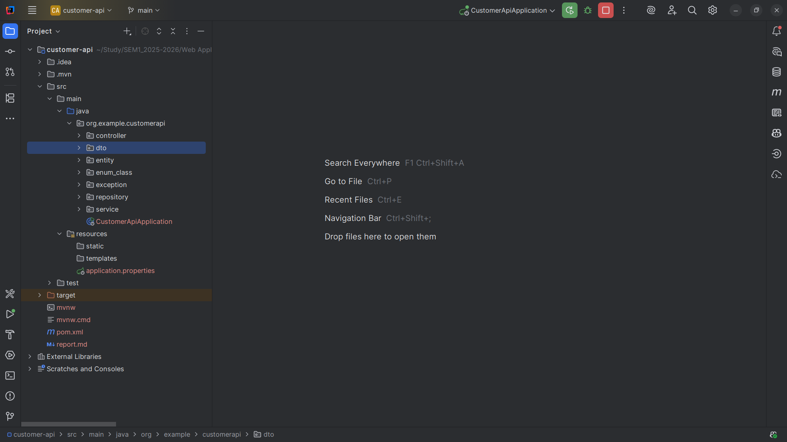

#### Task 1.2: Database Setup
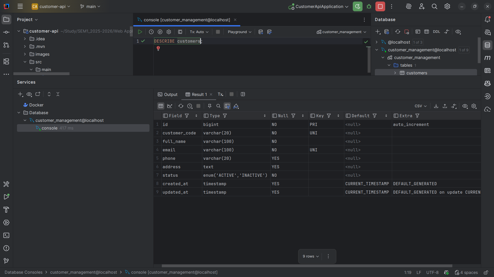

#### Task 1.3: Create Customer Entity
`entity/Customer.java`

```java
@Entity
@Table(name = "customers")
@Getter
@Setter
public class Customer {

    // Getters and Setters
    @Id
    @GeneratedValue(strategy = GenerationType.IDENTITY)
    private Long id;

    @Column(name = "customer_code", unique = true, nullable = false, length = 20)
    private String customerCode;

    @Column(name = "full_name", nullable = false, length = 100)
    private String fullName;

    @Column(unique = true, nullable = false, length = 100)
    private String email;

    @Column(length = 20)
    private String phone;

    @Column(columnDefinition = "TEXT")
    private String address;

    @Enumerated(EnumType.STRING)
    @Column(nullable = false, length = 20)
    private CustomerStatus status = CustomerStatus.ACTIVE;

    @Column(name = "created_at", updatable = false)
    private LocalDateTime createdAt;

    @Column(name = "updated_at")
    private LocalDateTime updatedAt;

    @PrePersist
    protected void onCreate() {
        this.createdAt = LocalDateTime.now();
        this.updatedAt = LocalDateTime.now();
    }

    @PreUpdate
    protected void onUpdate() {
        this.updatedAt = LocalDateTime.now();
    }

    // Constructors
    public Customer() {
    }

    public Customer(String customerCode, String fullName, String email, String phone, String address) {
        this.customerCode = customerCode;
        this.fullName = fullName;
        this.email = email;
        this.phone = phone;
        this.address = address;
    }
}
```

**Explanation:**
- **JPA Entity:** Think of the `@Entity` class as a blueprint for a row in your database table.
- **Primary Key:** `@Id` marks the unique ID for each customer, and `@GeneratedValue` tells the database to create this ID automatically (like auto-increment).
- **Data Constraints:** `@Column` rules (like `unique` or `nullable`) make sure the data in the database is valid and consistent.
- **Enum Mapping:** `@Enumerated` saves the status as readable text ("ACTIVE") instead of a confusing number (0 or 1).
- **Auditing:** `@PrePersist` and `@PreUpdate` are like automatic triggers that stamp the current time whenever you create or update a record.
- **Lombok:** `@Getter` and `@Setter` are shortcuts that write the boring "get" and "set" methods for you.

**Workflow:**
1.  **Define Structure:** Create a Java class (`Customer`) that represents a customer.
2.  **Map to Database:** Use annotations to tell Spring how to save this class to the database table `customers`.
3.  **Auto-Generate Code:** Lombok generates the necessary code to access and modify the data.
4.  **Lifecycle Hooks:** When you save a customer, the app automatically sets the creation time.

**Checkpoint #1: Verify entity mapping by running the application.**


### EXERCISE 2: DTO LAYER
#### Task 2.1: Create Request DTO
`dto/CustomerRequestDTO.java`

```java
@Getter
@Setter
public class CustomerRequestDTO {

    // Getters and Setters
    @NotBlank(message = "Customer code is required")
    @Size(min = 3, max = 20, message = "Customer code must be 3-20 characters")
    @Pattern(regexp = "^C\\d{3,}$", message = "Customer code must start with C followed by numbers")
    private String customerCode;

    @NotBlank(message = "Full name is required")
    @Size(min = 2, max = 100, message = "Name must be 2-100 characters")
    private String fullName;

    @NotBlank(message = "Email is required")
    @Email(message = "Invalid email format")
    private String email;

    @Pattern(regexp = "^\\+?[0-9]{10,20}$", message = "Invalid phone number format")
    private String phone;

    @Size(max = 500, message = "Address too long")
    private String address;

    private String status;

    // Constructors
    public CustomerRequestDTO() {
    }

    public CustomerRequestDTO(String customerCode, String fullName, String email, String phone, String address) {
        this.customerCode = customerCode;
        this.fullName = fullName;
        this.email = email;
        this.phone = phone;
        this.address = address;
    }

}
```

**Explanation:**
- **Input Validation:** Annotations like `@NotBlank` (cannot be empty) and `@Email` (must look like an email) check the data *before* it reaches your main logic.
- **Separation of Concerns:** The DTO (Data Transfer Object) is like a form that the user fills out. It's separate from the actual database entity to keep things safe and organized.
- **Security:** We don't include the `id` field here because users shouldn't be able to pick their own ID.
- **Regex Patterns:** The `@Pattern` annotation uses special codes (Regex) to enforce strict rules, like "phone number must be digits only".

**Workflow:**
1.  **Receive Data:** The API receives JSON data from the user (e.g., from a web form).
2.  **Validate:** Spring automatically checks if the data matches the rules (e.g., "is the email valid?").
3.  **Pass or Fail:** If valid, the data moves to the next step. If invalid, an error is sent back immediately.

#### Task 2.2: Create Response DTO
`dto/CustomerResponseDTO.java`

```java
@Getter
@Setter
public class CustomerResponseDTO {

    private Long id;
    private String customerCode;
    private String fullName;
    private String email;
    private String phone;
    private String address;
    private String status;
    private LocalDateTime createdAt;

    // Constructors
    public CustomerResponseDTO() {
    }

    public CustomerResponseDTO(Long id, String customerCode, String fullName, String email,
                               String phone, String address, String status, LocalDateTime createdAt) {
        this.id = id;
        this.customerCode = customerCode;
        this.fullName = fullName;
        this.email = email;
        this.phone = phone;
        this.address = address;
        this.status = status;
        this.createdAt = createdAt;
    }

}
```

**Explanation:**
- **Controlled Exposure:** This DTO defines exactly what the user gets to see. We can hide sensitive info (like passwords) or internal fields.
- **Data Flattening:** It simplifies the data structure so it's easy for the frontend (website or app) to read.
- **Type Safety:** It ensures that the API always returns data in a consistent format that the frontend expects.

**Workflow:**
1.  **Fetch Data:** The app retrieves the `Customer` entity from the database.
2.  **Convert:** The app copies data from the internal `Customer` entity to the public `CustomerResponseDTO`.
3.  **Send Response:** The DTO is converted to JSON and sent back to the user.

#### Task 2.3: Create Error Response DTO
`dto/ErrorResponseDTO.java`

```java
@Getter
@Setter
public class ErrorResponseDTO {

    private LocalDateTime timestamp;
    private int status;
    private String error;
    private String message;
    private String path;
    private List<String> details;

    public ErrorResponseDTO() {
        this.timestamp = LocalDateTime.now();
    }

    public ErrorResponseDTO(int status, String error, String message, String path) {
        this.timestamp = LocalDateTime.now();
        this.status = status;
        this.error = error;
        this.message = message;
        this.path = path;
    }
}
```

**Explanation:**
**Explanation:**
- **Standardized Errors:** Instead of just crashing or showing a blank screen, the API sends a structured error message (JSON) that explains exactly what went wrong.
- **Debugging Info:** It includes the time, the error code, and a message so developers can easily fix the problem.
- **Validation Details:** If the user made a mistake (like a bad email), the `details` list tells them exactly which field is wrong.

**Workflow:**
1.  **Error Occurs:** Something goes wrong (e.g., "Customer not found").
2.  **Catch Error:** The app catches this error before it crashes.
3.  **Format Error:** The app creates an `ErrorResponseDTO` with all the details.
4.  **Send to User:** The user receives a clear, readable error message.

**Checkpoint #2: Verify all DTO classes compile without errors.**

### EXERCISE 3: REPOSITORY & SERVICE

#### Task 3.1: Create Repository
`repository/CustomerRepository.java`

```java
@Repository
public interface CustomerRepository extends JpaRepository<Customer, Long> {

    Optional<Customer> findByCustomerCode(String customerCode);

    Optional<Customer> findByEmail(String email);

    boolean existsByCustomerCode(String customerCode);

    boolean existsByEmail(String email);

    List<Customer> findByStatus(String status);

    @Query("SELECT c FROM Customer c WHERE " +
            "LOWER(c.fullName) LIKE LOWER(CONCAT('%', :keyword, '%')) OR " +
            "LOWER(c.email) LIKE LOWER(CONCAT('%', :keyword, '%')) OR " +
            "LOWER(c.customerCode) LIKE LOWER(CONCAT('%', :keyword, '%'))")
    List<Customer> searchCustomers(@Param("keyword") String keyword);
}
```

**Explanation:**
- **Spring Data JPA:** This is a powerful tool that writes the database code for you. You just create an interface, and it handles the SQL.
- **Derived Queries:** You can create queries just by naming methods correctly. For example, `findByEmail` automatically creates a query to find a customer by their email.
- **Custom JPQL:** For complex searches (like "search by name OR email OR code"), we write a custom query using `@Query`.

**Workflow:**
1.  **Call Method:** The Service layer calls a method like `findByEmail("john@example.com")`.
2.  **Translate:** Spring translates this into a SQL query (e.g., `SELECT * FROM customers WHERE email = ?`).
3.  **Execute:** The database runs the query and returns the result.
4.  **Return Entity:** Spring converts the database result back into a Java `Customer` object.

#### Task 3.2: Create Service Interface
`service/CustomerService.java`

```java

public interface CustomerService {

    List<CustomerResponseDTO> getAllCustomers();

    CustomerResponseDTO getCustomerById(Long id);

    CustomerResponseDTO createCustomer(CustomerRequestDTO requestDTO);

    CustomerResponseDTO updateCustomer(Long id, CustomerRequestDTO requestDTO);

    void deleteCustomer(Long id);

    List<CustomerResponseDTO> searchCustomers(String keyword);

    List<CustomerResponseDTO> getCustomersByStatus(String status);
}
```

**Explanation:**
**Explanation:**
- **Contract Definition:** This interface is like a menu of services. It lists what the application *can* do (create, update, delete customers) without worrying about *how* it's done.
- **Loose Coupling:** This makes the code flexible. The Controller only knows about this interface, so we can change the implementation later without breaking the Controller.

**Workflow:**
1.  **Define Actions:** We list all the actions we need (e.g., `createCustomer`, `getAllCustomers`).
2.  **Controller Usage:** The Controller will use these methods to handle user requests.

#### Task 3.3: Implement Service
`service/CustomerServiceImpl.java`

```java
@Service
@Transactional
public class CustomerServiceImpl implements CustomerService {

    private final CustomerRepository customerRepository;

    @Autowired
    public CustomerServiceImpl(CustomerRepository customerRepository) {
        this.customerRepository = customerRepository;
    }

    @Override
    public List<CustomerResponseDTO> getAllCustomers() {
        return customerRepository.findAll()
                .stream()
                .map(this::convertToResponseDTO)
                .collect(Collectors.toList());
    }

    @Override
    public CustomerResponseDTO getCustomerById(Long id) {
        Customer customer = customerRepository.findById(id)
                .orElseThrow(() -> new ResourceNotFoundException("Customer not found with id: " + id));
        return convertToResponseDTO(customer);
    }

    @Override
    public CustomerResponseDTO createCustomer(CustomerRequestDTO requestDTO) {
        // Check for duplicates
        if (customerRepository.existsByCustomerCode(requestDTO.getCustomerCode())) {
            throw new DuplicateResourceException("Customer code already exists: " + requestDTO.getCustomerCode());
        }

        if (customerRepository.existsByEmail(requestDTO.getEmail())) {
            throw new DuplicateResourceException("Email already exists: " + requestDTO.getEmail());
        }

        // Convert DTO to Entity
        Customer customer = convertToEntity(requestDTO);

        // Save to database
        Customer savedCustomer = customerRepository.save(customer);

        // Convert Entity to Response DTO
        return convertToResponseDTO(savedCustomer);
    }

    @Override
    public CustomerResponseDTO updateCustomer(Long id, CustomerRequestDTO requestDTO) {
        Customer existingCustomer = customerRepository.findById(id)
                .orElseThrow(() -> new ResourceNotFoundException("Customer not found with id: " + id));

        // Check if email is being changed to an existing one
        if (!existingCustomer.getEmail().equals(requestDTO.getEmail())
                && customerRepository.existsByEmail(requestDTO.getEmail())) {
            throw new DuplicateResourceException("Email already exists: " + requestDTO.getEmail());
        }

        // Update fields
        existingCustomer.setFullName(requestDTO.getFullName());
        existingCustomer.setEmail(requestDTO.getEmail());
        existingCustomer.setPhone(requestDTO.getPhone());
        existingCustomer.setAddress(requestDTO.getAddress());

        // Don't update customerCode (immutable)

        Customer updatedCustomer = customerRepository.save(existingCustomer);
        return convertToResponseDTO(updatedCustomer);
    }

    @Override
    public void deleteCustomer(Long id) {
        if (!customerRepository.existsById(id)) {
            throw new ResourceNotFoundException("Customer not found with id: " + id);
        }
        customerRepository.deleteById(id);
    }

    @Override
    public List<CustomerResponseDTO> searchCustomers(String keyword) {
        return customerRepository.searchCustomers(keyword)
                .stream()
                .map(this::convertToResponseDTO)
                .collect(Collectors.toList());
    }

    @Override
    public List<CustomerResponseDTO> getCustomersByStatus(String status) {
        return customerRepository.findByStatus(status)
                .stream()
                .map(this::convertToResponseDTO)
                .collect(Collectors.toList());
    }

    // Helper Methods for DTO Conversion

    private CustomerResponseDTO convertToResponseDTO(Customer customer) {
        CustomerResponseDTO dto = new CustomerResponseDTO();
        dto.setId(customer.getId());
        dto.setCustomerCode(customer.getCustomerCode());
        dto.setFullName(customer.getFullName());
        dto.setEmail(customer.getEmail());
        dto.setPhone(customer.getPhone());
        dto.setAddress(customer.getAddress());
        dto.setStatus(customer.getStatus().toString());
        dto.setCreatedAt(customer.getCreatedAt());
        return dto;
    }

    private Customer convertToEntity(CustomerRequestDTO dto) {
        Customer customer = new Customer();
        customer.setCustomerCode(dto.getCustomerCode());
        customer.setFullName(dto.getFullName());
        customer.setEmail(dto.getEmail());
        customer.setPhone(dto.getPhone());
        customer.setAddress(dto.getAddress());
        return customer;
    }
}
```

**Explanation:**
- **Transactional:** `@Transactional` is a safety net. It treats a series of steps as one unit. If any step fails, everything is undone (rolled back) to prevent messy data.
- **Business Rules:** This is where the "thinking" happens. We check rules like "is this email already taken?" before doing anything.
- **DTO Conversion:** The Service acts as a translator. It takes the "Request DTO" (from the user), converts it to an "Entity" (for the database), and then converts the result back to a "Response DTO".
- **Exception Throwing:** If a rule is broken (e.g., duplicate email), the Service stops and throws a specific error.

**Workflow (Create Customer):**
1.  **Receive Request:** The Service receives a `CustomerRequestDTO`.
2.  **Check Rules:** It checks if the email or customer code already exists.
3.  **Convert:** It converts the DTO to a `Customer` entity.
4.  **Save:** It calls the Repository to save the entity to the database.
5.  **Return:** It converts the saved entity to a `CustomerResponseDTO` and returns it.

**Checkpoint #3: Test service methods with a temporary test in main class.**


### EXERCISE 4: REST CONTROLLER

#### Task 4.1: Create Basic REST Controller
`controller/CustomerRestController.java`

```java
@RestController
@RequestMapping("/api/customers")
@CrossOrigin(origins = "*")  // Allow CORS for frontend
public class CustomerRestController {

    private final CustomerService customerService;

    @Autowired
    public CustomerRestController(CustomerService customerService) {
        this.customerService = customerService;
    }

    // GET all customers
    @GetMapping
    public ResponseEntity<List<CustomerResponseDTO>> getAllCustomers() {
        List<CustomerResponseDTO> customers = customerService.getAllCustomers();
        return ResponseEntity.ok(customers);
    }

    // GET customer by ID
    @GetMapping("/{id}")
    public ResponseEntity<CustomerResponseDTO> getCustomerById(@PathVariable Long id) {
        CustomerResponseDTO customer = customerService.getCustomerById(id);
        return ResponseEntity.ok(customer);
    }

    // POST create new customer
    @PostMapping
    public ResponseEntity<CustomerResponseDTO> createCustomer(@Valid @RequestBody CustomerRequestDTO requestDTO) {
        CustomerResponseDTO createdCustomer = customerService.createCustomer(requestDTO);
        return ResponseEntity.status(HttpStatus.CREATED).body(createdCustomer);
    }

    // PUT update customer
    @PutMapping("/{id}")
    public ResponseEntity<CustomerResponseDTO> updateCustomer(
            @PathVariable Long id,
            @Valid @RequestBody CustomerRequestDTO requestDTO) {
        CustomerResponseDTO updatedCustomer = customerService.updateCustomer(id, requestDTO);
        return ResponseEntity.ok(updatedCustomer);
    }

    // DELETE customer
    @DeleteMapping("/{id}")
    public ResponseEntity<Map<String, String>> deleteCustomer(@PathVariable Long id) {
        customerService.deleteCustomer(id);
        Map<String, String> response = new HashMap<>();
        response.put("message", "Customer deleted successfully");
        return ResponseEntity.ok(response);
    }

    // GET search customers
    @GetMapping("/search")
    public ResponseEntity<List<CustomerResponseDTO>> searchCustomers(@RequestParam String keyword) {
        List<CustomerResponseDTO> customers = customerService.searchCustomers(keyword);
        return ResponseEntity.ok(customers);
    }

    // GET customers by status
    @GetMapping("/status/{status}")
    public ResponseEntity<List<CustomerResponseDTO>> getCustomersByStatus(@PathVariable String status) {
        List<CustomerResponseDTO> customers = customerService.getCustomersByStatus(status);
        return ResponseEntity.ok(customers);
    }
}
```

**Explanation:**
**Explanation:**
- **REST API:** `@RestController` tells Spring that this class handles web requests and returns data (JSON), not HTML pages.
- **CORS Support:** `@CrossOrigin` allows your frontend (like a React app) to talk to this backend, even if they are on different servers.
- **Endpoint Mapping:** Annotations like `@GetMapping` and `@PostMapping` map URL addresses (like `/api/customers`) to specific Java methods.
- **Status Codes:** The API is polite; it tells the client what happened using codes (e.g., `201 Created` for success, `200 OK` for standard responses).
- **Validation Trigger:** `@Valid` tells Spring to run the validation checks we defined in the DTO earlier.

**Workflow (Get All Customers):**
1.  **Request:** A user sends a `GET` request to `/api/customers`.
2.  **Controller:** The Controller receives the request.
3.  **Service:** It calls `customerService.getAllCustomers()`.
4.  **Response:** The Service returns a list of customers.
5.  **JSON:** The Controller wraps this list in a `ResponseEntity` and sends it back as JSON.

#### Task 4.2: Add Exception Handling
`exception/ResourceNotFoundException.java`

```java
package org.example.customerapi.exception;

public class ResourceNotFoundException extends RuntimeException {

    public ResourceNotFoundException(String message) {
        super(message);
    }

    public ResourceNotFoundException(String message, Throwable cause) {
        super(message, cause);
    }
}
```

`exception/DuplicateResourceException.java`

```java
package org.example.customerapi.exception;

public class DuplicateResourceException extends RuntimeException {

    public DuplicateResourceException(String message) {
        super(message);
    }

    public DuplicateResourceException(String message, Throwable cause) {
        super(message, cause);
    }
}
```

`exception/GlobalExceptionHandler.java`

```java
@RestControllerAdvice
public class GlobalExceptionHandler {

    // Handle ResourceNotFoundException (404)
    @ExceptionHandler(ResourceNotFoundException.class)
    public ResponseEntity<ErrorResponseDTO> handleResourceNotFoundException(
            ResourceNotFoundException ex,
            WebRequest request) {

        ErrorResponseDTO error = new ErrorResponseDTO(
                HttpStatus.NOT_FOUND.value(),
                "Not Found",
                ex.getMessage(),
                request.getDescription(false).replace("uri=", "")
        );

        return new ResponseEntity<>(error, HttpStatus.NOT_FOUND);
    }

    // Handle DuplicateResourceException (409)
    @ExceptionHandler(DuplicateResourceException.class)
    public ResponseEntity<ErrorResponseDTO> handleDuplicateResourceException(
            DuplicateResourceException ex,
            WebRequest request) {

        ErrorResponseDTO error = new ErrorResponseDTO(
                HttpStatus.CONFLICT.value(),
                "Conflict",
                ex.getMessage(),
                request.getDescription(false).replace("uri=", "")
        );

        return new ResponseEntity<>(error, HttpStatus.CONFLICT);
    }

    // Handle Validation Errors (400)
    @ExceptionHandler(MethodArgumentNotValidException.class)
    public ResponseEntity<ErrorResponseDTO> handleValidationException(
            MethodArgumentNotValidException ex,
            WebRequest request) {

        List<String> details = new ArrayList<>();
        for (FieldError error : ex.getBindingResult().getFieldErrors()) {
            details.add(error.getField() + ": " + error.getDefaultMessage());
        }

        ErrorResponseDTO error = new ErrorResponseDTO(
                HttpStatus.BAD_REQUEST.value(),
                "Validation Failed",
                "Invalid input data",
                request.getDescription(false).replace("uri=", "")
        );
        error.setDetails(details);

        return new ResponseEntity<>(error, HttpStatus.BAD_REQUEST);
    }

    // Handle all other exceptions (500)
    @ExceptionHandler(Exception.class)
    public ResponseEntity<ErrorResponseDTO> handleGlobalException(
            Exception ex,
            WebRequest request) {

        ErrorResponseDTO error = new ErrorResponseDTO(
                HttpStatus.INTERNAL_SERVER_ERROR.value(),
                "Internal Server Error",
                ex.getMessage(),
                request.getDescription(false).replace("uri=", "")
        );

        return new ResponseEntity<>(error, HttpStatus.INTERNAL_SERVER_ERROR);
    }
}
```

---

**Explanation:**
- **Global Handling:** `@RestControllerAdvice` is like a global safety net that catches errors from *any* part of your application.
- **Custom Responses:** It takes a raw Java error (which is ugly and hard to read) and turns it into our nice, clean `ErrorResponseDTO` JSON.
- **Status Mapping:** It decides which HTTP status code fits the error (e.g., "Not Found" gets a 404 code).
- **Validation Feedback:** If the user sends bad data, this handler collects all the specific complaints (e.g., "Email is invalid", "Name is too short") and sends them back in a list.

**Workflow (Handling an Error):**
1.  **Exception Thrown:** The Service throws a `ResourceNotFoundException` because a customer ID doesn't exist.
2.  **Catch:** The `GlobalExceptionHandler` catches this specific exception.
3.  **Create Response:** It creates an `ErrorResponseDTO` with the message "Customer not found" and status 404.
4.  **Reply:** It sends this JSON response back to the user instead of crashing.

**Checkpoint #4: Test all endpoints using Thunder Client.**
`GET`
- `http://localhost:8080/api/customers`
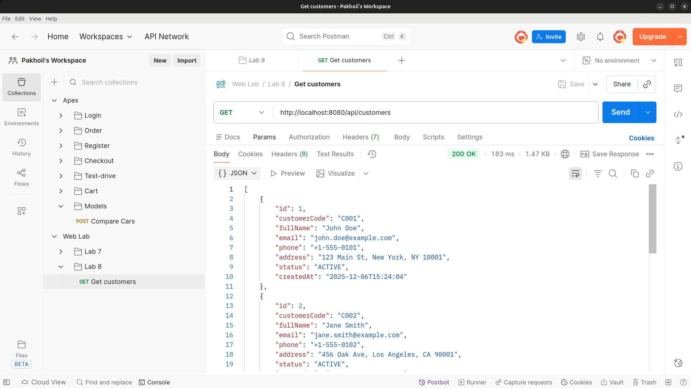
- `http://localhost:8080/api/customers/1`
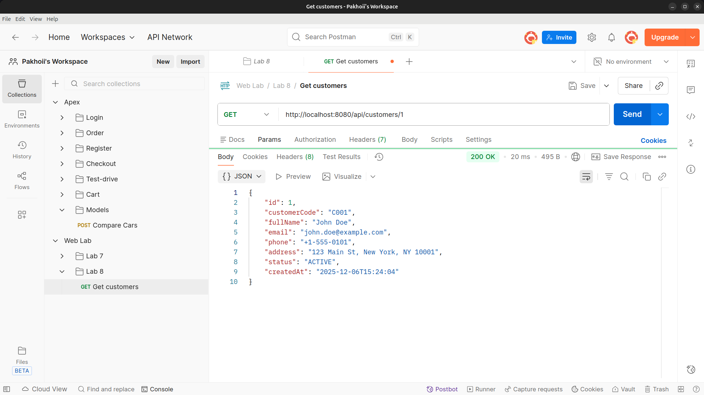
- `http://localhost:8080/api/customers/search?keyword=john`
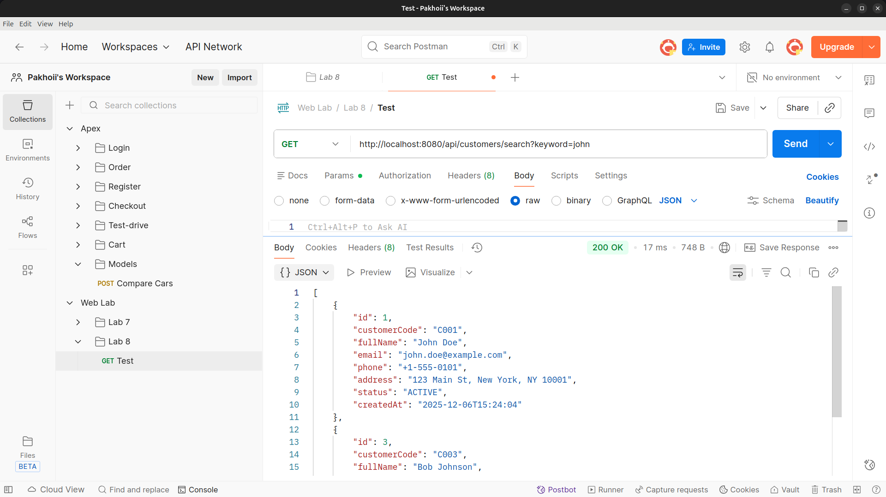
- `http://localhost:8080/api/customers/999`
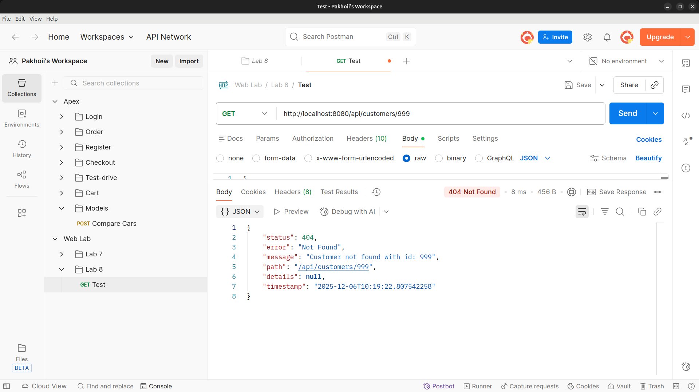

`POST`
- `http://localhost:8080/api/customers`
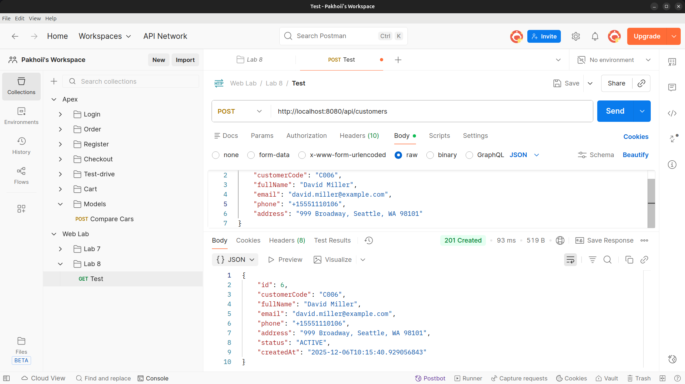
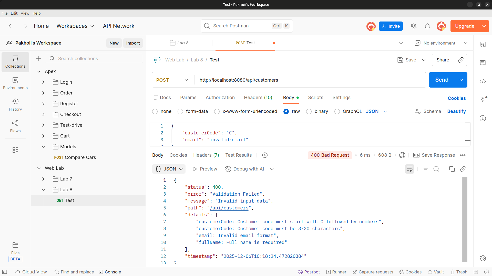
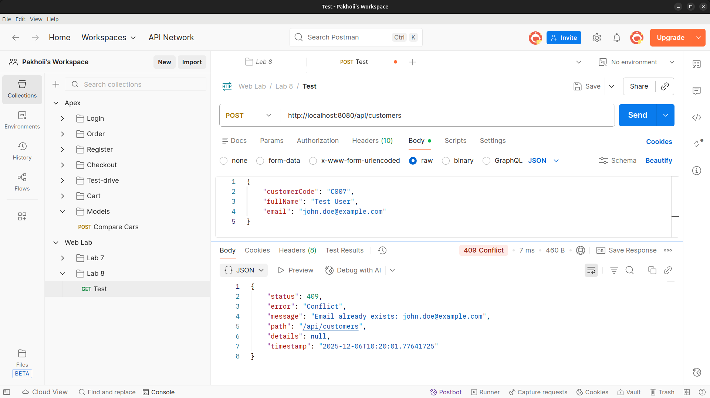

`PUT`
`http://localhost:8080/api/customers/6`
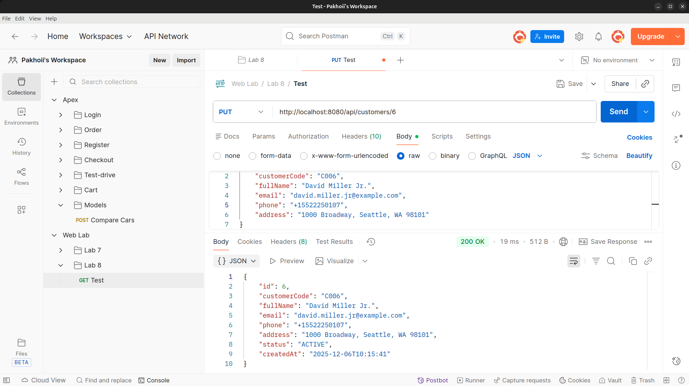

`DELETE`
`http://localhost:8080/api/customers/6`
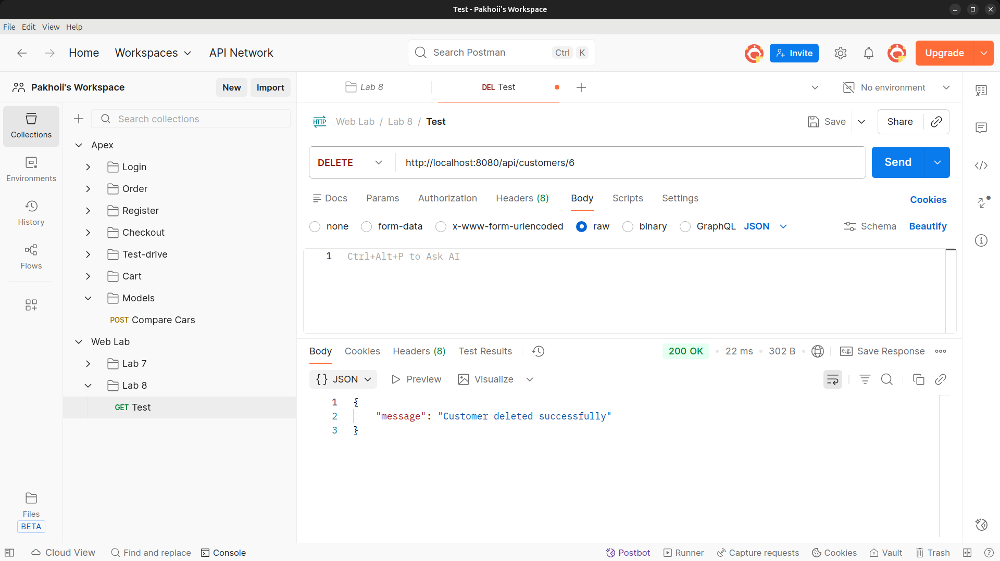

Command Line
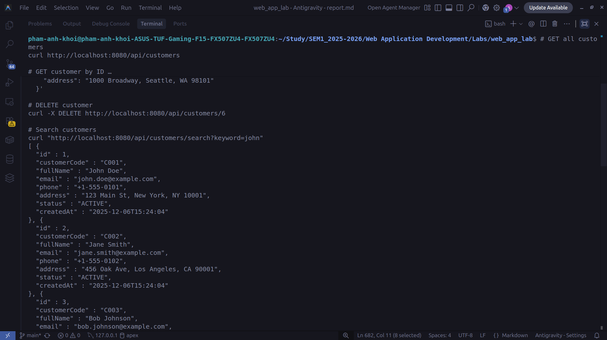


